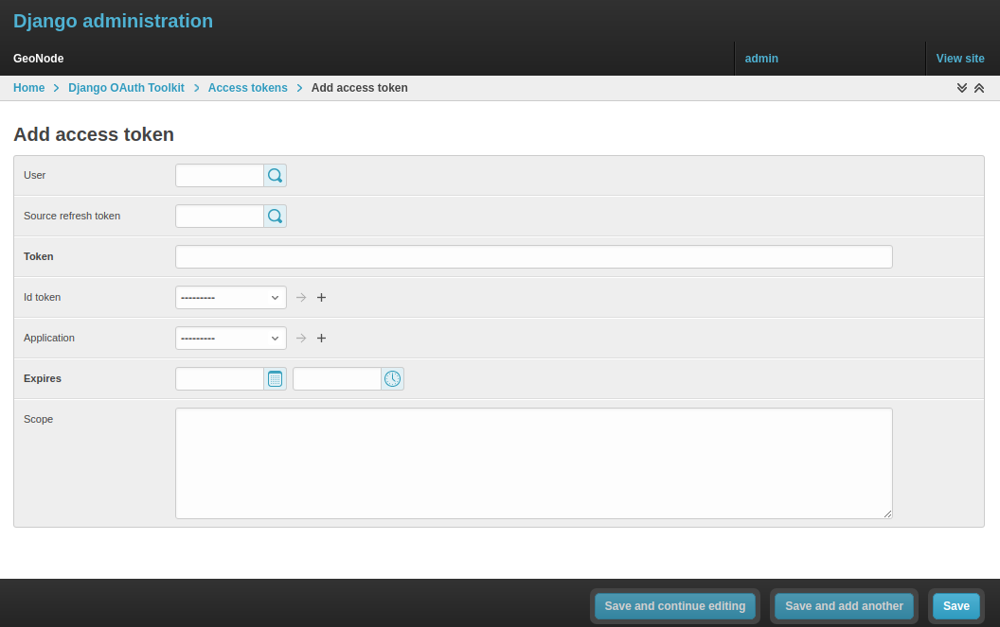
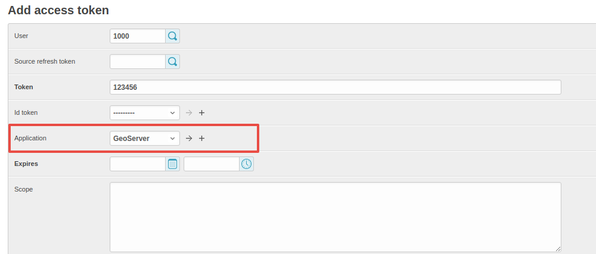
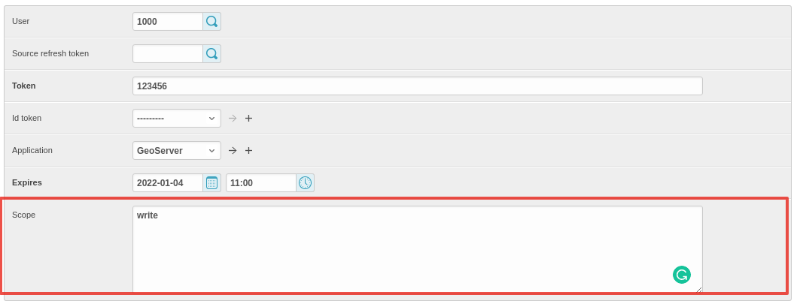

# OAuth2 Access Tokens

This small section won't cover entirely the GeoNode OAuth2 security integration, this is explained in detail in other sections of the documentation
(refer to :ref:`oauth2_fixtures_and_migration` and :ref:`oauth2_tokens_and_sessions`).

Here we will focus mainly on the :guilabel:`Admin > DJANGO/GEONODE OAUTH TOOLKIT` panel items with a specific attention to the ``Access tokens`` management.

The :guilabel:`Admin > DJANGO/GEONODE OAUTH TOOLKIT` panel (as shown in the figure below) allows an admin to manage everything related to
GeoNode OAuth2 grants and permissions.

As better explained in other sections of the documentation, this is needed to correctly handle the communication between GeoNode and GeoServer.

Specifically from this panel an admin can create, delete or extend OAuth2 ``Access tokens``.

The section :ref:`oauth2_tokens_and_sessions` better explains the concepts behind OAuth2 sessions; we want just to refresh the mind here
about the basic concepts:

* If the `SESSION_EXPIRED_CONTROL_ENABLED <../../basic/settings/index.html#session-expired-control-enabled>`_ setting is set to `True` (by default it is set to `True`)
  a registered user cannot login to neither GeoNode nor GeoServer without a valid ``Access token``.

* When logging-in into GeoNode through the sign-up form, GeoNode checks if a valid ``Access token`` exists and it creates a new one if not, or extends
  the existing one if expired.

* New ``Access tokens`` expire automatically after `ACCESS_TOKEN_EXPIRE_SECONDS <../../basic/settings/index.html#access-token-expire-seconds>`_ setting (by default 86400)

* When an ``Access token`` expires, the user will be kicked out from the session and forced to login again

## Create a new token or extend an existing one

It is possible from the :guilabel:`Admin > DJANGO/GEONODE OAUTH TOOLKIT` panel to create a new ``Access token`` for a user.

In order to do that, just click on the :guilabel:`Add` button beside ``Access tokens`` topic

On the new form

select the followings:

1. ``User``; use the search tool in order to select the correct user. The form want the user PK, which is a number, and **not** the username.
   The search tool will do everything for you.

    

2. ``Source refresh token``; this is not mandatory, leave it blank.

3. ``Token``; write here any alphanumeric string. This will be the ``access_token`` that the member can use to access the OWS services.
   We suggest to use a service like https://passwordsgenerator.net/ in order to generate a strong token string.

    

4. ``Application``; select **GeoServer**, this is mandatory

    

5. ``Expires``; select an expiration date by using the :guilabel:`date-time` widgets.

    

6. ``Scope``; select **write**, this is mandatory.

    

Do not forget to :guilabel:`Save`.

From now on, GeoNode will use this ``Access Token`` to control the user session (notice that the user need to login again if closing the browser session),
and the user will be able to access the OWS Services by using the new ``Access Token``, e.g.:

    https://dev.geonode.geo-solutions.it/geoserver/ows?service=wms&version=1.3.0&request=GetCapabilities&access_token=123456

Notice the ``...quest=GetCapabilities&access_token=123456`` (**access_token**) parameter at the end of the URL.

## Force a User Session to expire

Everything said about the creation of a new ``Access Token``, applies to the deletion of the latter.

From the same interface an admin can either select an expiration date or delete all the ``Access Tokens`` associated to a user, in order to
force its session to expire.

Remember that the user could activate another session by logging-in again on GeoNode with its credentials.

In order to be sure the user won't force GeoNode to refresh the token, reset first its password or de-activate it.