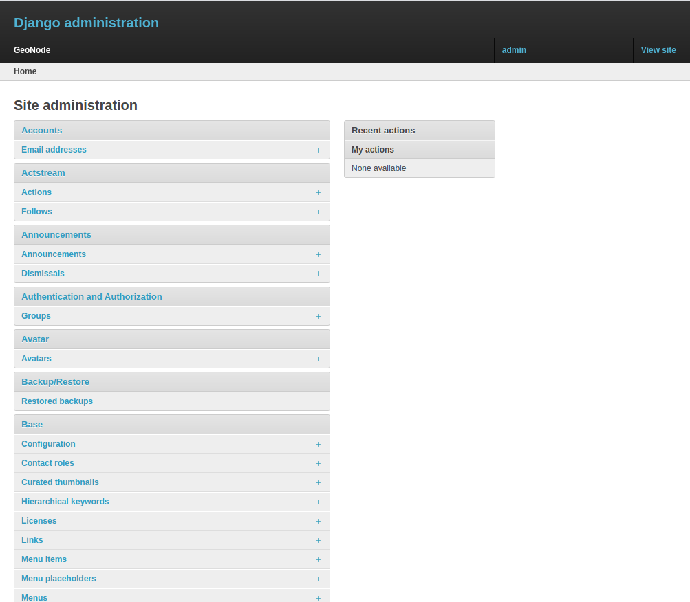

# Accessing the panel

The *Admin Panel* is a model-centric interface where trusted users can manage content on GeoNode.
Only the staff users can access the admin interface.

!!! note "Important notes"
    The “staff” flag, which controls whether the user is allowed to log in to the admin interface, can be set by the admin panel itself.

The panel can be reached from :guilabel:`Admin` link of the *User Menu* in the navigation bar (see the picture below) or through this URL: ``http://<your_geonode_host>/admin``.

When clicking on that link the Django-based *Admin Interface* page opens and shows you all the Django models registered in GeoNode.

