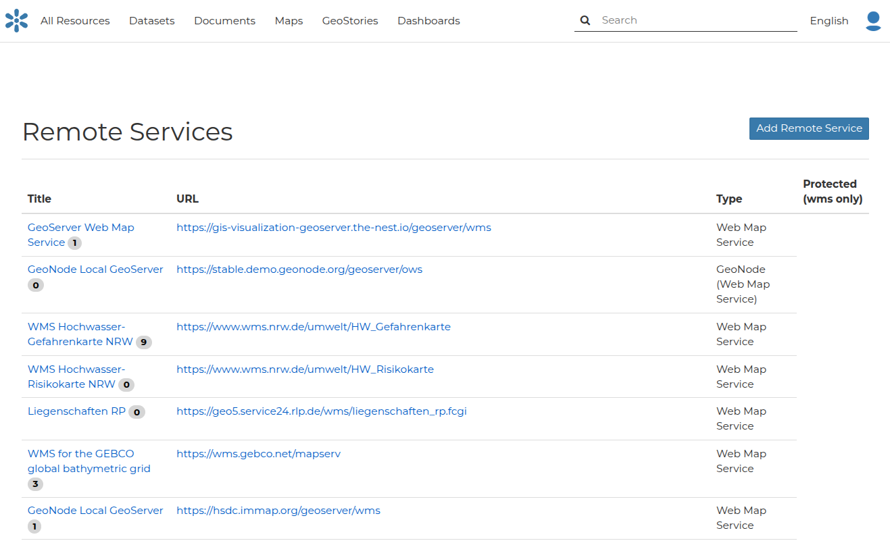
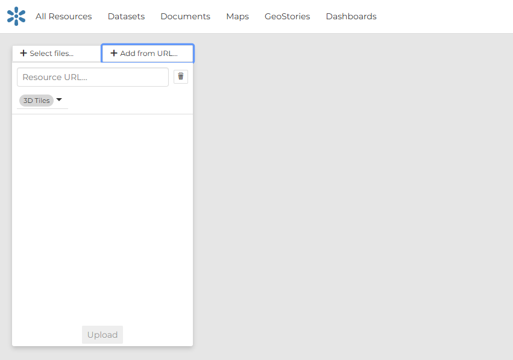

## Remote datasets
GeoNode is also capable to publish resources served from remote sources. Third-party WMS and ArcGIS REST services, and 3D Tiles tilesets served over HTTPS can be published inside the catalog, with the same metadata and sharing options as other resource types. GeoNode is not managing contents from these soruces, so editing and other more advanced content management features are not supported.

### Remote Services

Remote services are references to external WMS servers, from which multiple layers can be obtained and published inside the GeoNode catalog.
They can be created either through **Add Resource -> Remote Services** (All resources page) or **New -> Remote Services** (Datasets page).

The page that opens will contain the list of the available services, if any.

To configure a new service:

* click on **Add Remote Service**
* type the **Service URL**
* select the **Service Type**
* (Optional) define the credentials of the remote service, if it requires authentication
* click on **Create**

The supported Service types are:

- **Web Map Service**: Generic Web Map Service (WMS) based on a standard protocol for serving georeferenced map images over the Internet. These images are typically produced by a map server (like GeoServer) from data provided by one or more distributed geospatial databases. Common operations performed by a WMS service are: GetCapabilities (to retrieves metadata about the service, including supported operations and parameters, and a list of the available datasets) and GetMap (to retrieves a map image for a specified area and content). The URL will be the base URL of the WMS service.
- **GeoNode Web Map Service**: Generally a WMS is not directly invoked; client applications such as GIS-Desktop or WEB-GIS are used that provide the user with interactive controls. A GeoNode WMS automatically performs some operations and lets you to immediately retrieve resources. The URL will be the base URL of the WMS service exposed by GeoNode. For example: `http://dev.geonode.geo-solutions.it/geoserver/wms`
- **ArcGIS REST ImageServer**: This Image Server allows you to assemble, process, analyze, and manage large collections of overlapping, multiresolution imagery and raster data from different sensors, sources, and time periods. You can also publish dynamic image services that transform source imagery and other raster data into multiple image products on demand—without needing to preprocess the data or store intermediate results—saving time and computer resources. In addition, ArcGIS Image Server uses parallel processing across multiple machines and instances, and distributed storage to speed up large raster analysis tasks. The URL should follow this pattern: `https://<servicecatalog-url>/services/<serviceName>/ImageServer`

Once the service has been configured, you can select the resources you are interested in through the **Import Resources** page.

From the page where the services are listed, it is possible to click on the Title of a service, which will open the Service Details page.
If you want to import more resources from that service, you can click on the **Import Service Resources** button.

### Remote 3D Tiles

The GeoNode client supports visualization of [3D Tiles](https://docs.mapstore.geosolutionsgroup.com/en/latest/user-guide/catalog/#3d-tiles-catalog) thanks to the capabilities fo the MapStore framework on which it is based. 3D Tiles tilesets can be published either from a file upload (.zip file containing the tileset) or by reference of a remotwly published tileset, served over HTTP(S).

Remote 3D Tiles can be configured by switching to the "Form Url" tab inside the upload dataset sidebar.

