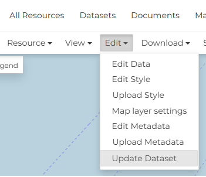
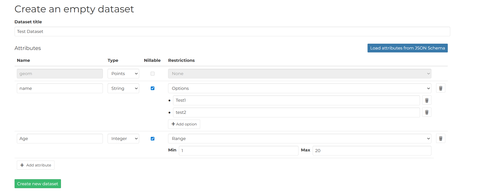
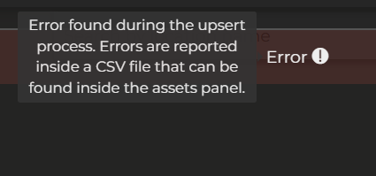
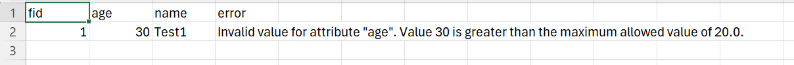

# Replace and Update a dataset
GeoNode provides mechanisms to update the content of an existing dataset without changing its identity within the catalog. This is useful when the underlying data must be refreshed while preserving the dataset's metadata, permissions, service endpoints, and links used by external applications.

Two main approaches are available:

- **Replace dataset**, which completely substitutes the existing data with a new version while keeping the same resource.
- **Upsert dataset**, which selectively updates existing features and inserts new ones based on a unique identifier, avoiding duplication and enabling incremental data synchronization.

These operations allow administrators and data managers to keep datasets up to date while ensuring continuity for users and services that rely on them.

## Replace a dataset

### Step 1: Access the Resource Page
 - Navigate to the GeoNode instance.

 - Go to the `Datasets` section and find the specific dataset you want to update.

 - Click on the dataset's title to go to its details Page.

### Step 2: Initiate the Replacement

- On the dataset's Details Page, look for an `Edit` and then `Update Dataset`
- Clicking the `Replace` option will take you to the replacement interface.

### Step 3: Upload the New Data
- The replacement interface will typically present a file upload form.

 - Click "Browse" or "Choose File" and select the new data file from your computer (e.g., a .zip file containing a Shapefile, a new GeoTIFF, or a GeoJSON file).

!!! warning "Important Check"

    Ensure the new data has the same intended projection (CRS/SRID) as the old data,
    or that GeoNode is configured to reproject it correctly.

### Step 4: System Processing (The Waiting Game)

Once you click "Replace", the following steps happen in the background, and you will typically see a loading indicator or a status message:

- The new file is uploaded to the server.

- The system validates the new file's structure and integrity.

- The data is ingested into the database (for vector) or file system (for raster).

- The associated GeoServer layer is automatically reconfigured to point to the new data location.

- The old data is deleted.

- New thumbnails and previews are generated based on the new data.

### Important notes

!!! note "Important notes"

    It's not possible to replace a vector dataset with a raster data and vice-versa

## Update a dataset

The Upsert functionality in GeoNode allows users to efficiently manage geospatial data by combining the operations of Update and Insert into a single transaction. Instead of running a check to see if a record exists before deciding whether to update it or create a new one, upsert handles this logic automatically.

### How it works

When you perform an upsert operation on a GeoNode layer, the system evaluates the incoming data against the existing records using one or more specified key columns.

- The system checks if a record with the same value(s) in the key column(s) already exists in the layer's data table
- If a match is found, the existing record is updated with the new attribute values and geometry from the incoming data
- If no match is found for the specified key(s), a brand new record (row) is inserted into the data table with the provided attribute values and geometry

### Common Use Cases
Upsert is invaluable for data synchronization tasks:

- Synchronizing External Data: When you receive periodic updates from an external source (e.g., a daily report of infrastructure assets), upsert allows you to load the entire dataset, updating assets that have changed and adding any new assets, all in one operation.

- Preventing Duplicates: It ensures that if a record is submitted multiple times, it is updated rather than creating redundant duplicates.

- Batch Editing: It simplifies the process of making large-scale changes where some features are modified and others are completely new additions.

### How to upsert a dataset

!!! warning "Important notes"

    1) This is an experimental functionality

    2) Upsert is available ONLY for vector dataset (3dTiles are excluded)

    3) You can replace a shapefile with any other vector file format

#### Step 1: Access the Resource Page
 - Navigate to the GeoNode instance.

 - Go to the `Datasets` section and find the specific dataset you want to update.

 - Click on the dataset's title to go to its details Page.

#### Step 2: Initiate the Upsert

- On the dataset's Details Page, look for an `Edit` and then `Update Dataset`
- Clicking the `Update` option will take you to the replacement interface.

#### Step 3: Upload the New Data
- The upsert interface will typically present a file upload form.

 - Click "Browse" or "Choose File" and select the new data file from your computer (e.g., a .zip file containing a Shapefile, a new GeoTIFF, or a GeoJSON file).

!!! warning "Important Check"

    Ensure the new data has the same intended projection (CRS/SRID) as the old data,
    or that GeoNode is configured to reproject it correctly.

#### Step 4: System Processing (The Waiting Game)

Once you click "Replace", the following steps happen in the background, and you will typically see a loading indicator or a status message:

- The new file is uploaded to the server.

- The system validates the new file's structure and integrity.

- The data is ingested into the database

- New thumbnails and previews are generated based on the new data.

### Upsert limitations

Since is an experimental feature, the upser brings on the table some limitation for the usage.

Follows some general rule to successfully perform the upsert

1) The schema MUST be the same, is not possible to upsert dataset with different schema or partial schemas

2) All the dataset uploaded MUST have the FID column referring to an unique identifier.

3) The FID column cannot be NONE

4) The dataset used for the upsert must contain at least 1 feature

5) Is possible to upsert a dataset only if the Dyamic model of the target dataset exists, if not the original dataset MUST be re-uploaded

6) The column type must be always the same, for example if the column A was STR, it cannot be upserted with an INT

7) Is not possible to upsert a dataset with a different CRS

### Upsert Validation

The upsert validation process first performs the validation checks described in the **Upsert Limitations** section. If those limitations are satisfied, it then validates each feature by checking the restriction configured to determine if each feature is valid.

#### Setting Restrictions

Restrictions can be configured in two ways:

##### 1. Setting Restriction on GeoServer

From GeoServer version 2.27.3, it is possible to define [validation constraints](https://docs.geoserver.org/main/en/user/data/webadmin/layers.html#feature-type-details-vector) on vector feature types, including:

- Allowed value ranges for numeric fields
- Enumerated lists of accepted values for numeric or textual fields

Each incoming feature is validated against these constraints during the upsert process.

##### 2. While Creating an Empty Dataset

You can set the restriction for each field during the empty dataset creation process.

You can add attributes along with optional restrictions, which include:

- Allowed value ranges for numeric fields
- Enumerated lists of accepted values for numeric or textual fields

#### Validation During Upsert

During the upsert operation, each feature is validated against its attribute restrictions. If a feature does not satisfy the restriction, the operation will fail and an error will be recorded in a CSV.

**Error reporting**

If validation fails for one or more features, the upsert will surface a general error message and generate a CSV file with detailed, per‑feature errors. You can find and download this CSV from the **Assets** panel, following the steps and screenshots shown below.

##### Example

If you pass a value of `30` for an age field that requires values between 1-20 (inclusive), an error will be displayed.

Initially, a general error message appears:

To obtail the CSV file with the error information:

1) click on top-right on the `X` button

2) on the right panel, click on "Assets"

3) In the asset list a new file is present with the name `error_<dataset_name>_<datetime>.csv`

After downloading the CSV, the error can be seen like below:

