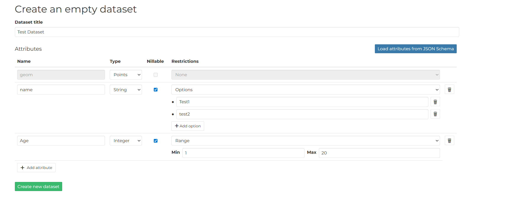
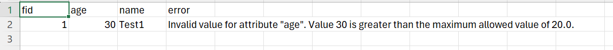
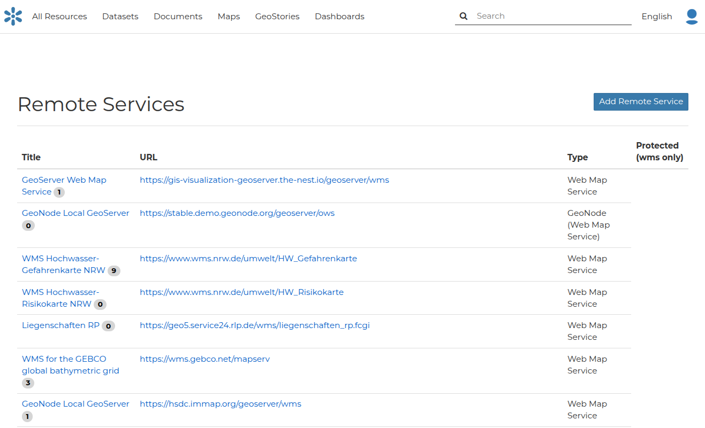
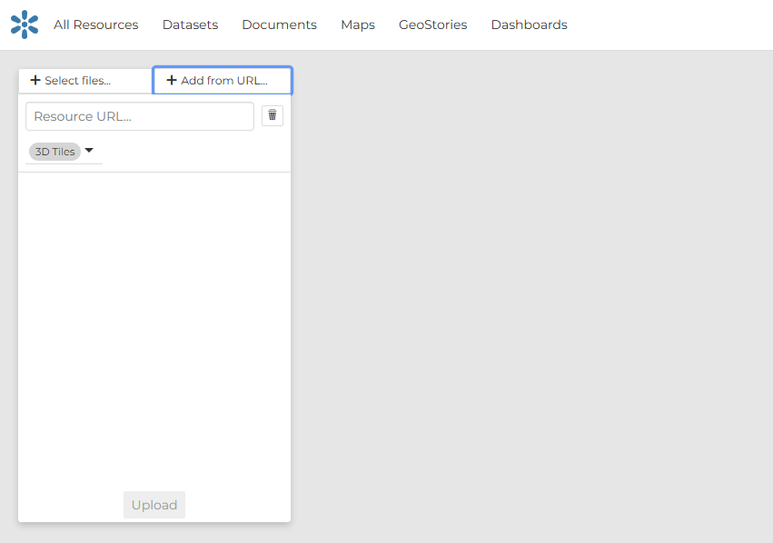

Datasets are published resources representing raster o vector spatial data sources. Datasets can also be associated with metadata, ratings, and comments.
In this section, you will learn how to create a new dataset by uploading a local data set, add dataset info, change the style of the dataset, and share the results.

## Upload from file
The most important resource type in GeoNode is the Dataset. A dataset represents spatial information so it can be displayed inside a map.
To better understand what we are talking about lets upload your first dataset.
It is possible to upload a Datasets in two ways:

 - From the **All Resources** page by clicking the **Add Resource** button which displays a list including Upload dataset link
 - From the **Datasets** page, by clicking on **New** which displays a list including Upload dataset link

The Datasets Uploading page looks like the one in the picture below.

Through the **Select files** button you can select files from your disk, or drag and drop files in the sidebar area. Make sure they are valid raster or vector spatial data, then you can click to **Upload** button.
Multiple files can be uploaded in parallel, within the max parallel uploads per user allowed by the system.

A progress bar and a spinning icon show the operation made during the dataset upload and alert you when the process is over.

!!! note
    If you get the following error message:

    `Total upload size exceeds 100.0 MB. Please try again with smaller files.`

    This means that there is an upload size limit of 100 MB. An user with administrative access can change the upload size limits at the admin panel for size limits.

    Similarly, for the following error message:

    `The number of active parallel uploads exceeds 5. Wait for the pending ones to finish.`

    You can modify the upload parallelism limits at the admin panel for parallelism limits.

## Replace a dataset
This functionality allows users to upload new data (vector or raster) to update an existing resource while preserving the resource's identity, metadata, and service endpoint.

### Step 1: Access the Resource Page
 - Navigate to the GeoNode instance.

 - Go to the `Datasets` section and find the specific dataset you want to update.

 - Click on the dataset's title to go to its details Page.

### Step 2: Initiate the Replacement

- On the dataset's Details Page, look for an `Edit` and then `Update Dataset`
- Clicking the `Replace` option will take you to the replacement interface.

### Step 3: Upload the New Data
- The replacement interface will typically present a file upload form.

 - Click "Browse" or "Choose File" and select the new data file from your computer (e.g., a .zip file containing a Shapefile, a new GeoTIFF, or a GeoJSON file).

!!! warning "Important Check"

    Ensure the new data has the same intended projection (CRS/SRID) as the old data,
    or that GeoNode is configured to reproject it correctly.

### Step 4: System Processing (The Waiting Game)

Once you click "Replace", the following steps happen in the background, and you will typically see a loading indicator or a status message:

- The new file is uploaded to the server.

- The system validates the new file's structure and integrity.

- The data is ingested into the database (for vector) or file system (for raster).

- The associated GeoServer layer is automatically reconfigured to point to the new data location.

- The old data is deleted.

- New thumbnails and previews are generated based on the new data.

### Important notes

!!! note "Important notes"

    It's not possible to replace a vector dataset with a raster data and vice-versa

## Update a dataset

The Upsert functionality in GeoNode allows users to efficiently manage geospatial data by combining the operations of Update and Insert into a single transaction. Instead of running a check to see if a record exists before deciding whether to update it or create a new one, upsert handles this logic automatically.

### How it works

When you perform an upsert operation on a GeoNode layer, the system evaluates the incoming data against the existing records using one or more specified key columns.

- The system checks if a record with the same value(s) in the key column(s) already exists in the layer's data table
- If a match is found, the existing record is updated with the new attribute values and geometry from the incoming data
- If no match is found for the specified key(s), a brand new record (row) is inserted into the data table with the provided attribute values and geometry

### Common Use Cases
Upsert is invaluable for data synchronization tasks:

- Synchronizing External Data: When you receive periodic updates from an external source (e.g., a daily report of infrastructure assets), upsert allows you to load the entire dataset, updating assets that have changed and adding any new assets, all in one operation.

- Preventing Duplicates: It ensures that if a record is submitted multiple times, it is updated rather than creating redundant duplicates.

- Batch Editing: It simplifies the process of making large-scale changes where some features are modified and others are completely new additions.

### How to upsert a dataset

!!! warning "Important notes"

    1) This is an experimental functionality

    2) Upsert is available ONLY for vector dataset (3dTiles are excluded)

    3) You can replace a shapefile with any other vector file format

#### Step 1: Access the Resource Page
 - Navigate to the GeoNode instance.

 - Go to the `Datasets` section and find the specific dataset you want to update.

 - Click on the dataset's title to go to its details Page.

#### Step 2: Initiate the Upsert

- On the dataset's Details Page, look for an `Edit` and then `Update Dataset`
- Clicking the `Update` option will take you to the replacement interface.

#### Step 3: Upload the New Data
- The upsert interface will typically present a file upload form.

 - Click "Browse" or "Choose File" and select the new data file from your computer (e.g., a .zip file containing a Shapefile, a new GeoTIFF, or a GeoJSON file).

!!! warning "Important Check"

    Ensure the new data has the same intended projection (CRS/SRID) as the old data,
    or that GeoNode is configured to reproject it correctly.

#### Step 4: System Processing (The Waiting Game)

Once you click "Replace", the following steps happen in the background, and you will typically see a loading indicator or a status message:

- The new file is uploaded to the server.

- The system validates the new file's structure and integrity.

- The data is ingested into the database

- New thumbnails and previews are generated based on the new data.

### Upsert limitations

Since is an experimental feature, the upser brings on the table some limitation for the usage.

Follows some general rule to successfully perform the upsert

1) The schema MUST be the same, is not possible to upsert dataset with different schema or partial schemas

2) All the dataset uploaded MUST have the FID column referring to an unique identifier.

3) The FID column cannot be NONE

4) The dataset used for the upsert must contain at least 1 feature

5) Is possible to upsert a dataset only if the Dyamic model of the target dataset exists, if not the original dataset MUST be re-uploaded

6) The column type must be always the same, for example if the column A was STR, it cannot be upserted with an INT

7) Is not possible to upsert a dataset with a different CRS

### Upsert Validation

The upsert validation process first performs the validation checks described in the **Upsert Limitations** section. If those limitations are satisfied, it then validates each feature by checking the restriction configured to determine if each feature is valid.

#### Setting Restrictions

Restrictions can be configured in two ways:

##### 1. Setting Restriction on GeoServer

From GeoServer version 2.27.3, it is possible to define [validation constraints](https://docs.geoserver.org/main/en/user/data/webadmin/layers.html#feature-type-details-vector) on vector feature types, including:

- Allowed value ranges for numeric fields
- Enumerated lists of accepted values for numeric or textual fields

Each incoming feature is validated against these constraints during the upsert process.

##### 2. While Creating an Empty Dataset

You can set the restriction for each field during the empty dataset creation process.

You can add attributes along with optional restrictions, which include:

- Allowed value ranges for numeric fields
- Enumerated lists of accepted values for numeric or textual fields

#### Validation During Upsert

During the upsert operation, each feature is validated against its attribute restrictions. If a feature does not satisfy the restriction, the operation will fail and an error will be recorded in a CSV.

**Error reporting**

If validation fails for one or more features, the upsert will surface a general error message and generate a CSV file with detailed, per‑feature errors. You can find and download this CSV from the **Assets** panel, following the steps and screenshots shown below.

##### Example

If you pass a value of `30` for an age field that requires values between 1-20 (inclusive), an error will be displayed.

Initially, a general error message appears:

To obtail the CSV file with the error information:

1) click on top-right on the `X` button

2) on the right panel, click on "Assets"

3) In the asset list a new file is present with the name `error_<dataset_name>_<datetime>.csv`

After downloading the CSV, the error can be seen like below:

## Remote datasets
GeoNode is also capable to publish resources served from remote sources. Third-party WMS and ArcGIS REST services, and 3D Tiles tilesets served over HTTPS can be published inside the catalog, with the same metadata and sharing options as other resource types. GeoNode is not managing contents from these soruces, so editing and other more advanced content management features are not supported.

### Remote Services

Remote services are references to external WMS servers, from which multiple layers can be obtained and published inside the GeoNode catalog.
They can be created either through **Add Resource -> Remote Services** (All resources page) or **New -> Remote Services** (Datasets page).

The page that opens will contain the list of the available services, if any.

To configure a new service:

* click on **Add Remote Service**
* type the **Service URL**
* select the **Service Type**
* (Optional) define the credentials of the remote service, if it requires authentication
* click on **Create**

The supported Service types are:

- **Web Map Service**: Generic Web Map Service (WMS) based on a standard protocol for serving georeferenced map images over the Internet. These images are typically produced by a map server (like GeoServer) from data provided by one or more distributed geospatial databases. Common operations performed by a WMS service are: GetCapabilities (to retrieves metadata about the service, including supported operations and parameters, and a list of the available datasets) and GetMap (to retrieves a map image for a specified area and content). The URL will be the base URL of the WMS service.
- **GeoNode Web Map Service**: Generally a WMS is not directly invoked; client applications such as GIS-Desktop or WEB-GIS are used that provide the user with interactive controls. A GeoNode WMS automatically performs some operations and lets you to immediately retrieve resources. The URL will be the base URL of the WMS service exposed by GeoNode. For example: `http://dev.geonode.geo-solutions.it/geoserver/wms`
- **ArcGIS REST ImageServer**: This Image Server allows you to assemble, process, analyze, and manage large collections of overlapping, multiresolution imagery and raster data from different sensors, sources, and time periods. You can also publish dynamic image services that transform source imagery and other raster data into multiple image products on demand—without needing to preprocess the data or store intermediate results—saving time and computer resources. In addition, ArcGIS Image Server uses parallel processing across multiple machines and instances, and distributed storage to speed up large raster analysis tasks. The URL should follow this pattern: `https://<servicecatalog-url>/services/<serviceName>/ImageServer`

Once the service has been configured, you can select the resources you are interested in through the **Import Resources** page.

From the page where the services are listed, it is possible to click on the Title of a service, which will open the Service Details page.
If you want to import more resources from that service, you can click on the **Import Service Resources** button.

### Remote 3D Tiles

The GeoNode client supports visualization of [3D Tiles](https://docs.mapstore.geosolutionsgroup.com/en/latest/user-guide/catalog/#3d-tiles-catalog) thanks to the capabilities fo the MapStore framework on which it is based. 3D Tiles tilesets can be published either from a file upload (.zip file containing the tileset) or by reference of a remotwly published tileset, served over HTTP(S).

Remote 3D Tiles can be configured by switching to the "Form Url" tab inside the upload dataset sidebar.

## The dataset viewer

### Data viewer and editor
For vector (tabular) datasets, data content can be edited. When the **View/Edit Data** menu item is clicked, the **Attribute Table** panel of the Dataset will automatically appear at the bottom of the Map. In that panel all the features are listed. For each feature you can zoom to its extent by clicking on the corresponding magnifying glass icon  at the beginning of the row, edit its attribute values, and remove it. New features can also be created. 
You can reference MapStore's documentation about basic and advanced usage of the [Attribute table](https://docs.mapstore.geosolutionsgroup.com/en/latest/user-guide/attributes-table/){ target=_blank }.

### Map Settings

#### Editing the style
In GeoNode each dataset has one style refered to as a Default Style which is determined by the nature of the data you’re mapping. When uploading a new dataset (see Datasets Uploading) a new default style will be associated to it.

Editing the Dataset Style
#### GetFeatureInfo 

### Create Map
Datasets can be previewed inside a map. The viewer provides a subset of the map tools that are available for Maps, because the viewer is mainly intended for just previewing the spatial content of a dataset. For a full featured map (including map widgets, and additional plugins) a Map can be created, containing the dataset.