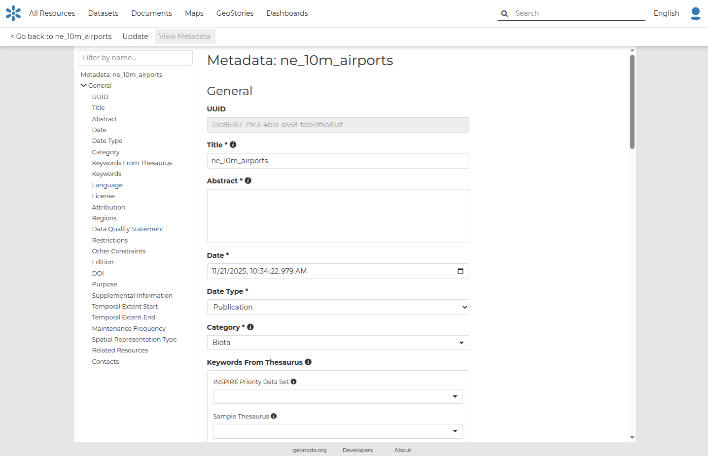
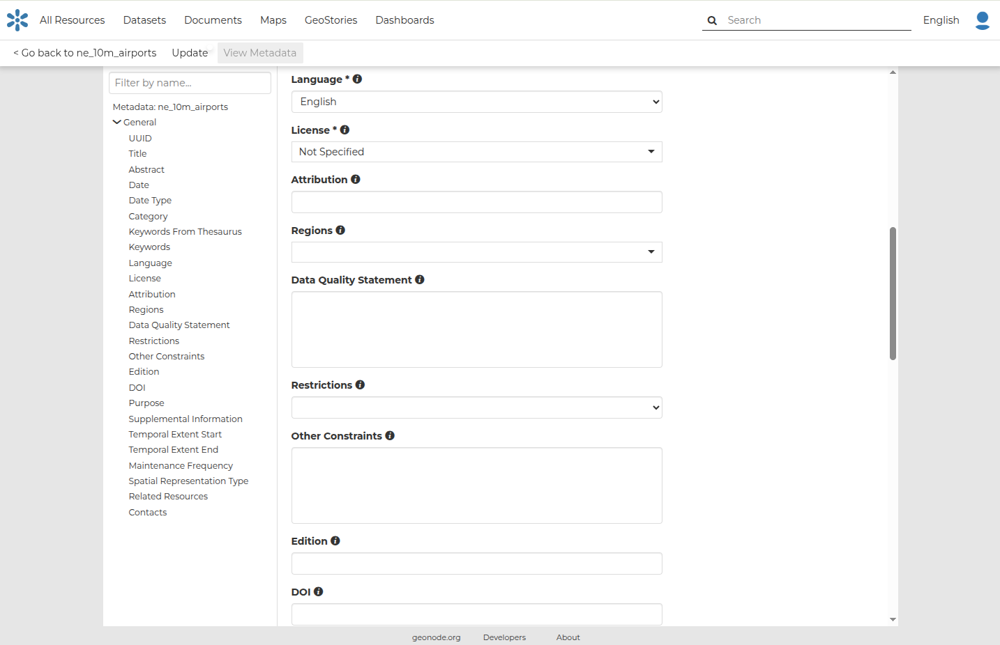
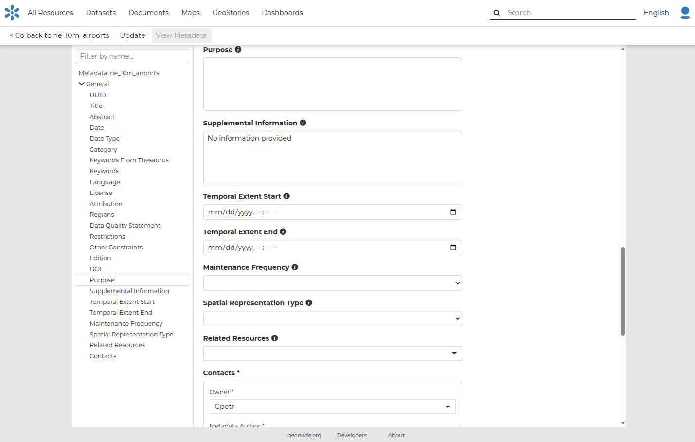

## Metadata

In GeoNode, metadata play a central role and follow well-defined standard formats. In addition to describing resources, metadata also drive several core functionalities within GeoNode, including resource visualization, discovery, searching, and filtering.

The default metadata fields are based on the [ISO 19115](https://www.iso.org/standard/53798.html) standard for geographic information metadata. In particular, GeoNode includes the fields required by this specification as part of its default metadata model.

!!! Note
    The Metadata editor highlights required fields with an asterisk (**). However, users are not strictly required to populate them. This design choice allows catalog resources to remain usable even when their metadata are incomplete.

Metadata are also used by the [OGC Catalogue Service for the Web (CSW)](https://www.ogc.org/standards/cat/) exposed by GeoNode (available at the `catalogue/csw` endpoint). This service implements a standard protocol that enables external systems to publish, search, and retrieve metadata records describing spatial resources.

Editing Metadata
---------------

Metadata contains all the information related to the resource. They provide essential information for its identification and its comprehension. Metadata also make the resource more easily retrievable through search by other users.
The **Metadata** of a resource can be changed through a **Edit Metadata** form which involves four steps, one for each type of metadata considered:

You can open the **Metadata** form of a **Resource** by clicking the `Edit Metadata` link from the `Edit` options on the Resource Page.

 

In the first fields the system asks you to insert metadata including:

 - **Title** of the resource, which should be clear and understandable;
 - **Abstract**, brief narrative summary of the content of the resource
 - **Date / Date type**
 - **Keywords**, which should be chosen within the available list. The contributor search for available keywords by clicking on the searching bar, or on the folder logo representing, or by entering the first letters of the desired word;
 - **Category** which the resource belongs to;
 - **Keywords from Thesaurus**
 - **Keywords** which are simple keywords for the resource

Subsequently, more specialized metadata fields are presented in the metadata form:

 

 

 - **Language** of the resource;
 - **License** of the resource;
 - **Attribution** of the resource; authority or function assigned, as to a ruler, legislative assembly, delegate, or the like
 - **Regions**, which informs on the spatial extent covered by the resource. Proposed extents cover the following scales: global, continental, regional, national;
 - **Data Quality statement** (general explanation of the data producer's knowledge about the lineage of a resource);
 - **Restrictions** on resource sharing.
 - **Other constraints**;
 - **Edition**; Version nof cited resource
 - **DOI** of the resource; if available, this represents the `Digital Object Identifier <https://www.doi.org/>`_ of the resource
 - **Edition** to indicate the reference or the source of the resource;
 - **Purpose** of the resource and its objectives;
 - **Supplemental information** that can provide a better understanding of the uploaded resource;
 - **Temporal extent start / Temporal extent end;
 - **Maintenance frequency** of the resource;
 - **Spatial representation type** used.
 - **Related resources** to link one or multiple resources to the document. These will be visible inside the Resource information panel
 - **Contacts** to reference one or more users for specific roles in relationship to this resource.
  