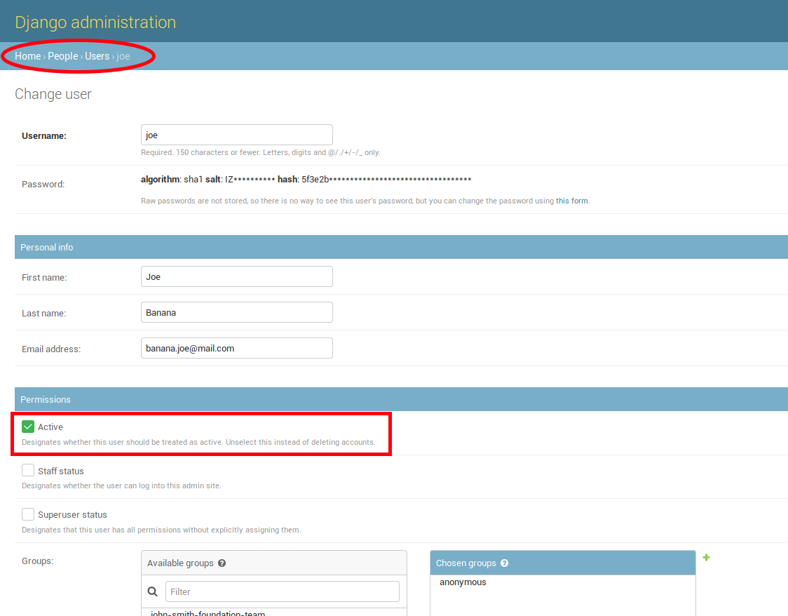
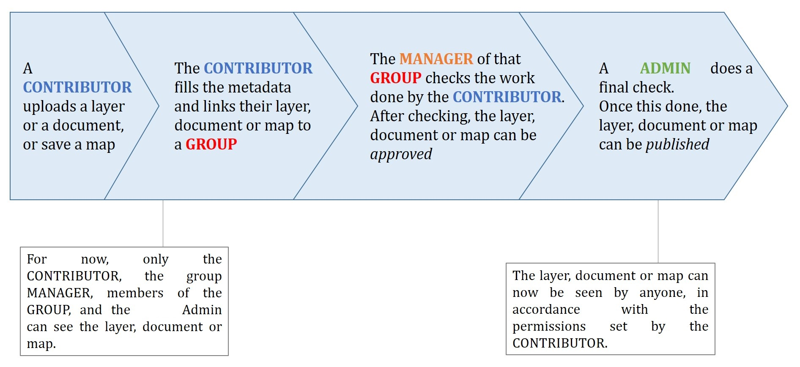

Accessing the panel
===================

| The *Admin Panel* is a model-centric interface where trusted users can manage content on GeoNode.
| Only the staff users can access the admin interface.

.. note:: The “staff” flag, which controls whether the user is allowed to log in to the admin interface, can be set by the admin panel itself.

The panel can be reached from :guilabel:`Admin` link of the *User Menu* in the navigation bar (see the picture below) or through this URL: ``http://<your_geonode_host>/admin``.

.. figure:: img/admin_link.png
     :align: center

     *The Admin Link of the User Menu*

When clicking on that link the Django-based *Admin Interface* page opens and shows you all the Django models registered in GeoNode.

.. figure:: img/django_geonode_admin_interface.png
     :align: center

     *The GeoNode Admin Interface*

Reset or Change the admin password
==================================

From the *Admin Interface* you can access the :guilabel:`CHANGE PASSWORD` link on the right side of the navigation bar.

.. figure:: img/change_password_link.png
     :align: center

     *The Change Password Link*

It allows you to access the *Change Password Form* through which you can change your password.

.. figure:: img/change_password_form.png
     :align: center

     *The Change Password Form*

Once the fields have been filled out, click on :guilabel:`CHANGE MY PASSWORD` to perform the change.

.. _simple-theming:

Simple Theming
==============

GeoNode provides by default some theming options manageable directly from the Administration panel.
Most of the times those options allows you to easily change the GeoNode look and feel without touching a single line of `HTML` or `CSS`.

As an `administrator` go to ``http://<your_geonode_host>/admin/geonode_themes/geonodethemecustomization/``.

.. figure:: img/theming/themes.png
    :align: center

    *List of available Themes*

The panel shows all the available GeoNode themes, if any, and allows you to create new ones.

.. warning:: Only one theme at a time can be **activated** (aka *enabled*). By disabling or deleting all the available themes, GeoNode will turn the gui back to the default one.

Editing or creating a new Theme, will actually allow you to customize several properties.

At least you'll need to provide a ``Name`` for the Theme. Optionally you can specify also a ``Description``, which will allow you to better
identify the type of Theme you created.

.. figure:: img/theming/theme-def-0001.png
    :align: center

    *Theme Name and Description*

Just below the ``Description`` field, you will find the ``Enabled`` checkbox, allowing you to toggle the Theme.

.. figure:: img/theming/theme-def-0002.png
    :align: center

    *Theme Name and Description*

Jumbotron and Get Started link
^^^^^^^^^^^^^^^^^^^^^^^^^^^^^^

.. note:: Remember, everytime you want to apply some changes to the Theme, you **must** save the Theme and reload the GeoNode browser tab.
    In order to quickly switch back to the Home page, you can just click the ``VIEW SITE`` link on the top-right corner of the Admin dashboard.

    .. figure:: img/theming/theme-def-0003c.png
        :align: center

The next section, allows you to define the first important Theme properties. This part involves the GeoNode main page sections.

    *Jumbotron and Logo options*

By changing those properties as shown above, you will easily change your default home page from this

.. figure:: img/theming/theme-def-0003a.png
    :align: center

    *GeoNode Default Home*

to this

    *Updating Jumbotron and Logo*

It is possible to optionally **hide** the ``Jumbotron text`` and/or the ``Call to action`` button

.. figure:: img/theming/theme-def-0003d.png
    :align: center

.. figure:: img/theming/theme-def-0003e.png
    :align: center

    *Hide Jumbotron text and Call to action button*

Copyright and contact info footer
^^^^^^^^^^^^^^^^^^^^^^^^^^^^^^^^^

The default GeoNode footer does not present any type of contact info.

.. figure:: img/theming/theme-def-0004.png
    :align: center

    *Default GeoNode Footer*

By enabling and editing the ``contact us box`` fields

.. figure:: img/theming/theme-def-0004a.png
    :align: center

    *Enable contact us box*

it will be possible to show a simple *Contact Us* info box on the GeoNode footer section.

    *Contact Us Footer*

Similarly, by editing the ``Copyright`` text box and/or background color

.. figure:: img/theming/theme-def-0004c.png
    :align: center

    *Copyright Text and Color*

it will be possible to show the Copyright statement to the bottom of the page

.. figure:: img/theming/theme-def-0004d.png
    :align: center

    *Copyright*

Partners
^^^^^^^^

GeoNode simple theming, allows also a ``Partners`` section, in order to easily list links to third-party institutions collaborating to the project.

The example below shows the ``Partners`` section of `WorldBank CHIANG MAI URBAN FLOODING <https://urbanflooding.geo-solutions.it/>`_ GeoNode instance
made through integrating theming options.

.. figure:: img/theming/theme-def-0005.png
    :align: center

    *Urbanflooding GeoNode Partners Section*

The ``Partners`` items can be managed through the ``http://<your_geonode_host>/admin/geonode_themes/partner/`` Admin section

.. figure:: img/theming/theme-def-0005a.png
    :align: center

    *GeoNode Partners Admin Section*

From here it is possible to add, modify or delete partners items.

A new partner is defined by few elements, a ``Logo``, a ``Name``, a ``Display Name`` and a ``Website``

.. figure:: img/theming/theme-def-0005b.png
    :align: center

    *Add a Partner*

In order to attach or detach a ``Partner`` to an existing ``Theme`` on GeoNode, you will need to edit the Theme and go to the ``Partners`` section

    *Theme Partners Section*

From here you will be able to either to change the ``Partners title`` text and/or select/deselect ``Partners`` from the ``multi-select`` box.

.. note:: In order to select/deselect elements from the ``multi-select`` box, you **must** use the ``CTRL+CLICK`` button combintation.

Privacy Policies and Cookie settings
^^^^^^^^^^^^^^^^^^^^^^^^^^^^^^^^^^^^

By enabling the ``Cookies Law Info Bar`` checkbox (``True`` by default)

.. figure:: img/theming/theme-def-0006.png
    :align: center

    *Cookies Law Info Bar checkbox*

it will be possible to allow GeoNode presenting the `Privacy Policies and Cookie settings` pop-ups and links at the bottom of the home page

.. figure:: img/theming/theme-def-0006a.png
    :align: center

    *Cookies Law Info Bar*

There are plenty of options available, allowing you to customize contact info as long as colors of the bar and page.

One of the most importat to consider it is for sure the ``Cookie law info bar text``

    *Cookie law info bar text*

The default text contained in this section is the following one

.. code-block:: html

    This website uses cookies to improve your experience,
    check <strong><a style="color:#000000" href="/privacy_cookies/">this page</a></strong> for details.
    We'll assume you're ok with this, but you can opt-out if you wish.

The text can be changed and customized, of course. Nevertheless it points by default to the following page

.. code-block:: shell

    /privacy_cookies/

aka `http://<your_geonode_host>/privacy_cookies/`

    */privacy_cookies/ Default Page*

The page contains a default generic text along with some placeholders, which, most probably, won't feet your needs.

In order to change this you have two options:

1. Change the link reported into the ``Cookie law info bar text`` section, to make it pointing to an external/static page.

2. Change the contents of ``/geonode/templates/privacy-cookies.html`` Django template accordingly to your needs; this is basically a plain ``HTML`` page which can be easily customized by using a standard text editor.

Switching between different themes
^^^^^^^^^^^^^^^^^^^^^^^^^^^^^^^^^^

In the case you have defined more Themes, switching between them is as easy as ``enabling`` one and ``disabling`` the others.

Remember to save the Themes everytime and refresh the GeoNode home page on the browser to see the changes.

It is also important that there is **only one** Theme enabled **at a time**.

In order to go back to the standard GeoNode behavior, just disable or delete all the available Themes.

Add a new user
==============

In GeoNode, administrators can manage other users. For example, they can *Add New Users* through the following form.

.. figure:: img/add_user_form.png
    :align: center

    *Adding New Users*

The form above can be reached from the *Admin Panel* at the following path: *Home > People > Users*. Click on :guilabel:`ADD USER +` to open the form page.

.. figure:: img/add_user_button.png
    :align: center

    *The Add User button in the Users List page*

It is also available, in the GeoNode UI, the :guilabel:`Add User` link of the *About* menu in the navigation bar.

.. figure:: img/add_user_link.png
    :align: center

    *Add User Link*

To perform the user creation fill out the required fields (*username* and *password*) and click on :guilabel:`SAVE`.
You will be redirected to the *User Details Page* which allows to insert further information about the user.

    *The User Details Page*

The user will be visible into the *Users List Page* of the *Admin Panel* and in the *People Page* (see :ref:`user-info`).

    *The User in the People page*

Activate/Disable a User
=======================

When created, new users are *active* by default.
You can check that in the *User Details Page* from the *Admin Panel* (see the picture below).

    *New Users Active by default*

| *Active* users can interact with other users and groups, can manage resources and, more in general, can take actions on the GeoNode platform.
| Untick the *Active* checkbox to disable the user. It will be not considered as user by the GeoNode system.

.. figure:: img/new_user_disabled.png
    :align: center

    *Disabeld Users*

Change a User password
======================

GeoNode administrators can also change/reset the password for those users who forget it.
As shown in the picture below, click on ``this form`` link from the *User Details Page* to access the *Change Password Form*.

.. figure:: img/change_user_password_link.png
    :align: center

    *Changing Users Passwords*

The *Change User Password Form* should looks like the following one.
Insert the new password two times and click on :guilabel:`CHANGE PASSWORD`.

    *Changing Users Passwords*

Promoting a User to Staff member or superuser
=============================================

Active users have not access to admin tools.
GeoNode makes available those tools only to *Staff Members* who have the needed permissions.
*Superusers* are staff members with full access to admin tools (all permissions are assigned to them).

Administrators can promote a user to *Staff Member* by ticking the **Staff status** checkbox in the *User Details Page*.
To make some user a *Superuser*, the **Superuser status** checkbox should be ticked. See the picture below.

    *Staff and Superuser permissions*

Creating a Group
================

| In GeoNode is possible to create new groups with set of permissions which will be inherited by all the group members.
| The creation of a Group can be done both on the GeoNode UI and on the *Admin Panel*, we will explain how in this paragraph.

The :guilabel:`Create Groups` link of *About* menu in the navigation bar allows administrators to reach the *Group Creation Page*.

.. figure:: img/create_group_page_link.png
    :align: center

    *The Create Group Link*

The following form will open.

    *The Group Creation Form*

Fill out all the required fields and click :guilabel:`Create` to create the group.
The *Group Details Page* will open.

.. figure:: img/group_details_page.png
    :align: center

    *The Group Details Page*

The new created group will be searchable in the *Groups List Page*.

.. figure:: img/groups_list_page.png
    :align: center

    *The Groups List Page*

.. note:: The :guilabel:`Create a New Group` button on the *Groups List Page* allows to reach the *Group Creation Form*.

| As already mentioned above, groups can also be created from the Django-based *Admin Interface* of GeoNode.
| The *Groups* link of the *AUTHENTICATION AND AUTHORIZATION* section allows to manage basic Django groups which only care about permissions.
| To create a GeoNode group you should take a look at the *GROUPS* section.

.. figure:: img/groups_admin_section.png
    :align: center

    *The Groups Section on the Admin Panel*

As you can see, GeoNode provides two types of groups. You will learn more about that in the next paragraph.

Types of Groups
^^^^^^^^^^^^^^^

In GeoNode users can be grouped through a *Group Profile*, an enhanced Django group which can be enriched with some further information such as a description, a logo, an email address, some keywords, etc.
It also possible to define some *Group Categories* based on which those group profiles can be divided and filtered.

A new **Group Profile** can be created as follow:

* click on the *Group Profile* :guilabel:`+ Add` button

* fill out all the required fields (see the picture below), *Group Profiles* can be explicitly related to group categories

  .. figure:: img/new_group_profile_form.png
      :align: center

      *A new Group Profile*

* click on :guilabel:`SAVE` to perform the creation, the new created group profile will be visible in the *Group Profiles List*

  .. figure:: img/group_profiles_list.png
      :align: center

      *The Group Profiles List*

Group Categories
^^^^^^^^^^^^^^^^

*Group Profiles* can also be related to *Group Categories* which represents common topics between groups.
In order to add a new **Group Category** follow these steps:

* click on the *Group Categories* :guilabel:`+ Add` button

* fill out the creation form (type *name* and *description*)

  .. figure:: img/new_group_category_form.png
      :align: center

      *A new Group Category*

* click on :guilabel:`SAVE` to perform the creation, the new created category will be visible in the *Group Categories List*

  .. figure:: img/group_categories_list.png
      :align: center

      *The Group Categories List*

| When a GeoNode resource (layer, document or maps) is associated to some *Group Profile*, it is also possible to retrieve the *Group Category* it belongs to.
| So when searching for resources (see :ref:`finding-data`) you can also filter the data by group category.

.. figure:: img/layers_group_category.png
    :align: center

    *Filtering Layers by Group Category*

Managing a Group
================

Through the :guilabel:`Groups` link of *About* menu in the navigation bar, administrators can reach the *Groups List Page*.

    *The Groups Link in the navigation bar*

In that page all the GeoNode *Group Profiles* are listed.

.. figure:: img/group_profiles_list_page.png
    :align: center

    *Group Profiles List Page*

For each group some summary information (such as the *title*, the *description*, the number of *members* and *managers*) are displayed near the *Group Logo*.

Administrators can manage a group from the *Group Profile Details Page* which is reachable by clicking on the *title* of the group.

.. figure:: img/group_profile_details_page.png
    :align: center

    *Group Profile Details Page*

As shown in the picture above, all information about the group are available on that page:

* the group *Title*;
* the *Last Editing Date* which shows a timestamp corresponding to the last editing of the group properties;
* the *Keywords* associated with the group;
* *Permissions* on the group (Public, Public(invite-only), Private);
* *Members* who join the group;
* *Managers* who manage the group.

There are also four links:

* The :guilabel:`Edit Group Details` link opens the *Group Profile Form* through which the following properties can be changed:

  * *Title*.
  * *Logo* (see next paragraphs).
  * *Description*.
  * *Email*, to contact one or all group members.
  * *Keywords*, a comma-separated list of keywords.
  * *Access*, which regulates permissions:

    * *Public*: any registered user can view and join a public group.
    * *Public (invite-only)*: only invited users can join, any registered user can view the group.
    * *Private*: only invited users can join the group, registered users cannot see any details about the group, including membership.

  * *Categories*, the group categories the group belongs to.

  .. figure:: img/group_profile_details_page.png
      :align: center

      *Group Profile Details Page*

* :guilabel:`Managing Group Members` (see next paragraphs).
* the :guilabel:`Delete this Group`, click on it to delete the Group Profile. GeoNode requires you to confirm this action.

  .. figure:: img/confirm_group_deletion.png
      :align: center
      :width: 400px

      *Confirm Group Deletion*

* the :guilabel:`Group Activities` drives you to the *Group Activites Page* where you can see all layers, maps and documents associated with the group. There is also a *Comments* tab which shows comments on those resources.

  .. figure:: img/group_activities.png
      :align: center

      *Group Activities*

Group Logo
^^^^^^^^^^

Each group represents something in common between its members.
So each group should have a *Logo* which graphically represents the idea that identify the group.

On the *Group Profile Form* page you can insert a logo from your disk by click on :guilabel:`Browse...`.

    *Editing the Group Logo*

| Click on :guilabel:`Update` to apply the changes.
| Take a look at your group now, you should be able to see that logo.

    *The Group Logo*

Managing Group members
^^^^^^^^^^^^^^^^^^^^^^

The :guilabel:`Manage Group Members` link opens the *Group Members Page* which shows *Group Members* and *Group Managers*.
**Managers** can edit group details, can delete the group, can see the group activities and can manage memberships.
Other **Members** can only see the group activities.

| In Public Groups, users can join the group without any approval.
  Other types of groups require the user to be invited by the group managers.
| Only group managers can *Add new members*.
  In the picture below, you can see the manager can search for users by typing their names into the *User Identifiers* search bar.
  Once found, he can add them to the group by clicking the :guilabel:`Add Group Members` button.
  The *Assign manager role* flag implies that all the users found will become managers of the group.

.. figure:: img/add_new_member.png
    :align: center

    *Adding a new Member to the Group*

The following picture shows you the results.

    *New Members of the Group*

Group based advanced data workflow
==================================

By default GeoNode is configured to make every resource (Layer, Document or Map) suddenly available to everyone, i.e. publicly accessible
even from anonymous/non-logged in users.

It is actually possible to change few configuration settings in order to allow GeoNode to enable an advanced publication workflow.

With the advanced workflow enabled,  your layer, document or map won't be automatically published (i.e. made visible and accessible for all, contributors or simple users).

For now, your item is only visible by yourself, the manager of the group to which the layer, document or map is linked (this information is filled in the metadata), the members of this group, and the GeoNode Administrators.

Before being published, the layer, document or map will follow a two-stage review process, which is described below:

    *From upload to publication: the review process on GeoNode*

How to enable the advanced workflow
^^^^^^^^^^^^^^^^^^^^^^^^^^^^^^^^^^^

You have to tweak the GeoNode settings accordingly.

Please see the details of the following GeoNode ``Settings``:

* `ADMIN_MODERATE_UPLOADS <../../basic/settings/index.html#admin-moderate-uploads>`_

* `GROUP_PRIVATE_RESOURCES <../../basic/settings/index.html#group-private-resources>`_

* `RESOURCE_PUBLISHING <../../basic/settings/index.html#resource-publishing>`_

The group Manager approval
^^^^^^^^^^^^^^^^^^^^^^^^^^
Here, the role of the Manager of the group to which your layer, document or map is linked is to check that the uploaded item is correct.
Particularly, in the case of a layer or a map, it consists of checking that the chosen cartographic representation and the style are
fitting but also that the discretization is appropriate.

The Manager must also check that the metadata are properly completed and that the mandatory information
(Title, Abstract, Edition, Keywords, Category, Group, Region) are filled.

If needed, the Manager can contact the contributor responsible of the layer, document or map in order to report potential comments or
request clarifications.

Members of the group can also take part in the reviewing process and give some potential inputs to the responsible of the
layer, document or map.

When the Manager considers that the layer, document or map is ready to be published, he should approve it.
To do so, the Manager goes to the layer, document or map page, then opens the :guilabel:`Wizard` in order to edit the metadata.
In the :guilabel:`Settings` tab, the manager checks the :guilabel:`Approved` box, and then updates the metadata and saves the changes:

.. figure:: img/adv_data_workflow/approbation_manager.gif
    :align: center

    *The approbation process of an item by a Manager*

Following this approval, the GeoNode Administrators receive a notification informing them that an item is now waiting for publication

.. figure:: img/adv_data_workflow/unpublished.png
    :align: center

    *An approved layer, waiting for publication by the GeoNode administrators*

The publication by the GeoNode Administrator
^^^^^^^^^^^^^^^^^^^^^^^^^^^^^^^^^^^^^^^^^^^^

Prior to the public release of an approved layer, a document or a map, the Administrator of the platform performs a final validation of
the item and its metadata, notably to check that it is in line with licence policies.

If needed, the GeoNode Administrator can contact the Manager who has approved the layer, document or map, as well as its responsible.

Once the layer, document or map is validated, the item is made public by the Administrator.
It can now be viewed, accessed, and downloaded in accordance with the ``Permissions`` set by the responsible contributor.

Manage profiles using the admin panel
=====================================

So far GeoNode implements two distinct roles, that can be assigned to resources such as layers, maps or documents:

* party who authored the resource
* party who can be contacted for acquiring knowledge about or acquisition of the resource

These two profiles can be set in the GeoNode interface by accessing the metadata page and setting the ``Point of Contact`` and ``Metadata Author`` fields respectively.

Is possible for an administrator to add new roles if needed, by clicking on the :guilabel:`Add Role` button in the :guilabel:`Base -> Contact Roles` section:

Clicking on the :guilabel:`People` section (see figure) will open a web for with some personal information plus a section called :guilabel:`Users`.

Is important that this last section is not modified here unless the administrator is very confident in that operation.

.. figure:: img/admin-profiles-contactroles.png
    :align: center

Manage layers using the admin panel
===================================

Some of the Layers information can be edited directly through the admin interface although the best place is in the :guilabel:`Layer -> Metadata Edit` in GeoNode.

Clicking on the :guilabel:`Admin > Layers` link will show the list of available layers.

.. figure:: img/admin-layers.png
    :align: center

.. warning:: It is not recommended to modify the Layers' ``Attributes`` or ``Styles`` directly from the Admin dashboard unless you are aware of your actions.

The ``Metadata`` information can be changed for multiple Layers at once throguh the :guilabel:`Metadata batch edit` action.

By clicking over one Layer link, it will show a detail page allowing you to modify some of the resource info like the metadata, the keywords, the title, etc.

.. note:: It is strongly recommended to always use the GeoNode :guilabel:`Metadata Wizard` or :guilabel:`Metadata Advanced` tools in order to edit the metadata info.

Manage the maps using the admin panel
=====================================

Similarly to the Layers, it is possible to manage the available GeoNode Maps through the Admin panel also.

Move to :guilabel:`Admin > Maps` to access the Maps list.

.. figure:: img/admin-maps.png
    :align: center

The ``Metadata`` information can be changed for multiple Maps at once throguh the :guilabel:`Metadata batch edit` action.

By clicking over one Map link, it will show a detail page allowing you to modify some of the resource info like the metadata, the keywords, the title, etc.

.. note:: It is strongly recommended to always use the GeoNode :guilabel:`Metadata Wizard` or :guilabel:`Metadata Advanced` tools in order to edit the metadata info.

Notice that by enabling the ``Featured`` option here, will allow GeoNode to show the Map thumbnail and the Map detail link on the :guilabel:`Home Page`

.. figure:: img/admin-maps-featured-001.png
    :align: center

.. figure:: img/admin-maps-featured-002.png
    :align: center

Manage the documents using the admin panel
==========================================

Similarly to the Layers and Maps, it is possible to manage the available GeoNode Documents through the Admin panel also.

Move to :guilabel:`Admin > Documents` to access the Documents list.

.. figure:: img/admin-documents.png
    :align: center

The ``Metadata`` information can be changed for multiple Documents at once throguh the :guilabel:`Metadata batch edit` action.

By clicking over one Document link, it will show a detail page allowing you to modify some of the resource info like the metadata, the keywords, the title, etc.

.. note:: It is strongly recommended to always use the GeoNode :guilabel:`Metadata Wizard` or :guilabel:`Metadata Advanced` tools in order to edit the metadata info.

Manage the base metadata choices using the admin panel
======================================================

:guilabel:`Admin > Base` contains almost all the objects you need to populate the resources metadata choices.

    *Admin dashboard Base Panel*

In other words the options available from the :guilabel:`select-boxes` of the :guilabel:`Metadata Wizard` and :guilabel:`Metadata Advanced` panels.

    *Metadata Wizard Panel*

.. figure:: img/metadata-base/admin-panel-metadata-contents-0003.png
    :align: center

    *Metadata Advanced Panel*

.. note:: When editing the resource metadata throguh the :guilabel:`Metadata Wizard`, some fields are marked as ``mandatory`` and by filling those information
    the ``Completeness`` progress will advance accordingly.

    .. figure:: img/metadata-base/admin-panel-metadata-contents-0003a.png
        :align: center

        *Metadata Completeness*
    
    Even if not all the fields have been filled, the system won't prevent you to update the metadata; this is why the ``Mandatory`` fields are
    mandatory to be fully compliant with an ``ISO 19115`` metadata schema, but are only recommended to be compliant with GeoNode.

    Also the ``Completeness`` indicates how far the metadata is to be compliant with an ``ISO 19115`` metadata schema.

    Of course, it is **highly** recommended to always fill as much as possible at least all the metadata fields marked as ``Mandatory``.

    This will improve not only the quality of the data stored into the system, but will help the users to easily search for them on GeoNode.

    All the ``Search & Filter`` panels and options of GeoNode are, in fact, based on the resources metadata fields. Too much generic descriptions and
    too empty metadata fields, will give highly un-precise and very wide search results to the users.

Hierarchical keywords
^^^^^^^^^^^^^^^^^^^^^

Through the :guilabel:`Admin > Base > Hierarchical keywords` panel it will be possible to manage all the keywords associated to the resources.

    *Hierarchical keywords list*

    *Hierarchical keywords edit*

* The :guilabel:`Name` is the human readable text of the keyword, what users will see.

* The :guilabel:`Slug` is a unique label used by the system to identify the keyword; most of the times it is equal to the name.

Notice that through the :guilabel:`Position` and :guilabel:`Relative to` selectors, it is possible to establish a hierarchy between the available keywords.
The hierarchy will be reflected in the form of a tree from the metadata panels.

By default each user with editing metadata rights on any resource, will be able to insert new keywords into the system by simply typing a free text on the keywords metadata field.

It is possible to force the user to select from a fixed list of keywords throug the `FREETEXT_KEYWORDS_READONLY <../../basic/settings/index.html#freetext-keywords-readonly>`_ setting.

When set to `True` keywords won't be writable from users anymore. Only admins can will be able to manage them through the :guilabel:`Admin > Base > Hierarchical keywords` panel.

Licenses
^^^^^^^^

Through the :guilabel:`Admin > Base > Licenses` panel it will be possible to manage all the licenses associated to the resources.

.. figure:: img/metadata-base/admin-panel-metadata-contents-0006.png
    :align: center

    *Metadata editor Licenses*

The licence description and the info URL will be shown on the resource detail page.

    *Resource detail License*

The licence text will be shown on the catalogue metadata XML documents.

.. figure:: img/metadata-base/admin-panel-metadata-contents-0008.png
    :align: center

    *Resource Metadata ISO License*

.. warning:: It is **strongly** recommended to not publish resources without an appropriate licence. Always make sure the data provider specifies the correct licence and that all the restrictions have been honored.

Metadata Regions
^^^^^^^^^^^^^^^^

Through the :guilabel:`Admin > Base > Metadata Regions` panel it will be possible to manage all the admin areas associated to the resources.

    *Resource Metadata Regions*

Notice that those regions are used by GeoNode to filter search results also through the resource list view.

    *GeoNode fitlering by Metadata Regions*

.. note:: GeoNode tries to guess the ``Regions`` intersecting the data bounding boxes when uploading a new layer. Those should be refined by the user layer on anyway.

Metadata Restriction Code Types and Spatial Representation Types
^^^^^^^^^^^^^^^^^^^^^^^^^^^^^^^^^^^^^^^^^^^^^^^^^^^^^^^^^^^^^^^^

Through the :guilabel:`Admin > Base > Metadata Restriction Code Types` and :guilabel:`Admin > Base > Metadata Spatial Representation Types` panels, it will
be possible to **update only** the metadata descriptions for restrictions and spatial representation types.

Such lists are *read-only* by default since they have been associated to the specific codes of the ``ISO 19115`` metadata schema.
Changing them would require the system to provide a custom dictionary throguh the metadata catalog too. Such functionality is not supported actually by GeoNode.

Metadata Topic Categories
^^^^^^^^^^^^^^^^^^^^^^^^^

Through the :guilabel:`Admin > Base > Metadata Topic Categories` panel it will be possible to manage all the resource metadata categories avaialble into the system.

Notice that by default, GeoNode provides the standard topic categories avaialble with the ``ISO 19115`` metadata schema. Changing them means that the system won't be
compliant with the standard ``ISO 19115`` metadata schema anymore. ``ISO 19115`` metadata schema extensions are not currently supported natively by GeoNode.

It is worth notice that GeoNode allows you to associate `Font Awesome Icons <https://fontawesome.com/icons?d=gallery>`_ to each topic category through their ``fa-icon`` code.
Those icons will be used by GeoNode to represent the topic category on both the ``Search & Filter`` menus and :guilabel:`Metadata` panels.

.. warning:: The list of the ``Metadata Topic Categories`` on the home page is currently fixed. To change it you will need to update or override the GeoNode ``index.html`` HTML template.

By default the ``Metadata Topic Categories`` are *writable*. Meaning that they can be removed or created by the :guilabel:`Admin` panel.

It is possible to make them fixed (it will be possible to update their descriptions and icons only) through the `MODIFY_TOPICCATEGORY <../../basic/settings/index.html#modify-topiccategory>`_ setting.

Announcements
=============

As an Administrator you might need to broadcast announcements to the world about your portal or simply to the internal contributors.

GeoNode ``Announcements`` allow actually to do that; an admin has the possibility to create thre types of messages, accordingly to their severity,
decide their validity in terms of time period (start date and expiring date of the announcement), who can view them or not (everyone or just the
registerd members) and whenever a user can hide the message or not and how long.

A GeoNode announcement actually looks like this:

    *A sample Warning Announcement*

There are three types of announcements accordingly to their severity level: ``General``, ``Warning`` and ``Critical``
The difference is mainly the color of the announcement box.

    *General Announcement*

    *Warning Announcement*

    *Critical Announcement*

Only administrators and staff members can create and manage announcements.

Currently there two ways to access and manage the announcements list:

#. Via the GeoNode interface, from the :guilabel:`Profile` panel

    .. note:: Those are accessible by both admins and staff members.

    .. figure:: img/announcments/admin-announcments-005.png
        :align: center

        *Announcements from the Profile panel*

#. Via the GeoNode :guilabel:`Admin` panel

    .. note:: Those are accessible by admins only.

    .. figure:: img/announcments/admin-announcments-006.png
        :align: center

        *Announcements from the Admin panel*

The functionalities are almost the same for both the interfaces, except that from the :guilabel:`Admin` panel it is possible to manage the
dismissals too.

``Dismissals`` are basically records of members that have read the announcement and closed the message box. An announcement can have one
``dismissal type`` among the three below:

#. :guilabel:`No Dismissal Allowed` it won't be possible to close the announcement's message box at all.

#. :guilabel:`Session Only Dismissal` (*) the default one, it will be possible to close the announcement's message box for the current browser session. It will show up again at next access.

#. :guilabel:`Permanent Dismissal Allowed` once the announcement's message box is closed, it won't appear again for the current member.

How to create and manage Announcements
^^^^^^^^^^^^^^^^^^^^^^^^^^^^^^^^^^^^^^

From the :guilabel:`Profile` panel, click on ``Announcements`` link

    *Announcements List from the Profile panel*

Click either on :guilabel:`New Announcement` to create a new one or over a title of an existing one to manage its contents.

Create a new announcement is quite straight; you have to fill the fields provided by the form.

.. warning:: In order to be visible, you will need to check the :guilabel:`Site wide` option **in any case**. You might want to hide the message to *anonymous* users by enabling the :guilabel:`Members only` option too.

.. figure:: img/announcments/admin-announcments-008.png
    :align: center

    *Create Announcement from the Profile panel*

Managing announcements form the :guilabel:`Admin` panel, is basically the same; the fields for the form will be exactly the same.

    *Create Announcement from the Admin panel*

Accessing announcements options from the :guilabel:`Admin` panel, allows you to manage dismissals also.
Through this interface you will be able to selectively decide members which can or cannot view a specific announcement, or force them to visualize the messages again by deleting the dismissals accordingly.

    *Create Dismissal from the Admin panel*

Menus, Items and Placeholders
=============================

GeoNode provides some integrated functionalities allowing you to quickly and easily customize the top-bar menu (see the example below).

    *GeoNode Top-Bar Menu customization*

With minor changes of the ``basic.html`` template, potentially, it could be possible to use the same approach for a more complex customization.
Let's start with the simple one.

By default GeoNode provides a custom ``placeholder`` already defined into the ``basic.html`` template, called ``TOPBAR_MENU``

.. code-block:: python

    ...
    <ul class="nav navbar-nav navbar-right">

        

            

        

        <li>
            

            <form id="search" action="" >
                
                
                <input id="search_input" type="text" placeholder="" name="q">
                
                <input id="search_input" type="text" placeholder="" name="title__icontains">
                
            </form>
            

        </li>
    ...

From the :guilabel:`Admin > Base` panel, it is possible to access to the ``Menu``, ``Menu Items`` and ``Menu Placeholder`` options.

    *Menu, Menu Items and Menu Placeholder options on the Admin panel*

The hierarchical structure of a custom ``Menu`` is the following one:

1. ``Menu Placeholder``; first of all you need to define a *placeholder* both into the :guilabel:`Admin > Base` panel and the ``basic.html`` template, using the same **keyword**.
    By default GeoNode provides an already defined one called ``TOPBAR_MENU``

    .. figure:: img/admin-panel-menus-0002.png
        :align: center

        *The default ``TOPBAR_MENU`` Menu Placeholder on the Admin panel*

2. ``Menu``; second thing to do is to create a new *menu* associated to the corresponding *placeholder*.
    This is still possible from the :guilabel:`Admin > Base` panel

    .. figure:: img/admin-panel-menus-0003.png
        :align: center

        *Create a new Menu from the Admin panel*
    
    You will need to provide:

    * A ``Title``, representing the name of the ``Menu`` visible by the users

      .. warning:: By using this approach, internationalization won't be supported. For the time being GeoNode does not support this for menus created from the :guilabel:`Admin > Base` panel.

    * A ``Menu Placeholder`` from the existing ones.

    * A ``Order`` in the case you'll create more menus associated to the same placeholder.

3. ``Menu Item``; finally you will need to create voices belonging to the *menu*. For the time being, GeoNode allows you to create only ``href`` links.

    .. figure:: img/admin-panel-menus-0004.png
        :align: center

        *Create a new Menu Item from the Admin panel*

    .. warning:: The ``Menu`` won't be visible until you add at least one ``Menu Item``

.. _oauth2_admin_panel_access_tokens:

OAuth2 Access Tokens
====================

This small section won't cover entirely the GeoNode OAuth2 security integration, this is explained in detail in other sections of the documentation
(refer to :ref:`oauth2_fixtures_and_migration` and :ref:`oauth2_tokens_and_sessions`).

Here we will focus mainly on the :guilabel:`Admin > DJANGO/GEONODE OAUTH TOOLKIT` panel items with a specific attention to the ``Access tokens`` management.

The :guilabel:`Admin > DJANGO/GEONODE OAUTH TOOLKIT` panel (as shown in the figure below) allows an admin to manage everything related to 
GeoNode OAuth2 grants and permissions.

As better explained in other sections of the documentation, this is needed to correctly handle the communication between GeoNode and GeoServer.

    *DJANGO/GEONODE OAUTH TOOLKIT Admin panel*

Specifically from this panel an admin can create, delete or extend OAuth2 ``Access tokens``.

The section :ref:`oauth2_tokens_and_sessions` better explains the concepts behind OAuth2 sessions; we want just to refresh the mind here 
about the basic concepts:

* If the `SESSION_EXPIRED_CONTROL_ENABLED <../../basic/settings/index.html#session-expired-control-enabled>`_ setting is set to `True` (by default it is set to `True`)
  a registered user cannot login to neither GeoNode nor GeoServer without a valid ``Access token``.

* When logging-in into GeoNode through the sign-up form, GeoNode checks if a valid ``Access token`` exists and it creates a new one if not, or extends
  the existing one if expired.

* New ``Access tokens`` expire automatically after `ACCESS_TOKEN_EXPIRE_SECONDS <../../basic/settings/index.html#access-token-expire-seconds>`_ setting (by default 86400)

* When an ``Access token`` expires, the user will be kicked out from the session and forced to login again

Create a new token or extend an existing one
^^^^^^^^^^^^^^^^^^^^^^^^^^^^^^^^^^^^^^^^^^^^

It is possible from the :guilabel:`Admin > DJANGO/GEONODE OAUTH TOOLKIT` panel to create a new ``Access token`` for a user.

In order to do that, just click on the :guilabel:`Add` button beside ``Access tokens`` topic

    *Add a new ``Access token``*

On the new form

    *Create an ``Access token``*

select the followings:

1. ``User``; use the search tool in order to select the correct user. The form want the user PK, which is a number, and **not** the username.
   The search tool will do everything for you.

    .. figure:: img/oauth2-tokens/admin-panel-tokens-0003a.png
        :align: center

        *Select a User*

2. ``Source refresh token``; this is not mandatory, leave it blank.

3. ``Token``; write here any alphanumeric string. This will be the ``access_token`` that the member can use to access the OWS services.
   We suggest to use a service like https://passwordsgenerator.net/ in order to generate a strong token string.

    .. figure:: img/oauth2-tokens/admin-panel-tokens-0003b.png
        :align: center

        *Select a Token*

4. ``Application``; select **GeoServer**, this is mandatory

    .. figure:: img/oauth2-tokens/admin-panel-tokens-0003c.png
        :align: center

        *Select the GeoServer Application*

5. ``Expires``; select an expiration date by uwing the :guilabel:`date-time` widgets.

    .. figure:: img/oauth2-tokens/admin-panel-tokens-0003d.png
        :align: center

        *Select the Token Expiration*

6. ``Scope``; select **write**, this is mandatory.

    .. figure:: img/oauth2-tokens/admin-panel-tokens-0003e.png
        :align: center

        *Select the Application Scope*

Do not forget to :guilabel:`Save`.

From now on, GeoNode will use this ``Access Token`` to control the user session (notice that the user need to login again if closing the browser session),
and the user will be able to access the OWS Services by using the new ``Access Token``, e.g.:

.. code-block:: shell

    https://dev.geonode.geo-solutions.it/geoserver/ows?service=wms&version=1.3.0&request=GetCapabilities&access_token=123456

Notice the ``...quest=GetCapabilities&access_token=123456`` (**access_token**) parameter at the end of the URL.

Force a User Session to expire
^^^^^^^^^^^^^^^^^^^^^^^^^^^^^^

Everyting said about the creation of a new ``Access Token``, applies to the deletion of the latter.

From the same interface an admin can either select an expiration date or delete all the ``Access Tokens`` associated to a user, in order to
force its session to expire.

Remember that the user could activate another session by logging-in again on GeoNode with its credentials.

In order to be sure the user won't force GeoNode to refresh the token, reset first its password or de-activate it.