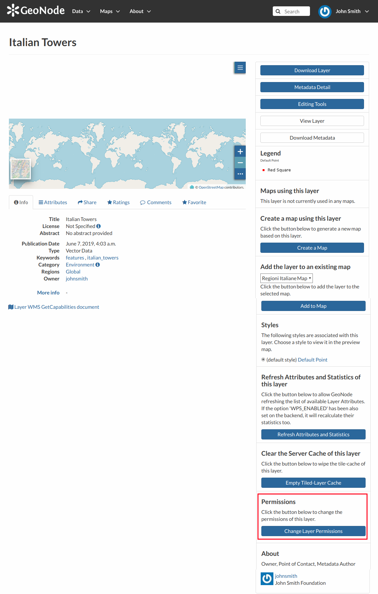
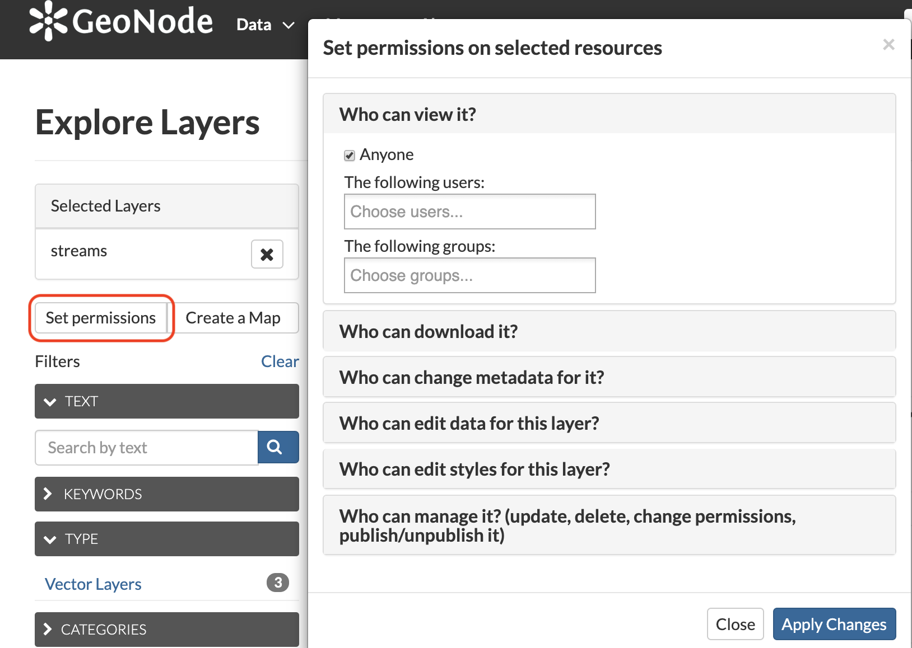

.. _permissions:

===========
Permissions
===========

| Permissions in GeoNode are set per resource, where a resource can be a layer, a map, a document or a service. The way the permissions are set is the same for all of them.

.. warning::

  GeoNode has a set of default permissions that are applied on resource creation **when** you don't explicitly declare them.
  This is particularly relevant when creating and saving a map, where you won't have the possibility to set the its permissions during the creation phase.
  GeoNode can be tuned to make sure that by default the new created resource are not public, this can be done by changing two settings, see `Default view permissions <../settings/index.html#default-anonymous-view-permission>`_ and `Default download permissions <../settings/index.html#default-anonymous-download-permission>`_

Single Resource permissions
---------------------------

| Resource permissions can be generally set from the *resource detail* page. The following figure shows how to open the dialog to set permissions on a layer, the same concept applies to documents and maps.

    *Change Layer Permissions*

| The dialog for setting the permission allow a granular selection of each permission type to be applied for users and/or groups, each permission type is grouped in tabs that are expanded on click.
| The text boxes have an autosuggest feature to help the compilation of user names and groups, it starts upon typing.

    *Resource Permission Dialogue*

You can set the following types of permissions:

* *View* allows to view the layer;
* *Download* allows to download the layer;
* *Change Metadata* allows to change the layer metadata;
* *Edit Data* allows to change attributes and properties of the layers features;
* *Edit Style* allows to change the layer style;
* *Manage* allows to update, delete, change permissions, publish and unpublish the layer.

.. warning:: When assigning permissions to a group, all the group members will have those permissions. Be careful in case of editing permissions.

Bulk permissions
----------------

| GeoNode offers the possibility to set permissions in bulk, this can be done in any *list* page.
| In order to set bulk permissions you have first to fill the *shopping cart* with the resources you are interested with by clicking the :guilabel:`+` button on the resource snippet.

    *Add Resource To Shopping Cart*

| Once happy with the selection you can click the :guilabel:`Set Permissions` button under the shopping cart to open the permissions dialogue that will apply the chosen permission to all selected resources.

    *Sopping Cart Permissions*
