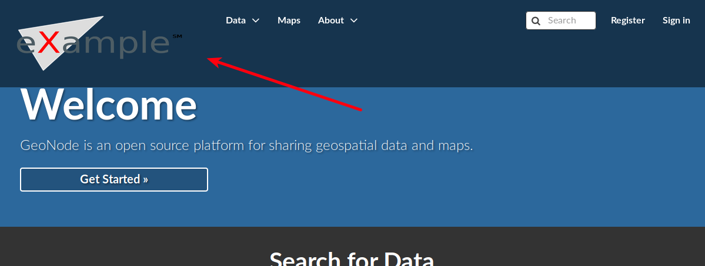
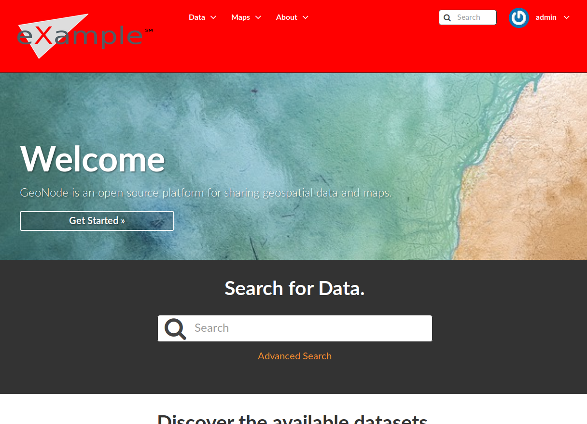

GeoNode Themes
==============

| We have already explained in :ref:`simple-theming` how to change the GeoNode theme directly from the *Admin Interface*.
  This is an easy way for customizing GeoNode appearance but, in some cases, you might want to have more control on it.
| In those cases, you have to venture into the code and it is highly recommended to use a GeoNode Project and customize it instead of the GeoNode default HTML/CSS code.
  See the following sections to learn more about that.

Theming your GeoNode Project
============================

There are a range of options available to you if you want to change the default look and feel of your :ref:`geonode-project`.
Since GeoNode’s style is based on `Bootstrap <https://getbootstrap.com/>`_ you will be able to make use of all that Bootstrap has to offer in terms of theme customization.
You should consult Bootstrap’s documentation as your primary guide once you are familiar with how GeoNode implements Bootstrap and how you can override GeoNode’s theme and templates in your own project.

Logos and graphics
^^^^^^^^^^^^^^^^^^

GeoNode intentionally does not include a large number of graphics files in its interface.
This keeps page loading time to a minimum and makes for a more responsive interface.
That said, you are free to customize your GeoNode’s interface by simply changing the default logo, or by adding your own images and graphics to deliver a GeoNode experience the way you envision it.

Your GeoNode project has a directory already set up for storing your own images at ``<my_geonode>/static/img``.
You should place any image files that you intend to use for your project in this directory.

Let’s walk through an example of the steps necessary to change the default logo.

#. Change to the :file:`img` directory:

   .. code-block:: console

      $ cd <my_geonode>/static/img

#. If you haven't already, obtain your logo image. The URL below is just an example, so you will need to change this URL to match the location of your file or copy it to this location:

   .. code-block:: console

      $ sudo wget https://upload.wikimedia.org/wikipedia/commons/thumb/a/ac/Service_mark.svg/500px-Service_mark.svg.png
      $ sudo chown -Rf geonode: .

#. Change to the :file:`css` directory:

   .. code-block:: console

      $ cd ../../..

#. Override the CSS that displays the logo by editing :file:`<my_geonode>/static/css/site_base.css` with your favorite editor and adding the following lines, making sure to update the width, height, and URL to match the specifications of your image.

   .. code-block:: console

      $ sudo vi site_base.css

   .. code-block:: css

      .navbar-brand {
          width: 350px;
          height: 80px;
          background: transparent url("../img/500px-Service_mark.svg.png") no-repeat;
          background-size: 300px 70px;
          background-position-y: center;
      }

#. Restart your GeoNode project and look at the page in your browser:

   .. code-block:: console

      $ cd /home/geonode
      $ sudo rm -Rf geonode/geonode/static_root/*
      $ cd my_geonode
      $ python manage.py collectstatic
      $ sudo service apache2 restart

   .. note:: It is a good practice to cleanup the **static_folder** and the Browser Cache before reloading in order to be sure that the changes have been correctly taken and displayed on the screen.

Visit your site at http://localhost/ or the remote URL for your site.

   *Custom logo*

You can see that the header has been expanded to fit your graphic.
In the following sections you will learn how to customize this header to make it as you want.

.. note:: You should commit these changes to your repository as you progress through this section, and get in the habit of committing early and often so that you and others can track your project on GitHub.
          Making many atomic commits and staying in sync with a remote repository makes it easier to collaborate with others on your project.

Cascading Style Sheets
^^^^^^^^^^^^^^^^^^^^^^

In the last section you already learned how to override GeoNode’s default CSS rules to include your own logo.
You are able to customize any aspect of GeoNode’s appearance this way.
In the last screenshot, you saw that the main area in the homepage is covered up by the expanded header.

First, we’ll walk through the steps necessary to displace it downward so it is no longer hidden, then change the background color of the header to match the color in our logo graphic.

#. Reopen :file:`<my_geonode>/static/css/site_base.css` in your editor:

  .. code-block:: console

      $ cd /home/geonode/my_geonode/my_geonode/static/css
      $ sudo vi site_base.css

#. Add the following CSS rules to consider the expanded header height:

  .. code-block:: css

      #wrap {
          margin-top: 100px !important;
          padding-top: 0px;
      }

#. Add a rule to change the background color of the header to match the logo graphic:

  .. code-block:: css

      .navbar-inverse {
          background-color: #ff0000 !important;
      }

#. Add a background image for the *hero* section:

  .. code-block:: css

    .jumbotron {
        background: url("https://cdn.pixabay.com/photo/2017/09/16/16/09/sea-2755908_960_720.jpg") no-repeat !important;
        background-size: cover !important;
    }

#. Your project CSS file should now look like this:

  .. code-block:: css

     .navbar-brand {
         width: 350px;
         height: 150px;
         background: transparent url("../img/500px-Service_mark.svg.png") no-repeat;
         background-size: 300px 100px;
         background-position-y: center;
     }

     #wrap {
         margin-top: 100px !important;
         padding-top: 0px;
     }

     .navbar-inverse {
         background-color: #ff0000 !important;
     }

     .jumbotron {
         background: url("https://cdn.pixabay.com/photo/2017/09/16/16/09/sea-2755908_960_720.jpg") no-repeat !important;
         background-size: cover !important;
     }

#. Collect the static files into STATIC_ROOT, restart the development server and reload the page:

   .. code-block:: console

      $ python manage.py collectstatic
      $ sudo service apache2 restart

   *CSS override*

You can continue adding rules to this file to override the styles that are in the GeoNode base CSS file which is built from `base.less <https://github.com/GeoNode/geonode/blob/master/geonode/static/geonode/less/base.less>`_.

.. note:: You may find it helpful to use your browser's development tools to inspect elements of your site that you want to override to determine which rules are already applied. See the screenshot below.

  .. figure:: img/inspect_element.png
     :align: center

     *Screenshot of using browser debugger to inspect the CSS overrides*

Templates and static pages
^^^^^^^^^^^^^^^^^^^^^^^^^^

Now that we have changed the default logo and adjusted our main content area to fit the expanded header, the next step is to update the content of the homepage itself.
Your GeoNode project includes two basic templates that you will use to change the content of your pages.

The file :file:`site_base.html` (in :file:`<my_geonode>/templates/`) is the basic template that all other templates inherit from and you will use it to update things like the header, navbar, site-wide announcement, footer, and also to include your own JavaScript or other static content included in every page in your site.
It's worth taking a look at `GeoNode's base file on GitHub <https://github.com/GeoNode/geonode/blob/master/geonode/templates/base.html>`_.
You have several blocks available to you for overriding, but since we will be revisiting this file in future sections of this guide, let's just look at it for now and leave it unmodified.

Open :file:`<my_geonode>/templates/site_base.html` in your editor:

.. code-block:: console

    $ cd /home/geonode/my_geonode/my_geonode/templates
    $ sudo vi site_base.html

You will see that it extends from :file:`base.html`, which is the GeoNode template referenced above and it currently only overrides the ``extra_head`` block to include our project's :file:`site_base.css` which we have modified in the previous section.

.. code-block:: html

    
    
          <link href="{{ STATIC_URL }}css/site_base.css" rel="stylesheet"/>
    

You can see on `line 189 of the GeoNode base.html template <https://github.com/GeoNode/geonode/blob/master/geonode/templates/base.html#L189>`_ that this block is included in an empty state and is set up specifically for you to include extra CSS files as your project is already set up to do.

| The file :file:`site_index.html` is the template used to define your GeoNode project's homepage.
  Let's actually override this template.
| It extends GeoNode's default :file:`index.html` template and gives you the option to override specific areas of the homepage like the *hero area*, but it also allows you leave other sections as they are.
  You are of course free to override the sections which you prefer, the following steps give you an example.

1. Open :file:`<my_geonode>/templates/site_index.html` in your editor.

2. Edit the first ``<h1>`` element inside the ``
`` to say something other than "Welcome":

  .. code-block:: html

    <h1>{{custom_theme.jumbotron_welcome_title|default:_("GeoNode Project Example")}}</h1>

  .. warning:: Pay attention to the ``custom_theme.jumbotron_welcome_title`` part, if you delete it you will cannot use the "admin-based" theme customization option (see :ref:`simple-theming`)

3. Edit the introductory paragraph to say something about your GeoNode project:

  .. code-block:: html

     

         
{{custom_theme.jumbotron_welcome_content|default:_("This GeoNode has been customized through my GeoNode Project.")}}

     

  .. warning:: Take care of the ``custom_theme.jumbotron_welcome_content`` if you are using the "admin-based" theme customization option (see :ref:`simple-theming`)

4. Your edited ``site_index.html`` file should now look like this:

  .. code-block:: html

    
    

    
        This is where you can override the hero area block. You can simply modify the content below or replace it wholesale to meet your own needs.
    

    
        

            

                <h1>{{custom_theme.jumbotron_welcome_title|default:_("GeoNode Project Example")}}</h1>
                

                
{{custom_theme.jumbotron_welcome_content|default:_("This GeoNode has been customized through my GeoNode Project.")}}

                
                    

                        <a class="btn btn-default btn-lg" target="_blank" role="button"
                          href="{{custom_theme.jumbotron_cta_link|default:_('http://docs.geonode.org/en/2.10.x/usage/')}}">
                            {{custom_theme.jumbotron_cta_text|default:_("Get Started &raquo;")}}
                        </a>
                    

                
            

        

    

5. Collect the static files into STATIC_ROOT, restart the development server and reload the page to see the changes:

  .. code-block:: console

     $ python manage.py collectstatic
     $ sudo service apache2 restart

  .. figure:: img/customized_geonode_project_home.png
    :align: center

    *Customized Geonode Project Home Page*

Other theming options
^^^^^^^^^^^^^^^^^^^^^

You are able to change any specific piece of your GeoNode project’s style by adding CSS rules to site_base.css, but since GeoNode is based on Bootstrap, there are many pre-defined themes that you can simply drop into your project to get a whole new look.
This is very similar to `WordPress <https://wordpress.com/>`_ themes and it is a powerful and easy way to change the look of your site without much effort.

Bootswatch
~~~~~~~~~~

From `Bootswatch <https://bootswatch.com/>`_ you can download ready-to-use themes for Bootstrap-based website.

.. warning:: Currently GeoNode uses the 3.3.7 version of Bootstrap, so `suitable Bootswatch themes <https://github.com/thomaspark/bootswatch/releases/tag/v3.3.7>`_ should have been built for the same version.

The following steps will show you how to use a theme from Bootswatch in your own GeoNode Project.

1. Downoload the `Bootswatch themes for Bootstrap v3.3.7 archive <https://github.com/thomaspark/bootswatch/releases/tag/v3.3.7>`_ and extract it on some folder in your disk.

2. Select a theme (in this example we will use *Sandstone*) and copy the ``bootstrap.css`` file inside the theme folder to the ``<my_geonode>/static/css`` (the static folder of your GeoNode Project).

3. Update the ``site_base.html`` template to include this file. It should now look like this:

  .. code-block:: console

      $ cd <my_geonode>/templates
      $ sudo vi site_base.html

  .. code-block:: html

      
      
          <link href="{{ STATIC_URL }}css/site_base.css" rel="stylesheet"/>
          <link href="{{ STATIC_URL }}css/bootstrap.css" rel="stylesheet"/>
      

5. Collect the static files into STATIC_ROOT, restart the development server and reload the page:

  .. code-block:: console

     $ python manage.py collectstatic
     $ sudo service apache2 restart

  .. figure:: img/bootswatch_theme.png
    :align: center

    *Bootswatch Theme for the Geonode Project*
