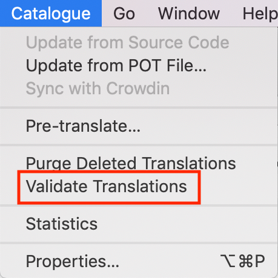

Contribute to Translations
==========================

Behind the scenes, GeoNode is using a software called GNU gettext further text-based translation files (django.po and djangojs.po) for translating content.  If you'd like to know more about how all of this works you'll find a full description at the  `Django Docs 
<https://docs.djangoproject.com/en/2.2/topics/i18n/translation/>`_.
Following will concentrate on what is needed for edit existing or contribute a new translation.

Download the translation File
^^^^^^^^^^^^^^^^^^^^^^^^^^^^^

All language files live in a specific subfolder called after their `iso code <https://en.wikipedia.org/wiki/List_of_ISO_639-1_codes/>`_  within the `locale folder <https://github.com/GeoNode/geonode/tree/master/geonode/locale/>`_.
For example, for French, the main translation file called django.po can be downloaded from `here <https://github.com/GeoNode/geonode/blob/master/geonode/locale/fr/LC_MESSAGES/django.po/>`_.

Next, to download the language file, we need to install an OpenSource Editor called "poedit" for editing from: https://poedit.net/download 

Translation process
^^^^^^^^^^^^^^^^^^^
Make a copy of the file before starting the translation so that you can revert in case of errors.

After installing 'poedit', you should be able to double click on the '.po' file to open it. Poedit’s interface should look similar to the one shown in the picture below:

Identifying translation issues
^^^^^^^^^^^^^^^^^^^^^^^^^^^^^^

From the 'poedit' menu 'View', make sure that 'Entries with Errors first' is checked:

Next click on 'Validate Translations' from the 'Catalogue' menu:

'Poedit' will place translations which may require additional consideration on top of the list.
A warning mark means that the interpretation might be not entirely consistent with the original phrase. This is not necessarily an error, just a warning asking the user to double check. 

Following to marked phrases, 'Poedit' will show untranslated sentences. When clicking on one, it can be translated through the bottom panel.

During translation pay special attention to the button saying 'needs work'. In case this button is checked, the phrase will be marked as 'fuzzy' and ignored in GeoNode.

Saving translations
^^^^^^^^^^^^^^^^^^^
As soon as the translation is complete, it must be saved and compiled.
Saving is straightforward. All you have to do is clicking the 'Save' button from the top menu.

As a last step we compile the file. Compiling the translation means to create a binary ".mo" file out of the edited ".po" file. To do so, click on "Compile to MO"

Poedit will ask where to write the ".mo" file to, by default, this is the same folder as the edited '.po' resides in. The '.mo' file can be overwritten if necessary.

Push translations to the repository
^^^^^^^^^^^^^^^^^^^^^^^^^^^^^^^^^^^

For sharing our updates, we must upload the files to GeoNode’s GitHub repository. 
Go to the correct file position which, in case for French is: 
https://github.com/GeoNode/geonode/tree/master/geonode/locale/fr/LC_MESSAGES

Click on "Upload Files"

Drag the updated files into the Upload form, and write a title/description of the changes

Click on "Create a new branch for this commit…" and then click on the green button.

.. figure:: img/github_commit.png
    :align: center
    :width: 680px
    :alt: drag files

The last step will create a `PULL REQUEST` which can be reviewed and then approved by a developer.

Activate updated translation at your server
^^^^^^^^^^^^^^^^^^^^^^^^^^^^^^^^^^^^^^^^^^^

Once the files have been pushed to GitHub, it will be necessary to update your server to respect changed files.

At this time, this can be done only by an administrator. From the server 'shell' following commands need to be executed:

.. code-block:: shell

 	workon geonode
	cd /opt/geonode
	DJANGO_SETTINGS_MODULE=geonode.settings python -W ignore manage.py collectstatic --noinput
	sudo service uwsgi restart
 

Texts not listed in  .po files
^^^^^^^^^^^^^^^^^^^^^^^^^^^^^^
In case you find a template output without corresponding translation you can add it as follows:

Identify the corresponding template file which is responsible for outputting the text. Add a ```` tag. Save the template file and run the following:

.. code-block:: shell

	django-admin makemessages -l en -d django -e "html,txt,py" -i docs 
	django-admin makemessages -l en -d djangojs -e "js" -i docs -i node_modules -i lib 
	

This will update the english .po file. also to update the language which should be edited by settings the ``-l fr`` parameter. Continue with updating the .po file as described above.
