Monitoring
==========

Internal Monitoring Application (geonode.monitoring)
----------------------------------------------------

.. note:: This application requires MaxMind's GeoIP database file.

Base concepts and objects
~~~~~~~~~~~~~~~~~~~~~~~~~

GeoNode monitoring is a configurable monitoring application, that allows internal resources and hardware resources monitoring for GeoNode installations, including GeoServer deployments.

Monitoring application is configurable, so different deployment scenarios could be handled - from GeoNode and GeoServer running on single host, through distributed installations, where GeoServer is deployed to several hosts.

Monitoring application uses three base entity classes to describe elements of reality: ``Host``, ``Service Type`` and ``Service``.

* ``Host`` is an object describing physical (or virtual) instance of operating system on which GN or GS is running.
  This object exists only for grouping and is not used directly by monitoring.

* ``Service Type`` is a description of kind of Service. Depending on service type, different metrics are stored, and different data
  collection mechanisms are used. Additionally, for system monitoring, it's not conducted directly, but with GeoNode or GeoServer as
  monitoring agent. That means, no additional software installation is needed to monitor system, but also, hosts that don't have GeoNode
  or GeoServer installed, won't be monitored. There are four service types:

  * ``hostgeonode``, ``hostgeoserver`` - those types describe system monitoring probes that are running with GeoNode or GeoServer respectively,

  * ``geonode``, ``geoserver`` - application-level probes that monitor one specific GeoNode or GeoServer instance.

* ``Service`` describes one specific instance of probe, either host-level or application-level.
  Service references Host and Service Type. Each service must be named, and name should be system-wide unique.

As mentioned above, each ``Service Type`` keeps a set of ``metrics``, specific for that type.
A ``metric`` is a description of measured value, for example: number of requests, response size or time, cpu usage, free memory etc.
Each ``Service Type`` has it's own metrics set. Metric value may be either value counter (like country of user),
numeric counter (like number of requests) or rate (like bytes in/out on network interface).

Besides metric data, monitoring will also store exception information for exceptions that were captured during request handling.

Data are collected periodically (at most every 1 minute), aggregated and stored in aggregated form.
User can see data from predefined relative periods (last minute, last 10 minutes, last hour, last day, last week).

User can enable and configure automated checks, which will be run after each collection/aggregation cycle, and will emit notifications
if metric values in that run exceed configured thresholds.

Analytics
~~~~~~~~~

GeoNode monitoring application makes also available information about resources usage at user level.

Those information are collected whenever an event occurs about some resource.
Events can be of different types (``EventType``) which refer to common user activities on resources (upload, view, download, etc.).
Those data are stored using a dedicated ``metric`` and aggregated based on a configurable granularity, depending on the time interval considered and the wanted resolution.

So the analytics client, once defined a time interval and a time frame, can retrieve stats such as:

- total number of unique visitors;
- number of unique visitors who trigger a specific type of event;
- number of unique visitors who trigger events on some resource type;
- number of unique visitors in a given country;
- number of unique visitors who trigger events on some specific resource;
- number of unique visitors considering a combination of multiple conditions (for example an event type on some resource type).

Installation
~~~~~~~~~~~~

.. warning:: This plugin requires a Potgresql DB backend enabled

* ensure ``UTC`` Timezone to your DB

    .. code-block:: python

        psql -c 'set timezone=UTC;'

* enable `MONITORING_ENABLED <../../basic/settings/index.html#monitoring-enabled>`_ flag and ensure that following code is in your settings:

.. code-block:: python

    # Settings for MONITORING plugin
    CORS_ORIGIN_ALLOW_ALL = ast.literal_eval(os.environ.get('CORS_ORIGIN_ALLOW_ALL', 'False'))
    GEOIP_PATH = os.getenv('GEOIP_PATH', os.path.join(PROJECT_ROOT, 'GeoIPCities.dat'))
    MONITORING_ENABLED = ast.literal_eval(os.environ.get('MONITORING_ENABLED', 'True'))

    MONITORING_CONFIG = os.getenv("MONITORING_CONFIG", None)
    MONITORING_HOST_NAME = os.getenv("MONITORING_HOST_NAME", HOSTNAME)
    MONITORING_SERVICE_NAME = os.getenv("MONITORING_SERVICE_NAME", 'local-geonode')

    # how long monitoring data should be stored
    MONITORING_DATA_TTL = timedelta(days=int(os.getenv("MONITORING_DATA_TTL", 7)))

    # this will disable csrf check for notification config views,
    # use with caution - for dev purpose only
    MONITORING_DISABLE_CSRF = ast.literal_eval(os.environ.get('MONITORING_DISABLE_CSRF', 'False'))

    if MONITORING_ENABLED:
        if 'geonode.monitoring' not in INSTALLED_APPS:
            INSTALLED_APPS += ('geonode.monitoring',)
        if 'geonode.monitoring.middleware.MonitoringMiddleware' not in MIDDLEWARE_CLASSES:
            MIDDLEWARE_CLASSES += \
                ('geonode.monitoring.middleware.MonitoringMiddleware',)

    # skip certain paths to not to mud stats too much
    MONITORING_SKIP_PATHS = ('/api/o/',
                             '/monitoring/',
                             '/admin',
                             '/lang.js',
                             '/jsi18n',
                             STATIC_URL,
                             MEDIA_URL,
                             re.compile('^/[a-z]{2}/admin/'),
                             )

    # configure aggregation of past data to control data resolution
    # list of data age, aggregation, in reverse order
    # for current data, 1 minute resolution
    # for data older than 1 day, 1-hour resolution
    # for data older than 2 weeks, 1 day resolution
    MONITORING_DATA_AGGREGATION = (
                                   (timedelta(seconds=0), timedelta(minutes=1),),
                                   (timedelta(days=1), timedelta(minutes=60),),
                                   (timedelta(days=14), timedelta(days=1),),
                                   )

    # privacy settings
    USER_ANALYTICS_ENABLED = ast.literal_eval(os.getenv('USER_ANALYTICS_ENABLED', 'False'))

* run

    .. code-block:: shell

        DJANGO_SETTINGS_MODULE=<project_name>.settings python manage.py migrate monitoring

    to apply db schema changes and insert initial data

* run

    .. code-block:: shell

        DJANGO_SETTINGS_MODULE=<project_name>.settings python manage.py updategeoip

    to fetch MaxMind's GeoIP database file. It will be written to path specified by `GEOIP_PATH` setting.

* run

    .. code-block:: shell

        DJANGO_SETTINGS_MODULE=<project_name>.settings python manage.py collect_metrics -n -t xml -f --since='<yyyy-mm-dd HH:mm:ss>'

    to create first metrics.

    .. warning::

        Replace ``<yyyy-mm-dd HH:mm:ss>`` with a real date time to start with.

* update ``Sites`` from admin; make sure it contains a correct host name
* do not forget to enable notifications and configure them from user profile

Enable the collect_metrics ``cron``
~~~~~~~~~~~~~~~~~~~~~~~~~~~~~~~~~~~

.. warning:: Here below you will find instructions for a Ubuntu 16.04/18.04 based machine, but the procedure is similar for other OSs.
             The basic concept is that you must allow the system to run the command every minute (**without -f and since**):

             .. code-block:: shell

                DJANGO_SETTINGS_MODULE=<project_name>.settings python manage.py collect_metrics -n -t xml

cront job
^^^^^^^^^

.. code:: python

    sudo crontab -e

.. code:: python

    # Add the following line at the bottom; this will run the supervisor command every minute
    * * * * * supervisorctl start geonode-monitoring

supervisor
^^^^^^^^^^

.. code:: python

    sudo apt install supervisor
    sudo service supervisor restart
    sudo update-rc.d supervisor enable

.. code:: python

    sudo vim /etc/supervisor/conf.d/geonode-monitoring.conf

.. code:: python

    [program:geonode-monitoring]
    command=<path_to_virtualenv>/geonode/bin/python -W ignore <path_to_your_project>/geonode/manage.py collect_metrics -n -t xml
    directory = <path_to_your_project>
    environment=DJANGO_SETTINGS_MODULE="<your_project>.settings"
    user=<your_user>
    numproc=1
    stdout_logfile=/var/log/geonode-celery.log
    stderr_logfile=/var/log/geonode-celery.log
    autostart = true
    autorestart = true
    startsecs = 10
    stopwaitsecs = 600
    priority = 998

.. code:: python

    sudo service supervisor restart
    sudo supervisorctl start geonode-monitoring
    sudo supervisorctl status geonode-monitoring

.. code:: python

    sudo vim /etc/hosts

.. code:: python

    127.0.0.1       localhost
    <public_ip>     <your_host.your_domain> <your_host>

    # The following lines are desirable for IPv6 capable hosts

Configuration
~~~~~~~~~~~~~

In order to have working monitoring, at least ``Service`` should be configured.
Let's assume following deployment scenario:

    * there's one machine, ``geo01``

    * ``geo01`` hosts both GeoNode and GeoServer (including PostgreSQL).

    * applications are served with nginx+uwsgi, on port 80, but they are reachable on ``localhost`` address.

    * GeoServer is served from ``/geoserver/`` path

    * GeoNode is served from ``/`` path

Here's step-by-step instruction how to create monitoring setup for deployment scenario:

1. Log in as admin, and go to admin section:

    .. image:: img/homepage-admin-link.png
        :alt: go to admin section

2. Go to **monitoring** section (or type ``/admin/monitoring/`` as a path in URL):

    .. image:: img/admin-monitoring-section.png
        :alt: go to admin/monitoring section

3. Go to **Hosts**:

    .. image:: img/admin-monitoring-hosts-services-underline.png
        :alt: go to admin/monitoring/hosts section

4. Click on **Add host +**:

    .. image:: img/admin-monitoring-add-host.png
        :alt: add host

5. Enter following information:
   * **host**: `localhost`
   * **ip**: `127.0.0.1`
   Note, that **host** value is arbitrary. You can enter other name if you like.
   Don't forget to save.

    .. image:: img/admin-monitoring-host.png
        :alt: added host

6. Go to **Services**:

    .. image:: img/admin-monitoring-hosts-services-underline.png
        :alt: go to admin/monitoring/services section

7. Click on **Add service +**:

    .. image:: img/admin-monitoring-add-service.png
        :alt: add service

8. Enter following information:

   * **name**: `local-geonode`
   * **host**: `localhost`
   * **service type**: `geonode`

    .. image:: img/admin-monitoring-service-local-geonode.png
        :alt: add geonode service

9. Add another **Service** Enter following information:

   * **name**: `local-system-geonode`
   * **host**: `localhost`
   * **service type**: `hostgeonode`
   * **url**: `http://localhost/` (should point to GeoNode home page)

    .. image:: img/admin-monitoring-service-local-system-geonode.png
        :alt: add hostgeonode service

10. Add another **Service** and enter following information:

   * **name**: `local-geoserver`
   * **host**: `localhost`
   * **service type**: `geoserver`
   * **url**: `http://localhost/geoserver/` (should point to GeoServer home page)

    .. image:: img/admin-monitoring-service-local-geoserver.png
        :alt: add geoserver service

To summarize, following entries should be created in admin/monitoring:

* Host: ``localhost``, with ip: 127.0.0.1

* Service: ``local-geonode``:
   * host ``localhost``
   * type ``geonode``

* Service: ``local-geoserver``:
   * url ``http://localhost/geoserver/``
   * host ``localhost``
   * type ``geoserver``

* Service: ``local-system-geonode``
   * url ``http://localhost/``
   * host ``localhost``
   * type ``hostgeonode``

Usage
~~~~~

Monitoring interface is available for superusers only. It's available in profile menu:

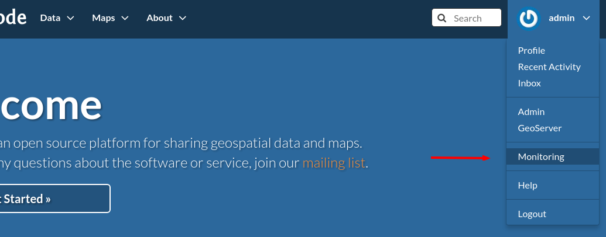

Dashboard
^^^^^^^^^

Main view offers overview of recent situation in GeoNode deployment.

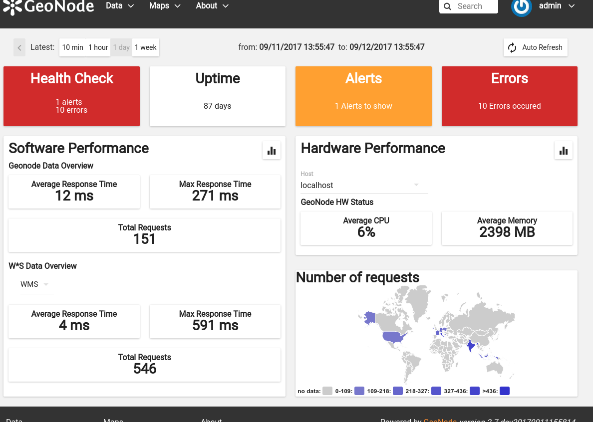

Top bar and indicators
^^^^^^^^^^^^^^^^^^^^^^

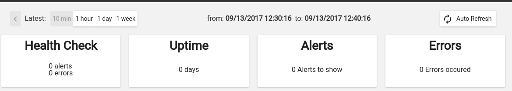

With top bar buttons User can:

 * go back from nested interface elements (charts, alerts, errors)
 * select time window from which data will be aggregated and shown (last 10 minutes, last 1 hour, last day or last week from now)
 * see what's currently used time window
 * enable/disable autorefresh

Below there are four main health indicators:

 * aggregated **Health Check** information.
    This element will be:

    * `green` if there is no alerts nor errors
    * `yellow` if there are alerts
    * `red` if there are errors

 * **Uptime** that shows GeoNode's system uptime.

 * **Alerts** shows number of notifications from defined checks. When clicked, Alerts box will show detailed information . See Notifications description for details.

 * **Errors** - shows how many errors were captured during request processing. When clicked, Errors box will show detailed list of captured errors. See Errros description for details.

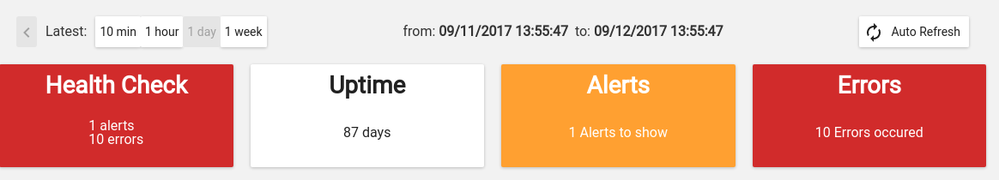

Indicators in error state

Software Performance
^^^^^^^^^^^^^^^^^^^^

Software Performance view shows GeoServer web service statistics, for all requests monitored and detailed, OWS-specific, per service type (WMS, WFS, OCS etc).

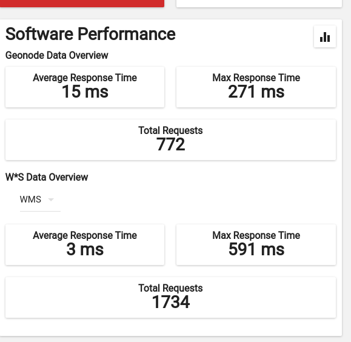

Clicking on

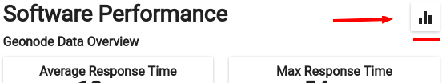

will show charts with data history for overall performance and per-OWS performance:

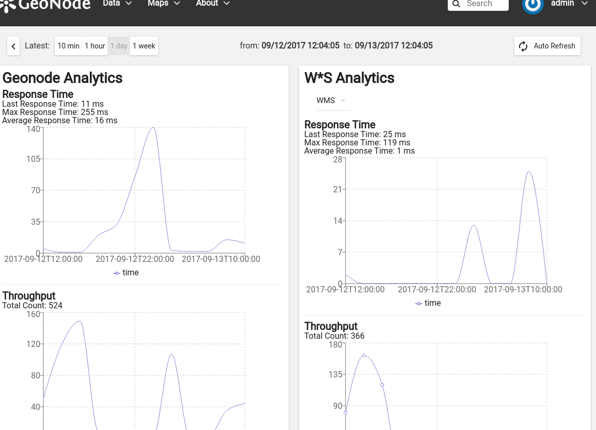

Hartware Performance
^^^^^^^^^^^^^^^^^^^^

Hardware performance box shows hardware usage statistics for selected host (monitored with any of hostgeonode or hostgeoserver type Service): % of CPU usage and average memory consumption. User can select from which host data will be presented.

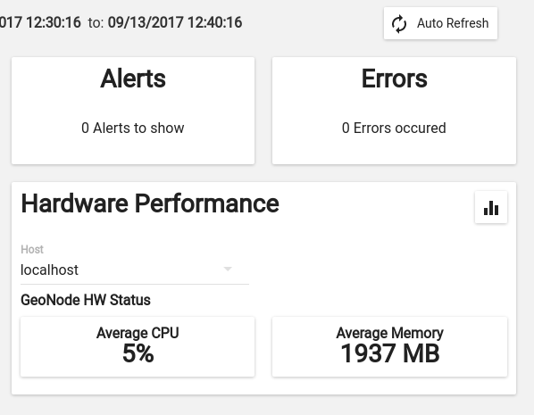

Clicking on

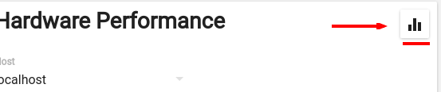

will show charts with data history for selected host and time period

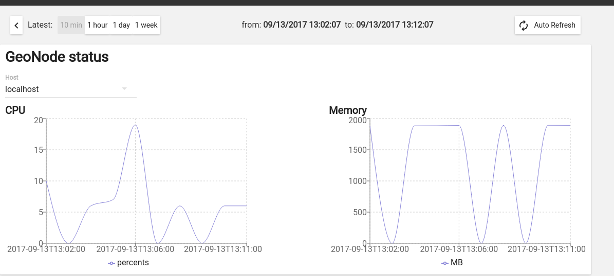

Errors
^^^^^^

Errors view will show list of captured errors in GeoNode and GeoServer. List contents is displayed for selected time window.

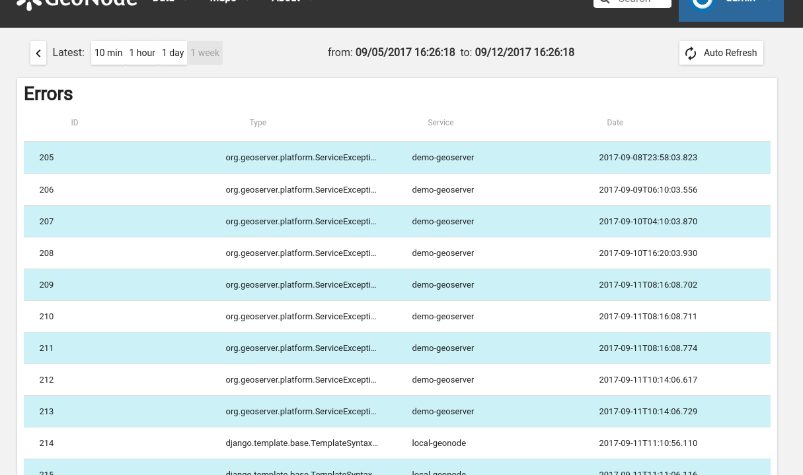

For each error, details are available:
 * error class, message and stack trace
 * basic request context (IP, path, user agent)

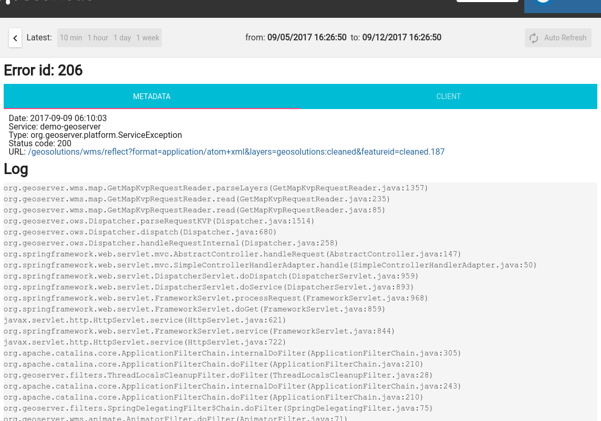

Alerts
^^^^^^

An alert is a descriptive information on situation when observed metric contains values outside allowed range (for example, response time is above 30 seconds, or no requests were served within last 30 minutes). Alerts are generated by notifications mechanism described below.

Alerts view will show list of alerts for current moment (alerts that were generated in past are not displayed here):

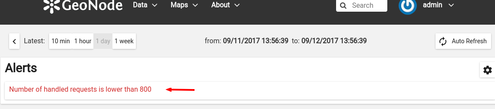

Each alert contains more descriptive information what is wrong:

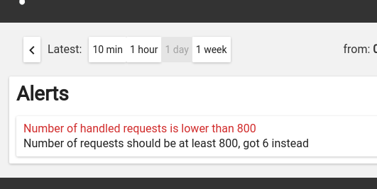

Notifications
+++++++++++++

Notification mechanism (not to be confused with notifications application in GeoNode) is a way to inform selected users about situations, where collected metric data would indicate a problem with deployment. Notifications are accessible from Alerts view:

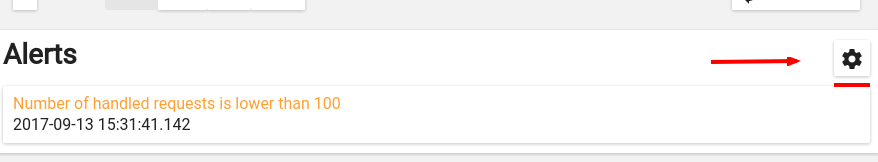

There can be several notification configurations available.

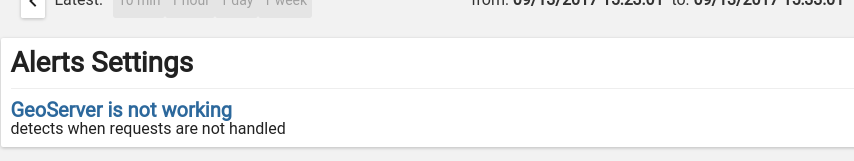

Each notification configuration contains two main elements:

 * list of email addressess which should be notified when alert is generated
 * list of checks (at least one check must be in invalid state to generate alert)

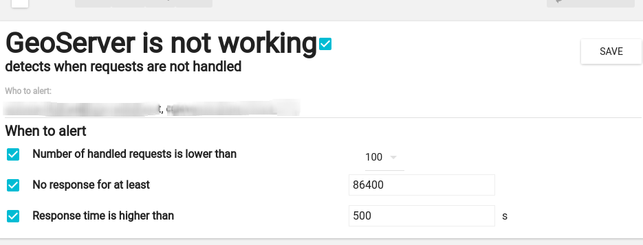

User can add arbitrary number of emails. Email address doesn't need to point to user registered in GeoNode instance. If email provided doesn't belong to any of users, alert will be send as a regular email. If email provided can be associated with specific user, notifications application (and thus, notification settings for that user) will be used to send alert.

Integration with GeoHealthCheck
-------------------------------

GeoNode can also be easily monitored with external tools, like `GeoHealthCheck <http://geohealthcheck.org/>`_. See `Documentation on adding resources <http://docs.geohealthcheck.org/en/latest/admin.html#adding-resources>`_ for details.
