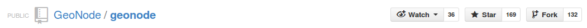
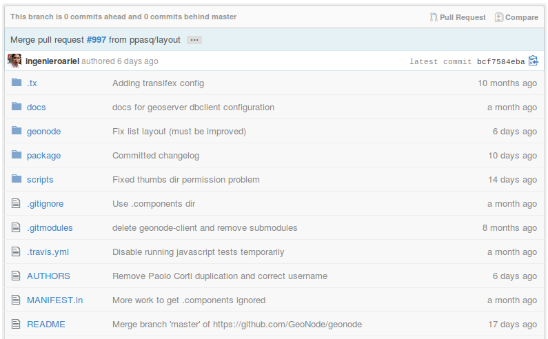
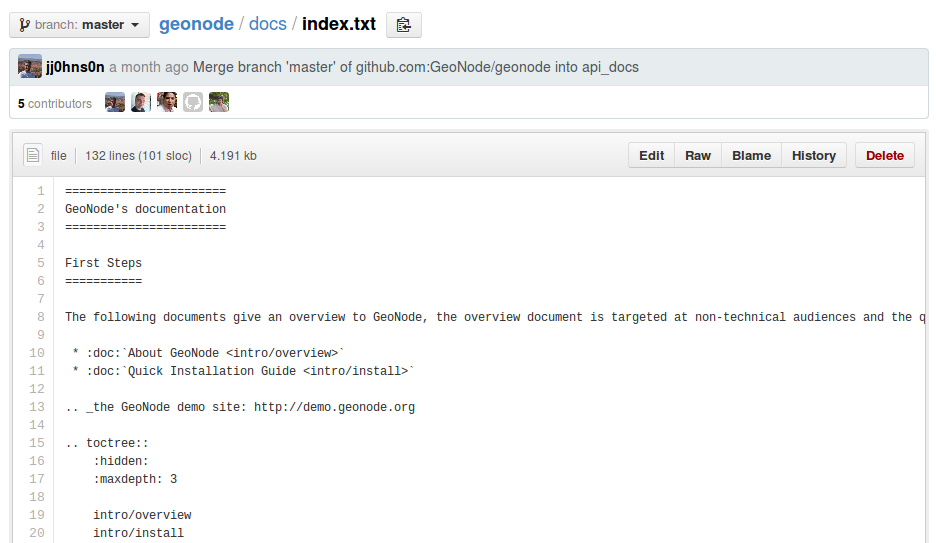
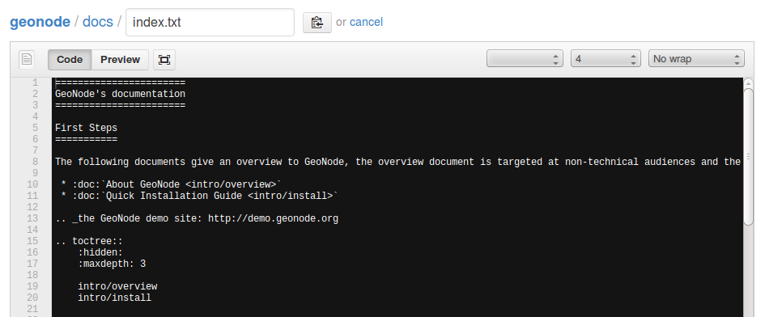
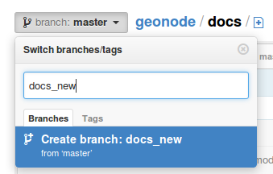
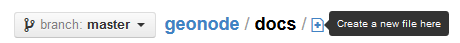
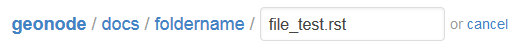
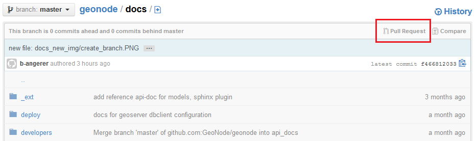

How to contribute to GeoNode Documentation
==========================================

If you feel like adding or changing something in the GeoNode documentation you are very welcome to do so. The documentation always needs improvement as the development of the software is going quite fast.

In order to be able to contribute to GeoNode documentation the following steps have to be done:

* Create an account on GitHub
* Fork our repository
* Edit the files in the */docs* directory
* Make pull requests

All these things can generally be done on the web you won't need to download something! But if you want to add images to your documentation you will have to do some more inital steps, because this can't
be done on the web. So when you are sure you just want to add some pieces of information and won't need images, just go ahead with this documentation.
To learn about how images can be added to your documentaion and what steps have to be done first, read this _link.

In the following part the steps will be explained more detailed.

Create an account on GitHub
---------------------------

The first step for you will be to create an account on GitHub. Just go to https://github.com/, find a username that suits you, enter your email and a password and hit *Sign up for GitHub*. 
Now you've signed in, you can type *geonode* into the searching area at the top of the website. On top of the search results you will find the repository *GeoNode/geonode*. By clicking on it you will be entering the repository and will be able to see all the folders and files that are needed for geonode. 
The files needed for the documentation can be found in */docs*. 

Fork a repository
------------------

In order to make changes to these files, you first have to fork this repository. On the top of the website you can see the following buttons:

Click on the button *Fork* at the top right and the *geonode* repository will be forked. You should now be able to see your repository *your_name/geonode*.
If you want to read more about how to fork a repository go to https://help.github.com/articles/fork-a-repo.

Edit files
----------

To make some changes to already exiting files or to create new files, go to your GitHub account. Under *repositories* you will find the geonode repository that you have forked. Click on it and you will again see all the folders and files GeoNode needs. 

Click on the folder *docs* and search for the file that you want to edit. If you found it, click on it and you will be able to see the content of this file.

To make changes to this file, hit the button *edit* on the right top. You can now make your changes or add something to the existing content. 

As you can see now, the documentation is written in *reStructeredText*, a lightweight markup language. To learn how to use it you should read the documentation that can be found here http://docutils.sourceforge.net/docs/user/rst/quickref.html.
By hitting the *preview* button you will be able to see how your text it is going to look like on the web. To save your changes, click on *Commit Changes* at the bottom of the site. Now you've saved the changes in your repository, but the original geonode repository still doesn't know anything about that!
In order to tell them that you have made some changes you have to send a *pull request* (as descriped below).

**Create a new branch**

If you are planning bigger changes on the structure of the documentation it is recommended to create a new branch and make your edits here. 
A new branch can be created by clicking on the button *branch: master* as shown here. 

Just type the name of your new branch, hit enter and your branch will be created. To learn more about branches it is recommended to take a look here http://git-scm.com/book/en/Git-Branching-What-a-Branch-Is.

*Remark*: Before you start editing make sure that you are in the right branch!

**Create a new folder/file**

If you want to add a completely new issue to the documentation, you have to create a new file (and maybe even folder).
As you will see there is no possibility to create an empty folder. You always have to create a new file as well! This can be 
done here

If you click on *create new file here* you can first subdirect to another folder by typing the *foldername* followed by /. If this folder
doesn't exist until now, one will be created. To create a new file in this folder just type *filename.rst* into the box and hit enter.
A short example on how to manage this is given here http://i.stack.imgur.com/n3Wg3.gif.

Now a black box will appear where you can add your comments. To save the file, hit the green *Commit New File* button at the bottom.

**Add images**

If you want to add some images to your documentation, you have to do some more initial steps. 

Add images
----------
To add images to your documentation you have to get your repository onto your local machine. So far you only had your repository on the web.
To be able to work on your local machine as well, you have to install *git*. To do so, type::

      sudo apt-get install git
      
(Usually git has already been installed during geonode installation)

Before you go further you should do some setup steps (can be found here: https://help.github.com/articles/set-up-git).

The next step is to fork the geonode repository. To do so, follow the instructions from _link. and return back if ready.
Now you should have successfully forked the geonode repository. But until now, it only exists on the web! To get your forked repository on to your machine, you have to *clone* it.
To do so, open a terminal, go to the folder where you want the projet to be and type::

      git clone https://github.com/GeoNode/geonode.git my_geonode

Now change the active directory to the newly cloned geonode directory using::

      cd my_geonode
       
To keep track of the original repository (the geonode repository where you forked from), you need to add a remote named *upstream*. Therefore type::

      git remote add upstream https://github.com/GeoNode/geonode.git
       
By typing::

      git fetch upstream
       
changes not present in your local repository will be pulled in without modifying your files.

Pull Request
------------

If you are done with your changes, you can send a pull request. This means, that you let the core developers know that you have done some changes and you would like them to review. They can hit accept and your changes will go in to the main line.
The *pull request* can be found here.

