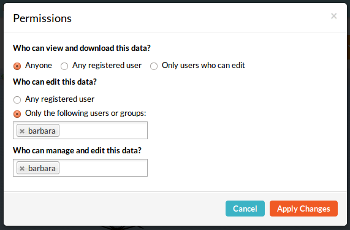
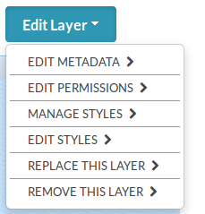

========================
Security and Permissions
========================

.. note:: This is mainly ment for administrators? (so far)

Geonode has the ability to restrict the access on your layers and maps, including the metadata and your uploaded documents.
This section will help you to understand which restrictions are possible and what do take care of while using them.
Generally it can be said that you can set permissions on all your uploaded data. But you have to be aware of some **special things**.
To understand how this permissions can be set, you have to know about the different kinds of users.

Für devs => link to geonode workshop about core models. (deeper into the materia => comes later!)

Users
-----
First of all it has to be said that there are basically two kind of useres in geonode:

* unregistered users (anonymous)
* registered users

An unregistered user is someone who is just visiting the site, but doesn't have any data uploaded yet. A registered user has
already done that. But there are even more kinds of registered users! A registered user can have one or more of those three status:

* superuser
* staff
* active
 
A superuser is usually generated directly after the installation of geonode via the terminal. When creating a *superuser* through 
the terminal it always has the status *active* and the status *staff* as well. It is also important to know 
that a superuser is a user that has all permissions without explicitly assigning them! That means that he is able to 
upload and edit layers, create maps etc. and can not be restricted from that! (**as far as I understood that!**) So the
superuser is basically the adminstrator, who knows and has access on everything.

The status *staff* only implies that a user with this status is able to attend the *Django Admin Interface* (maybe LINK!).
*Active* has no special meaning, it only says that there is a user. Instead of deleting this user, you could just delete
the status *active*, your user will still be remaining, but it won´t show up. This is the basic meaning of this status.

Basically there are three options to creat a user:

* terminal: Here you can only create a superuser
* geonode interface: A *normal* user will be created by signing up to geonode. It only has the status *active* so far! 
* django admin interface: A new user can be created as well as the status of an already existing user can be changed, e.g make a generic user a superuser.
 
Check out this (TUTORIAL) in order to go through this step by step.

Layers
------
As mentioned above, a superuser has access on all the uploaded data. In order to restrict other users from certain data, use
the superuser to change those permissions. Generally you have the following possibilies of permissions:

So there are permissions on:

* who can view and download
* who can edit
* who can edit and manage
 
The difference between *who can edit* and *who can edit and manage* is the fact, that only a user who is allowed to *edit and manage*
is able to change the permissions on this layer/map. (It should be that way but ther is still a problem => melden!!) 

Basically you can choose between

* Anybody
* Any registered user
* Only a certain user or group

If you allow a user to edit your layer, this user has the right to do the following actions:

* Edit metadata
* Edit styles
* Manage styles
* Replace the layer
* Remove the layer

This can also be seen here (instead of list, but image is wrong):

  
  .. todo:: EDIT PERMISSIONS HAS TO BE REMOVED!!
  
Now take a closer look on to the section *Edit Metadata*. All the following things can be edited in the metadata section:

* Owner
* Title
* Date
* Data type
* Edition
* Abstract
* Purpose
* Maintainance frequency
* Keywords region
* Restrictions
* Restrictions other
* Language
* Category
* Spatial representation type
* Temporal extent start
* Temporal extent end
* Supplemental information
* Distribution URL
* Distribution description
* Data quality statement
* Keywords
* Point of contact
* Metadata author
* Attributes (those can though not be changed!)

  .. todo:: eventually more detailed? can copy the descriptions as well.
  
The sections about editing and managing styles only include the possibility to change the existing styles of the layer and create new ones.

 .. note:: At the moment it is possible for any user, registered or unregistered, who is permitted to view and download a layer, to *Edit Styles*!

Any user who is permitted to edit your layer is also able to replace or even remove it!

Maps
----

Generally the same ... applies to maps, but here the opportunities of editing the map are fewer:

* Edit map metadata
* Set map thumbnail
* Remove the map

The sector *Edit metadata* is almost the same like in the layer's section, just that it has two options more:

* Metadata XML
* Thumbnail

In *Set map thumbnail* the thumbnail of the map can be set.

Documents
---------

The same permissions can be done on the documents. There's again a section on *Edit Metadata* and you could also *replace* 
or *remove* the document.

Groups
------
Groups are a generic way to apply permissions to more than one layer. 
Can this only be done in *Django Admin Interface*? => not working at the moment! (ref google groups jeff)

  .. todo:: not possible at the moment!

