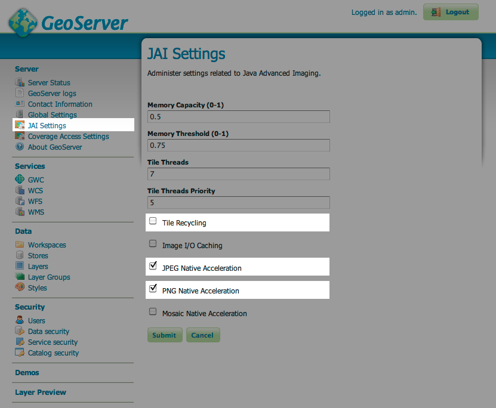
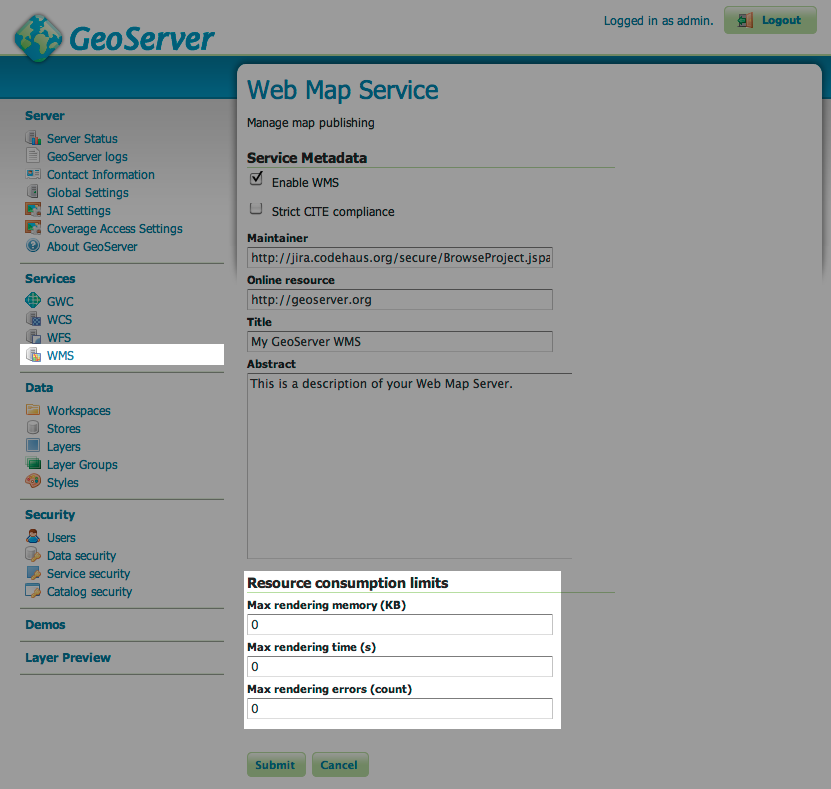

Configuring GeoNode for Production
==================================

This page documents recommendations for configuring GeoNode in production environments.

Creating a super user
---------------------

To create a superuser you can run::

    geonode createsuperuser

or, if you installed by source::

    source path/to/geonode/virtualenv/bin/activate
    django-admin.py createsuperuser --settings=geonode.settings

Configuring the correct DNS or IP address
-----------------------------------------

By default GeoNode runs in ``http://localhost/``, but when running in production in needs to know the public IP address or the DNS entry.
To configure it, edit the ``SITEURL`` setting in ``local_settings.py`` (which can be found either in your GeoNodePy/src/geonode folder or in ``/etc/geonode/local_settings.py`` if you used an automated installer.

Robot Exclusion File
--------------------

GeoNode has several views that require considerable resources to properly respond - for example, the download links on layer detail pages require GeoServer to dynamically generate output in PDF, PNG, etc. format.
Crawlers for web search engines such as Google may cause problems by quickly following many such links in succession.
In order to request that "robots" do not make requests directly to GeoServer, you can ensure that requests to ``/robots.txt`` return a text file with the following content::

    User-agent: *
    Disallow: /geoserver/
    Disallow: /geoserver-geonode-dev/
    Disallow: /geonetwork/

This will only affect automated web agents; web browsers in particular are unaffected.

Memory Management
-----------------

At the time of the GeoNode 1.0 release, the GeoNode manual recommended at least 4GB RAM for servers running GeoNode.
While 4GB *physical* RAM is sufficient, it is recommended that machines be configured with at least 6GB total *virtual* memory.
For example, a machine with 4GB physical RAM and 2GB swap space should be able to run GeoNode, but if you would like to run without a swapfile then you should configure the machine with at least 6GB RAM.

On Linux and MacOSX hosts, you can check the available RAM with the following command::

    $ free -m
                 total         used       free     shared    buffers     cached
    Mem:          6096         3863       2232          0          0          0
    -/+ buffers/cache:         3863       2232
    Swap:            0            0          0

The "total" column lists the available physical memory and swap space in megabytes; adding them together yields the amount of virtual memory available to the system.
In this example, there is no Swap space so that field is 0 and the available RAM on the system is 6096MB (6 GB). 

Configuring the Servlet Container
---------------------------------

GeoServer is the most resource intensive component of GeoNode.
There are some general notes on setting up GeoServer for production environments in the `GeoServer manual <http://docs.geoserver.org/stable/en/user/production/index.html>`_ .
However, the following are some GeoServer recommendations with GeoNode's specific needs in mind.

JVM Options
-----------

The JRE used with GeoNode should be that distributed by Oracle.
Others such as OpenJDK may work but Oracle's JRE is recommended for higher performance rendering.

Startup options should include the following::

    -Xmx1024M -Xms1024M -XX:MaxPermSize=256M \
        -XX:CompileCommand=exclude,net/sf/saxon/event/ReceivingContentHandler.startEvent

These can be specified using the ``CATALINA_OPTS`` variable in Tomcat's ``bin/catalina.sh`` file, or the ``JETTY_OPTS`` in Jetty's ``bin/jetty.sh`` file.

Constrain GeoServer Worker Threads
----------------------------------

While the JVM provides memory management for most operations in Java applications, the memory used for rendering (in GeoServer's case, responding to WMS GetMap requests) is not managed this way, so it is allocated in addition to the memory permitted by the JVM options above.
If GeoServer receives many concurrent requests, it may increase the memory usage significantly, so it is recommended to constrain the number of concurrent requests at the servlet container (ie, Jetty or Tomcat).

.. highlight:: xml

For Tomcat, you can edit ``conf/server.xml``.  By default, this file contains an entry defining a ContextHandler::

    <Connector port="8080" protocol="HTTP/1.1" 
        connectionTimeout="20000" 
        redirectPort="8443"/>

Add a ``maxThreads`` attribute to limit the number of threads (concurrent requests) to 50 (the default in Tomcat is 200)::

    <Connector port="8080" protocol="HTTP/1.1" 
        connectionTimeout="20000" 
        redirectPort="8443" maxThreads="50"/>

.. note:: This configuration is possible in Jetty as well but not yet documented in this manual.

Native JAI and JAI ImageIO
--------------------------

Using the native-code implementation of JAI and JAI ImageIO speeds up GeoServer, thereby requiring less concurrency at the same level of throughput.
The GeoServer manual contains `platform-specific instructions <http://docs.geoserver.org/stable/en/user/production/java.html#install-native-jai-and-jai-image-i-o-extensions>`_ for configuring JAI and JAI ImageIO.

GeoServer Configuration
-----------------------

There are a few controls to be set in the GeoServer configuration itself as well.

On the JAI Settings page
------------------------

   There are two considerations for the JAI settings.
   
      * Enable JPEG and PNG Native Acceleration to speed up the performance of WMS requests

      * Disable Tile Recycling as this optimization is less relevant on recent JVM implementations and has some overhead itself.

On the WMS Service page
-----------------------

   There is only one consideration for the Web Map Service page

     * Don't set the "Resource Consumption Limits."
       This sounds a bit counterintuitive, but these limits are implemented in an inefficient way such that unless resource-intensive requests are common on your server it is more efficient to avoid the limits.
       A better implementation of this feature is available for GeoServer 2.1 and will be incorporated in GeoNode 1.1.

Sitemaps Configuration
----------------------

GeoNode can automatically generate a sitemap suitable for submission to search
engines which can help them to index your GeoNode site more efficiently and 
effectively.

In order to generate the sitemap properly, the sites domain name must be set
within the sites framework. This requires that an admin user login to the
admin interface and navigate to the sites module and change example.com to the
actual domain name (and port if applicable). The admin interface can be accessed
at http://<host>:<port>/admin/sites/site/

It is possible to 'inform' google of changes to your sitemap. This is accomplished
using the ping_google management command. More information can be found here
http://docs.djangoproject.com/en/dev/ref/contrib/sitemaps/#django.contrib.sitemaps.ping_google
It is recommended to put this call into a cron (scheduled) job to update google periodically.
