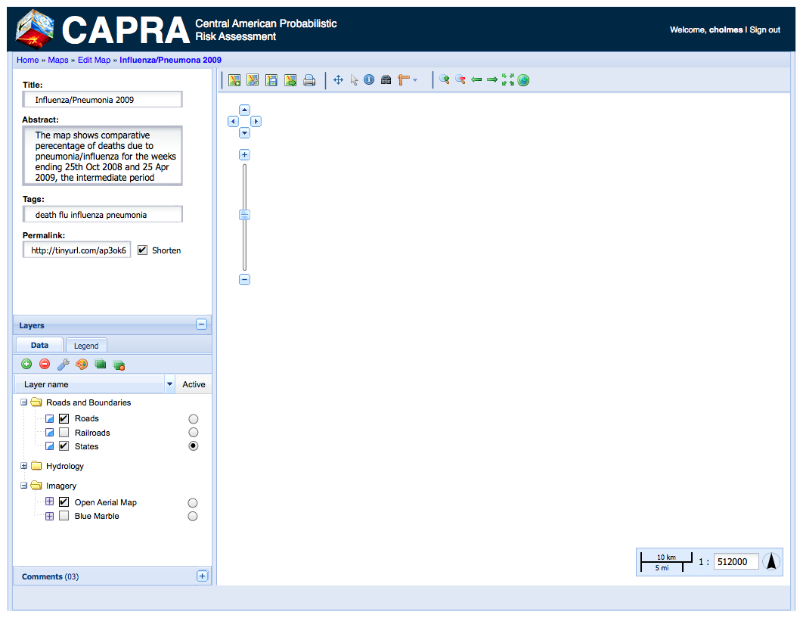

Map Viewer and Editor
=====================

The Map Viewer is currently implemented as a static HTML file.  For the current
round, we will be porting it to a Django template (to take advantage of code
reuse options provided by templating) as well as moving the map storage service
from a custom GeoServer extension to a Django application (described at
:doc:`../geonode-core/map-application`).

Older Specifications
--------------------

For previous rounds of CAPRA GeoNode development, the design and implementation
of the map viewer was done based on this mockup:

 
    The CAPRA map editor mockup from the first development iteration. Download 
    :download:`CAPRA_map_edit.png` for the full version.

Configuration 
-------------

JavaScript configuration objects for the mapping application should be
structured as follows::

    {
        about: {
            title: "GeoNode Demo Map",
            "abstract": "This is a demonstration of GeoNode, " +
                "an application for assembling and publishing web " +
                "based maps.  After adding layers to the map, use " +
                "the 'Save Map' button above to contribute your map " + 
                "to the GeoNode community.",
            contact: "For more information, contact <a href='http://opengeo.org'>OpenGeo</a>."
        },
        wms: {
            "capra": "http://capra.opengeo.org/geoserver/wms/",
            "un": "http://preview.grid.unep.ch:8080/geoserver/ows/"
        },
        map: {
            layers: [ {
                name: "overlay:CA",
                wms: "capra",
                group: "background"
            } ],
            center: [-84.7, 12.8],
            zoom: 5
        }
    }

.. todo:: Elaborate on the meaning of the map configuration options

In addition, the application itself should add options as appropriate to tie
into the Django services that accommodate it.  These options currently include::

    {
        proxy: "/proxy?url=",
        // a prefix that will be added to external URLs to side-step the 
        // same-origin policy

        rest: "/geoserver/rest/json"
        // the rest service endpoint used for saving and editing these maps
    }

