# Theming

GeoNode provides by default some theming options manageable directly from the Administration panel. Most of the time those options allow you to easily change the GeoNode look and feel without touching a single line of `HTML` or `CSS`.

As an `administrator`, go to `http://<your_geonode_host>/admin/geonode_themes/geonodethemecustomization/`.

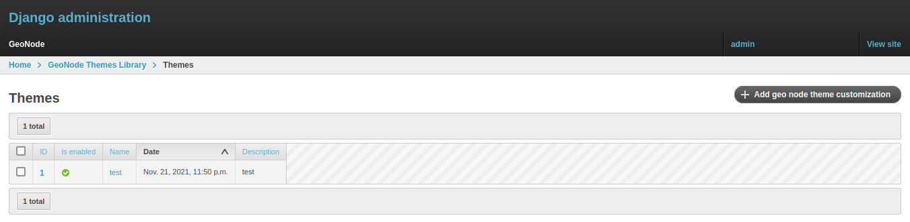{ align=center }
/// caption
*List of available Themes*
///

The panel shows all the available GeoNode themes, if any, and allows you to create new ones.

!!! Warning
    Only one theme at a time can be **activated** (aka *enabled*). By disabling or deleting all the available themes, GeoNode will turn the GUI back to the default one.

Editing or creating a new theme allows you to customize several properties.

At minimum, you need to provide a `Name` for the theme. Optionally, you can also specify a `Description`, which helps you better identify the type of theme you created.

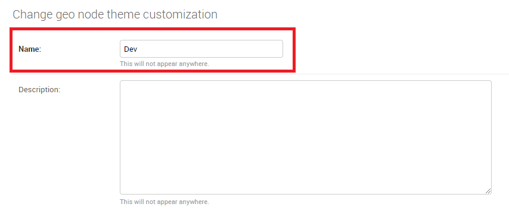{ align=center }
/// caption
*Theme Name and Description*
///

Just below the `Description` field, you will find the `Enabled` checkbox, which allows you to toggle the theme.

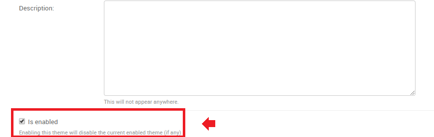{ align=center }
/// caption
*Theme Name and Description*
///

## Jumbotron and Get Started link

!!! Note
    Remember, every time you want to apply some changes to the theme, you **must** save the theme and reload the GeoNode browser tab.

    In order to quickly switch back to the Home page, you can just click the `VIEW SITE` link in the top-right corner of the Admin dashboard.

    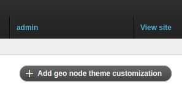{ align=center }

The next section allows you to define the first important theme properties. This part involves the GeoNode main page sections.

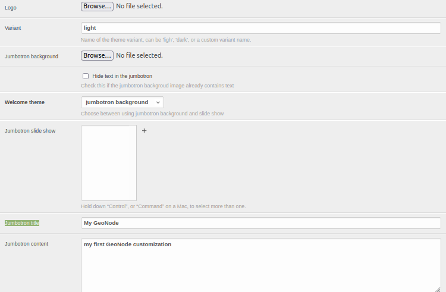{ align=center }
/// caption
*Jumbotron and Logo options*
///

By changing those properties as shown above, you can easily change your default home page from this:

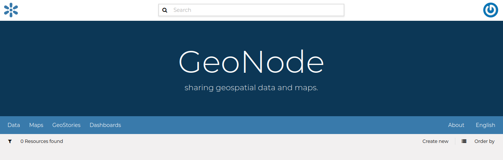{ align=center }
/// caption
*GeoNode Default Home*
///

to this:

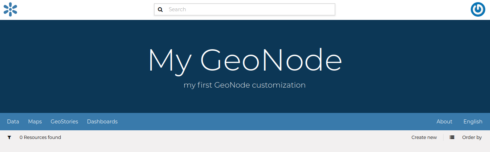{ align=center }
/// caption
*Updating Jumbotron and Logo*
///

It is also possible to optionally **hide** the `Jumbotron text`.

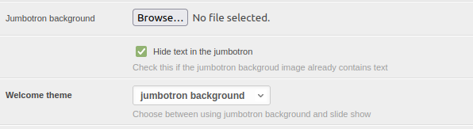{ align=center }

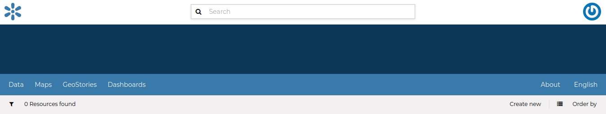{ align=center }
/// caption
*Hide Jumbotron text*
///

## Slide show

To switch between a slide show and a jumbotron, flip the value of the welcome theme from `slide show` to `jumbotron` and vice versa to display either a jumbotron with content or a slide show on the home page.

For example, to display a slide show, change the welcome theme from `jumbotron background`:

{ align=center }

to `slide show`:

{ align=center }

Before creating a slide show, make sure you have slides to select from in the multi-select widget.

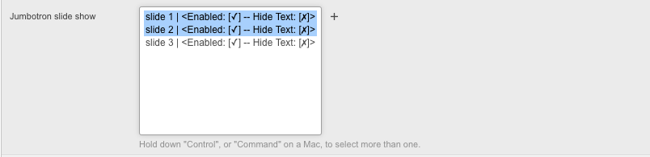{ align=center }

If no slides exist, click the plus (`+`) button beside the slide show multi-select widget to add a new slide.

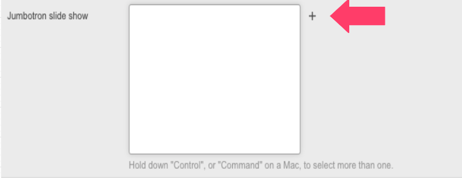{ align=center }

Fill in the slide name, slide content using Markdown formatting, and upload a slide image, which will be displayed when the slide is in view.

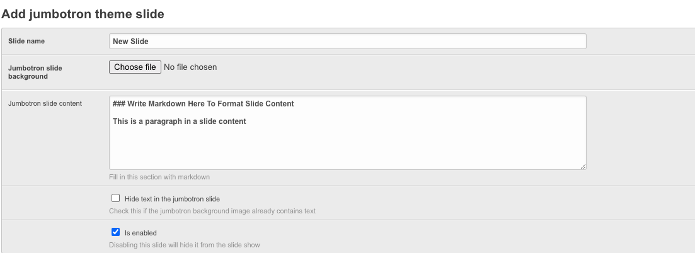{ align=center }

For slide images that already contain text, hide the slide content by checking the checkbox labeled `Hide text in the jumbotron slide` as shown below, then save the slide.

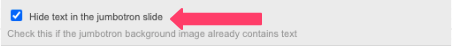{ align=center }

It is also possible to hide a slide from all slide show themes that use it by unchecking the checkbox labeled `Is enabled` as shown below.

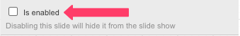{ align=center }

Selecting the above slide in a slide show and enabling the slide show using the `welcome theme` configuration will create a slide show with a slide as shown below:

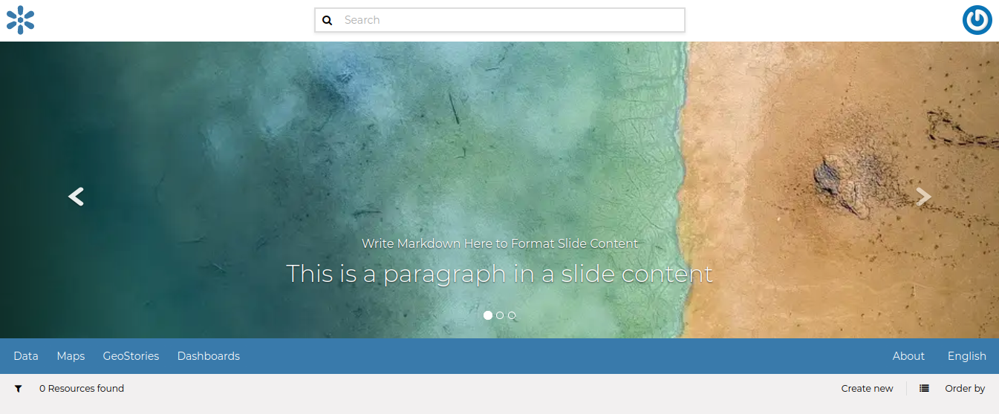{ align=center }

## Switching between different themes

If you have defined more themes, switching between them is as easy as `enabling` one and `disabling` the others.

Remember to save the themes every time and refresh the GeoNode home page in the browser to see the changes.

It is also important that there is **only one** theme enabled **at a time**.

To go back to the standard GeoNode behavior, just disable or delete all the available themes.
