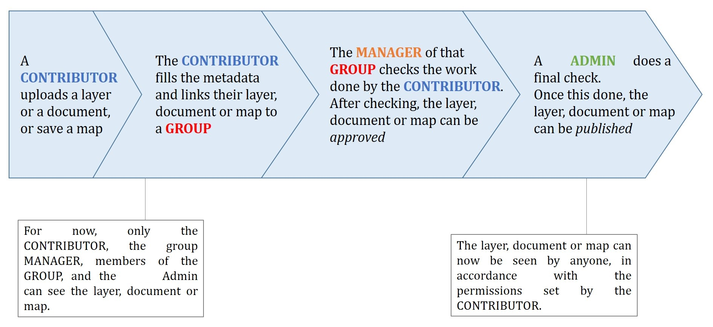

# Group based advanced data workflow

By default, GeoNode is configured to make every resource immediately available to everyone, meaning it is publicly accessible even to anonymous or non-logged-in users.

It is possible to change a few configuration settings to enable an advanced publication workflow.

With the advanced workflow enabled, your resources will not be automatically published, meaning they will not be visible and accessible to all contributors or users right away.

At first, your item is visible only to you, the manager of the group to which the resource is linked, the members of that group, and the GeoNode administrators.

Before being published, the resource follows a two-stage review process, as described below.

{ align=center }
/// caption
*From upload to publication: the review process on GeoNode*
///

## How to enable the advanced workflow

You need to adjust the GeoNode settings accordingly.

Please see the details of the following GeoNode `Settings`:

- [RESOURCE_PUBLISHING](../../setup/configuration/settings.md#resource_publishing)
- [ADMIN_MODERATE_UPLOADS](../../setup/configuration/settings.md#admin_moderate_uploads)
- [GROUP_PRIVATE_RESOURCES](../../setup/configuration/settings.md#group_private_resources)

In summary, when all the options above for the advanced workflow are enabled, a new upload behaves as follows:

- The **"unpublished"** resources are **hidden** from **anonymous users only**. **Registered users** can still access the resources if they have permission to do so.
- The **"unpublished"** resources remain hidden from users if the permission, see *Admin Guide section: 'Manage Permissions'*, is explicitly removed.
- During the upload, whenever the advanced workflow is enabled, the **owner's groups** are automatically allowed to access the resource, even if the **"anonymous"** flag has been disabled. Those permissions can be removed later.
- During the upload, the **managers** of the owner's groups associated with the resource are always allowed to edit the resource, just like they are admins for that resource.
- The **managers** of the owner's groups associated with the resource are allowed to **publish** the resources, not only to **approve** them.

## Change the owner rights in case of advanced workflow is on

After switching `ADMIN_MODERATE_UPLOADS` to `True` and once the resource is approved, the owner is no longer able to modify it. They will see a new `Request change` button on the resource detail page. After clicking it, a view with a short form is shown.

On this view, the user can write a short message explaining why they want to modify the resource.

This message is sent through the messaging and email system to the administrators.

After an administrator unapproves the resource, the owner is able to modify it again.

## The group Manager approval

Here, the role of the manager of the group to which your dataset, document, or map is linked is to check that the uploaded item is correct. In the case of a dataset or a map, this means checking that the chosen cartographic representation and style are appropriate and that the discretization is suitable.

The manager must also check that the metadata are properly completed and that the mandatory information, `Title`, `Abstract`, `Edition`, `Keywords`, `Category`, `Group`, and `Region`, is filled in.

If needed, the manager can contact the contributor responsible for the dataset, document, or map in order to report potential comments or request clarifications.

Members of the group can also take part in the review process and provide input to the person responsible for the dataset, document, or map.

When the manager considers that the resource is ready to be published, they should approve it. To do so, the manager goes to the resource detail page, then opens `Edit Metadata`.

In the `Settings` tab, the manager checks the `Approved` box, then updates the metadata and saves the changes.

Following this approval, the GeoNode administrators receive a notification informing them that an item is now waiting for publication.

## The publication by the GeoNode Administrator

Before the public release of an approved resource, the administrator of the platform performs a final validation of the item and its metadata, notably to check that it is in line with license policies.

If needed, the GeoNode administrator can contact the manager who approved the resource, as well as the person responsible for it.

Once the resource is validated, the item is made public by the administrator.

It can then be viewed, accessed, and downloaded in accordance with the `Permissions` set by the responsible contributor.

## Promotion, Demotion and Removal of Group Members

If the owner is a group manager, they have permission to edit, approve, and publish the resource.

When a group member is promoted to a manager role, they gain permission to edit, approve, and publish the resource.

When a group manager is demoted to a member role, they lose edit permission for the resource and remain with view and download permissions only.

When a member is removed from the group, they can no longer access the unpublished resource.
