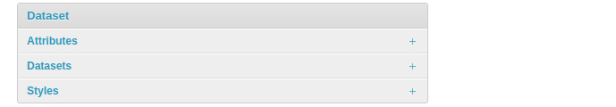
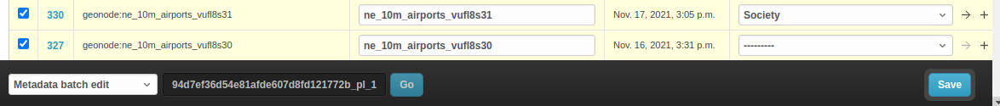
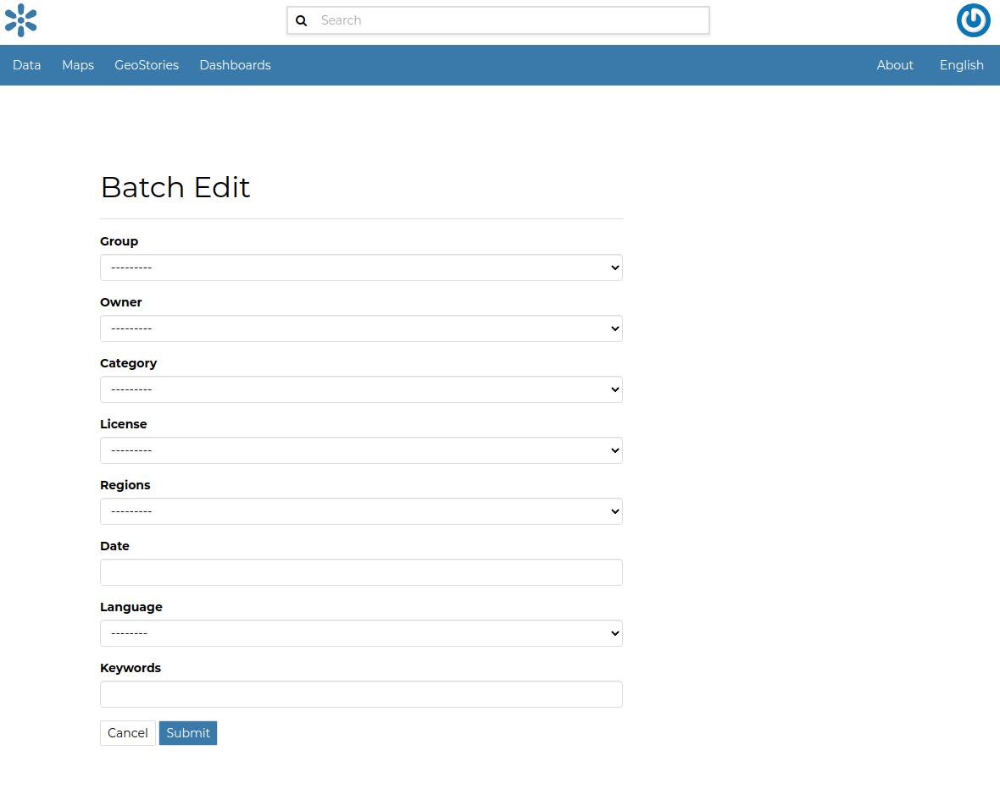
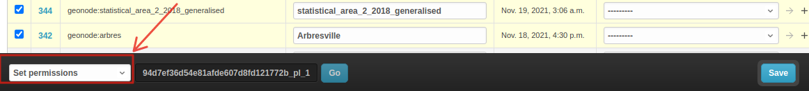

# Manage datasets using the admin panel

Some dataset information can be edited directly through the admin interface, although the best place to do that in GeoNode is `Dataset -> Metadata Edit`.

Clicking on the `Admin > Dataset > Datasets` link shows the list of available datasets.

{ align=center }

!!! Warning
    It is not recommended to modify the datasets' `Attributes` or `Styles` directly from the Admin dashboard unless you are fully aware of your actions.

The `Metadata` information can be changed for multiple datasets at once through the `Metadata batch edit` action. Select the datasets you want to edit in the batch and, at the bottom, choose the `Metadata batch edit` action, then click `Go`.

{ align=center }

This opens a form with the information you can edit in batch, as shown below.

{ align=center }

By clicking on a dataset link, a detail page opens that allows you to modify some of the resource information such as the metadata, keywords, title, and more.

!!! Note
    It is strongly recommended to always use the GeoNode resource `Edit Metadata` or `Advanced Metadata` tools in order to edit metadata information.

The `Permissions` can also be changed for multiple datasets at once through the `Set permissions` action.

{ align=center }

By clicking on a dataset link, a detail page opens that allows you to modify the permissions for the selected resource.
