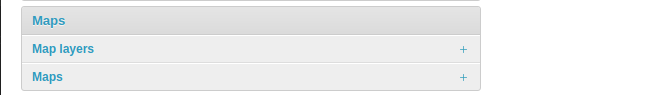
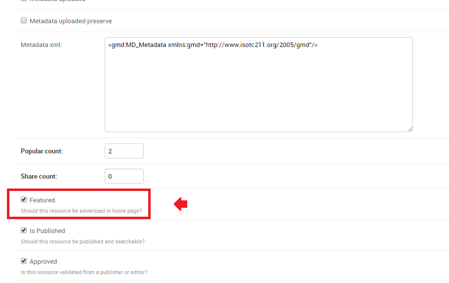
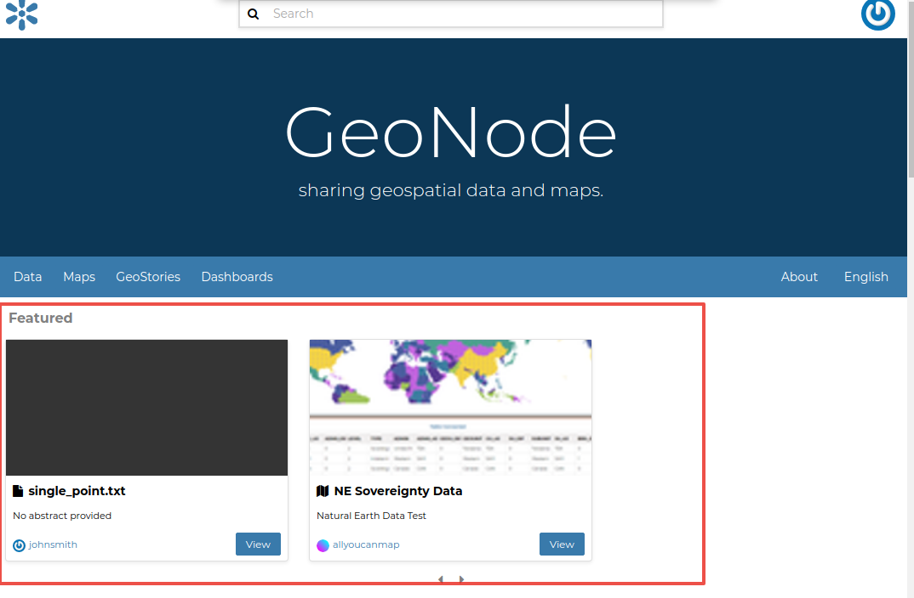

# Manage the maps using the admin panel

Similarly to datasets, it is also possible to manage the available GeoNode maps through the Admin panel.

Move to `Admin > Maps` to access the maps list.

{ align=center }

Notice that enabling the `Featured` option here allows GeoNode to show the map thumbnail and the map detail link at the top under featured resources on the `Home Page`.

{ align=center }

{ align=center }
