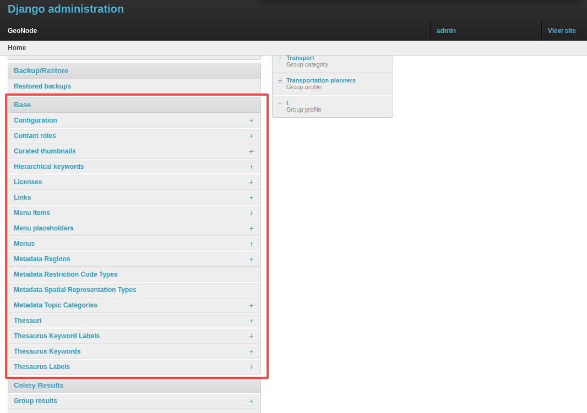
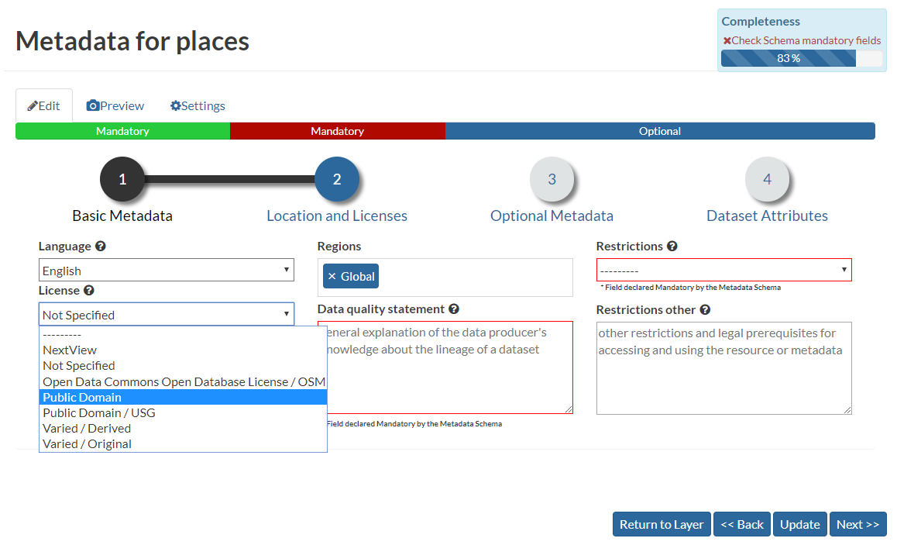
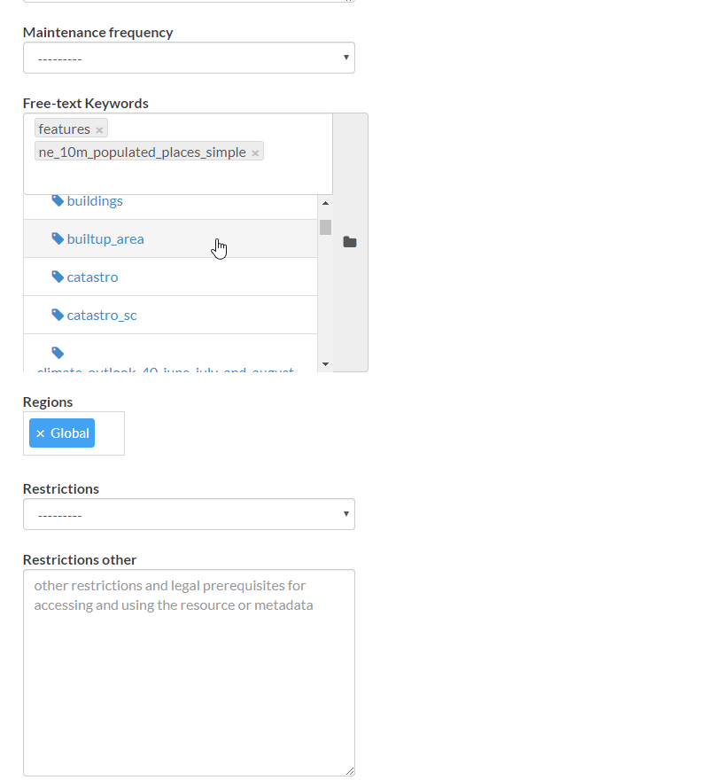
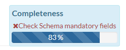
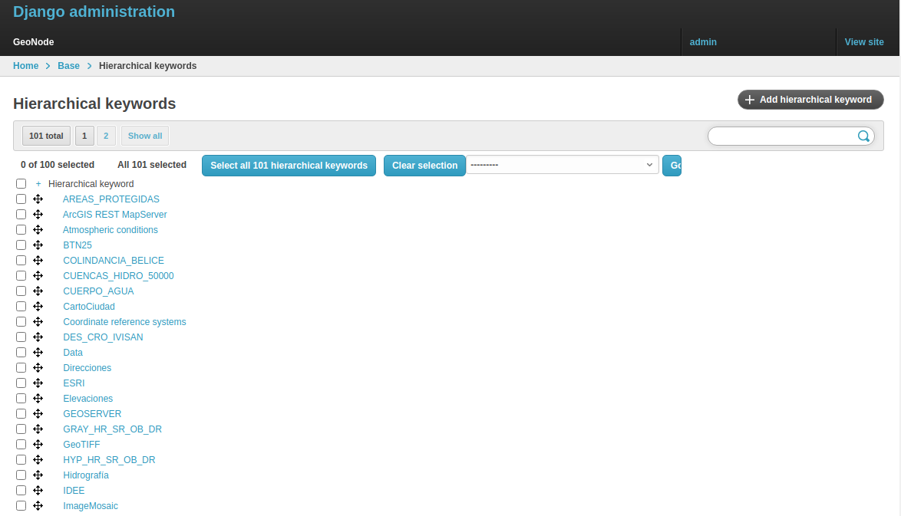
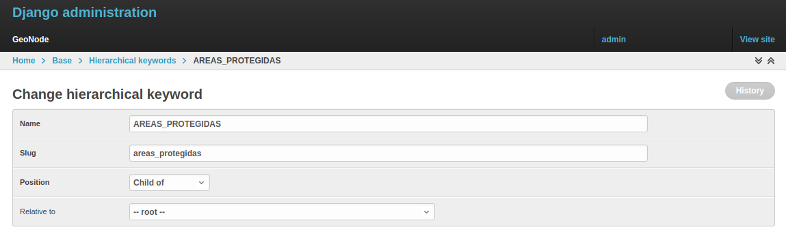
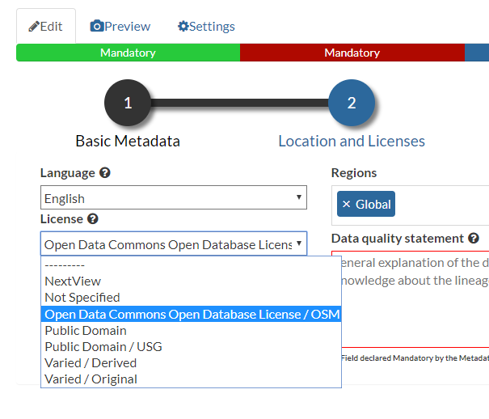
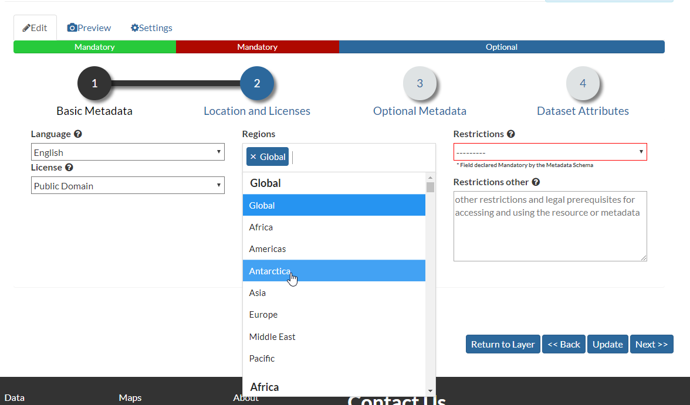

# Manage the base metadata choices using the admin panel

`Admin > Base` contains almost all the objects you need to populate the resource metadata choices.

{ align=center }
/// caption
*Admin dashboard Base Panel*
///

In other words, it contains the options available from the `select-boxes` of the resource `Edit Metadata` and `Advanced Metadata` forms.

{ align=center }
/// caption
*Metadata Form*
///

{ align=center }
/// caption
*Advanced Metadata Form*
///

!!! Note
    When editing resource metadata through `Edit Metadata`, some fields are marked as `mandatory` and filling them in advances the `Completeness` progress accordingly.

    { align=center }
    /// caption
    *Metadata Completeness*
    ///

    Even if not all fields have been filled in, the system will not prevent you from updating the metadata. This is why the `Mandatory` fields are mandatory to be fully compliant with an `ISO 19115` metadata schema, but are only recommended in order to be compliant with GeoNode.

    The `Completeness` value also indicates how close the metadata is to being compliant with an `ISO 19115` metadata schema.

    It is **highly** recommended to fill in as many metadata fields as possible, especially those marked as `Mandatory`.

    This improves not only the quality of the data stored in the system, but also helps users search for it more easily in GeoNode.

    All `Search & Filter` panels and options in GeoNode are based on the resource metadata fields. Overly generic descriptions and empty metadata fields produce imprecise and overly broad search results.

## Hierarchical keywords

Through the `Admin > Base > Hierarchical keywords` panel, it is possible to manage all the keywords associated with resources.

{ align=center }
/// caption
*Hierarchical keywords list*
///

{ align=center }
/// caption
*Hierarchical keywords edit*
///

- The `Name` is the human-readable text of the keyword, which users will see.
- The `Slug` is a unique label used by the system to identify the keyword. Most of the time it is equal to the name.

Notice that through the `Position` and `Relative to` selectors, it is possible to establish a hierarchy between the available keywords. The hierarchy is reflected in the form of a tree in the metadata panels.

By default, each user with metadata editing rights on a resource can insert new keywords into the system simply by typing free text into the keywords metadata field.

It is possible to force the user to select from a fixed list of keywords through the [FREETEXT_KEYWORDS_READONLY](../../setup/configuration/settings.md#freetext-keywords-readonly) setting.

When set to `True`, keywords are no longer writable by users. Only admins are able to manage them through the `Admin > Base > Hierarchical keywords` panel.

## Licenses

Through the `Admin > Base > Licenses` panel, it is possible to manage all the licenses associated with resources.

{ align=center }
/// caption
*Metadata editor Licenses*
///

!!! Warning
    It is **strongly** recommended not to publish resources without an appropriate license. Always make sure the data provider specifies the correct license and that all restrictions have been honored.

## Metadata Regions

Through the `Admin > Base > Metadata Regions` panel, it is possible to manage all the administrative areas associated with resources.

{ align=center }
/// caption
*Resource Metadata Regions*
///

Notice that those regions are also used by GeoNode to filter search results through the resource list view.

!!! Note
    GeoNode tries to guess the `Regions` intersecting the data bounding boxes when uploading a new dataset. Those values should still be refined by the user.

## Metadata Restriction Code Types and Spatial Representation Types

Through the `Admin > Base > Metadata Restriction Code Types` and `Admin > Base > Metadata Spatial Representation Types` panels, it is possible to **update only** the metadata descriptions for restriction and spatial representation types.

Such lists are *read-only* by default because they are associated with the specific codes of the `ISO 19115` metadata schema. Changing them would require the system to provide a custom dictionary through the metadata catalog as well. This functionality is not currently supported by GeoNode.

## Metadata Topic Categories

Through the `Admin > Base > Metadata Topic Categories` panel, it is possible to manage all the resource metadata categories available in the system.

By default, GeoNode provides the standard topic categories available in the `ISO 19115` metadata schema. Changing them means the system will no longer be compliant with the standard `ISO 19115` metadata schema. `ISO 19115` metadata schema extensions are not currently supported natively by GeoNode.

GeoNode also allows you to associate [Font Awesome Icons](https://fontawesome.com/icons?d=gallery) with each topic category through their `fa-icon` code. Those icons are used by GeoNode to represent the topic category in both the `Search & Filter` menus and `Metadata` panels.

!!! Warning
    The list of `Metadata Topic Categories` on the home page is currently fixed. To change it, you need to update or override the GeoNode `index.html` HTML template.

By default, `Metadata Topic Categories` are *writable*, meaning they can be removed or created from the `Admin` panel.

It is possible to make them fixed, so only their descriptions and icons can be updated, through the [MODIFY_TOPICCATEGORY](../../setup/configuration/settings.md#modify_topiccategory) setting.
