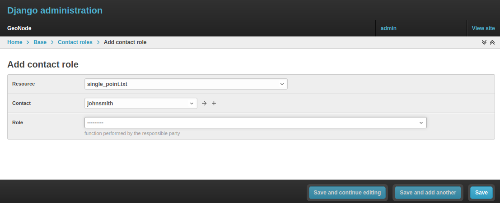
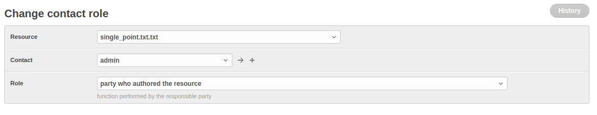

# Manage profiles using the admin panel

So far, GeoNode implements two distinct roles that can be assigned to resources such as datasets, maps, or documents:

- party who authored the resource
- party who can be contacted for acquiring knowledge about or acquisition of the resource

These two profiles can be set in the GeoNode interface by accessing the metadata page and setting the `Point of Contact` and `Metadata Author` fields respectively.

It is possible for an administrator to add new roles if needed by clicking on the `Add contact role` button in the `Base -> Contact Roles` section:

{ align=center }

Clicking on the `People` section, as shown in the figure, opens a web form with some personal information plus a section called `Users`.

{ align=center }

It is important that this last section is not modified unless the administrator is very confident about that operation.

{ align=center }
