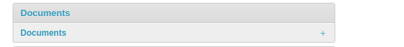

# Manage the documents using the admin panel

Similarly to datasets and maps, it is also possible to manage the available GeoNode documents through the Admin panel.

Move to `Admin > Documents` to access the documents list.

{ align=center }

By clicking on a document link, a detail page opens that allows you to modify some of the resource information such as the metadata, keywords, title, and more.
