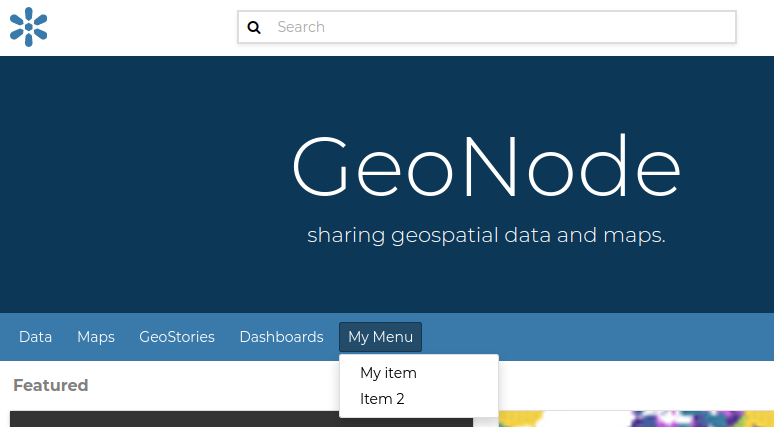
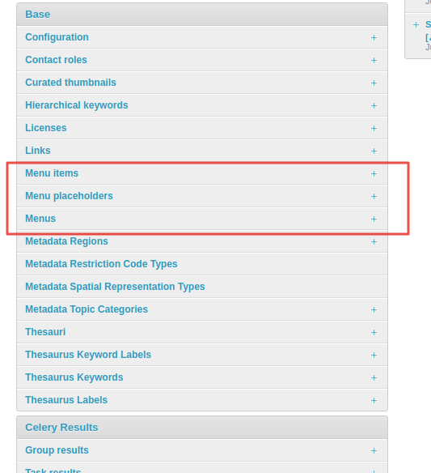
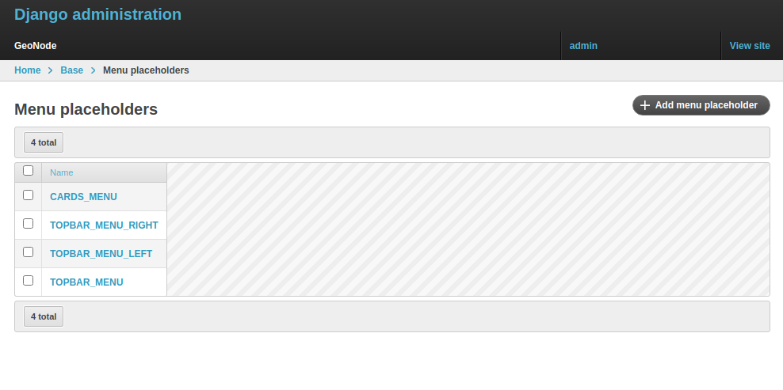
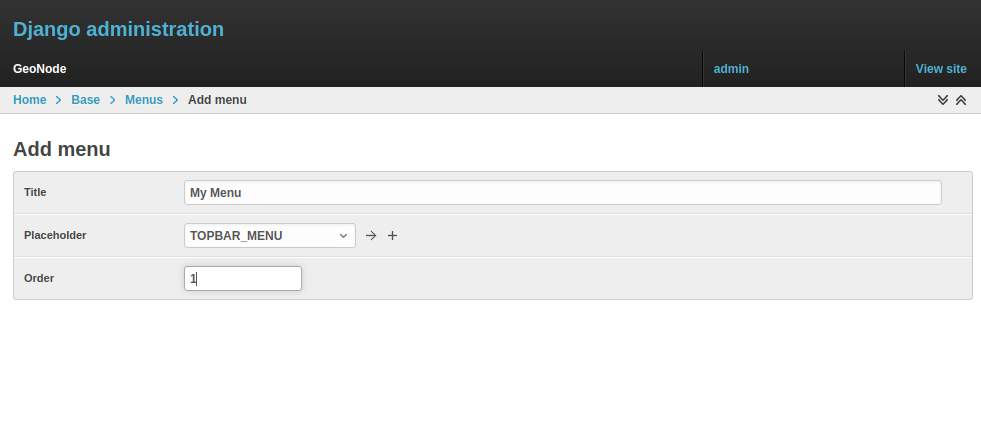
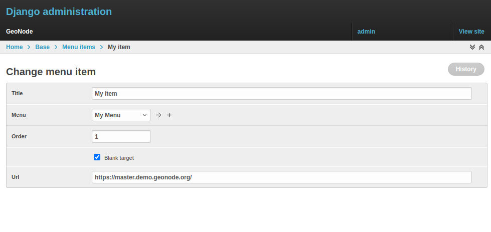

# Menus, Items and Placeholders

GeoNode provides integrated functionality that allows you to quickly and easily customize the top-bar menu, as shown in the example below.

{ align=center }
/// caption
*GeoNode Top-Bar Menu customization*
///

With minor changes to the `basic.html` template, it may also be possible to use the same approach for more complex customization. Let us start with the simple one.

By default, GeoNode provides custom `placeholders` already defined in the `basic.html` template, called `CARDS_MENU`, `TOPBAR_MENU_RIGHT`, `TOPBAR_MENU_LEFT`, and `TOPBAR_MENU`.

From the `Admin > Base` panel, it is possible to access the `Menu`, `Menu Items`, and `Menu Placeholder` options.

{ align=center }
/// caption
*Menu, Menu Items and Menu Placeholder options on the Admin panel*
///

The hierarchical structure of a custom `Menu` is the following:

1. `Menu Placeholder`: first, you need to define a placeholder both in the `Admin > Base` panel and in the `basic.html` template, using the same **keyword**. By default, GeoNode already provides predefined menus.

    { align=center }
    /// caption
    *The default `TOPBAR_MENU` Menu Placeholder on the Admin panel*
    ///

2. `Menu`: second, you need to create a new menu associated with the corresponding placeholder. This is still done from the `Admin > Base` panel.

    { align=center }
    /// caption
    *Create a new Menu from the Admin panel*
    ///

    You need to provide:

    - A `Title`, representing the name of the `Menu` visible to users
    - A `Menu Placeholder` from the existing ones
    - An `Order` value in case you create more menus associated with the same placeholder

    !!! Warning
        By using this approach, internationalization is not supported. For the time being, GeoNode does not support this for menus created from the `Admin > Base` panel.

3. `Menu Item`: finally, you need to create entries belonging to the menu. For the time being, GeoNode allows you to create only `href` links.

    { align=center }
    /// caption
    *Create a new Menu Item from the Admin panel*
    ///

    !!! Warning
        The `Menu` will not be visible until you add more than one `Menu Item`. If you have only one item, the item is shown directly, but not under the menu.
