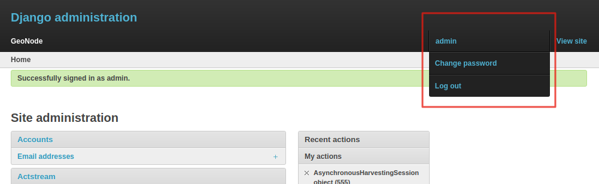
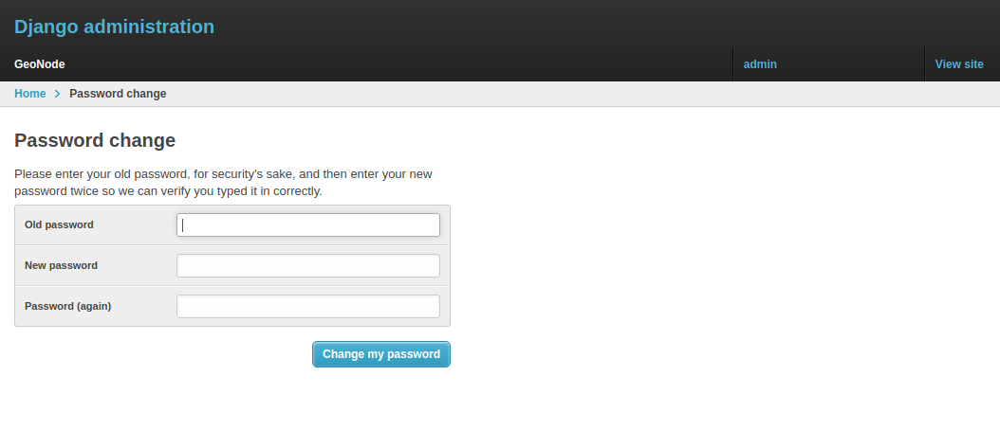

# Reset or Change the Admin Password

From the *Admin Interface* you can access the `Change password` link by clicking on the username on the right side of the navigation bar, which will open a dropdown.

{ align=center }
/// caption
*The Change Password Link*
///

It allows you to access the *Change Password Form* through which you can change your password.

{ align=center }
/// caption
*The Change Password Form*
///

Once the fields have been filled out, click on `Change my password` to perform the change.

()[]{ #simple-theming }
