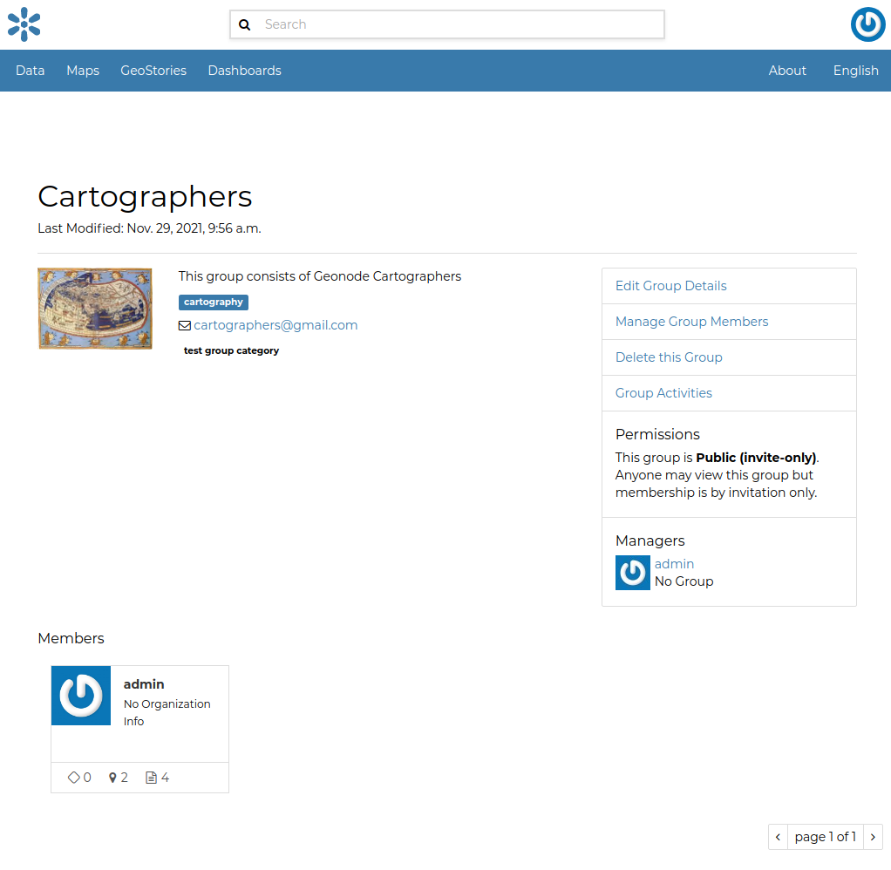
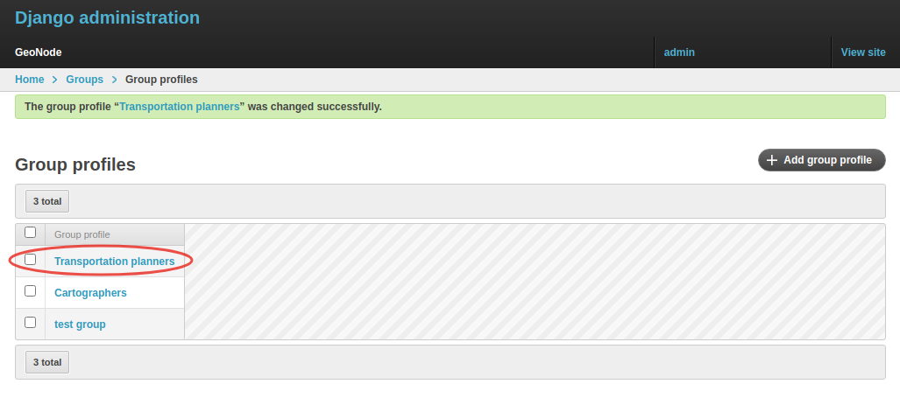
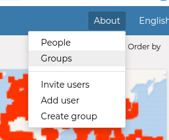
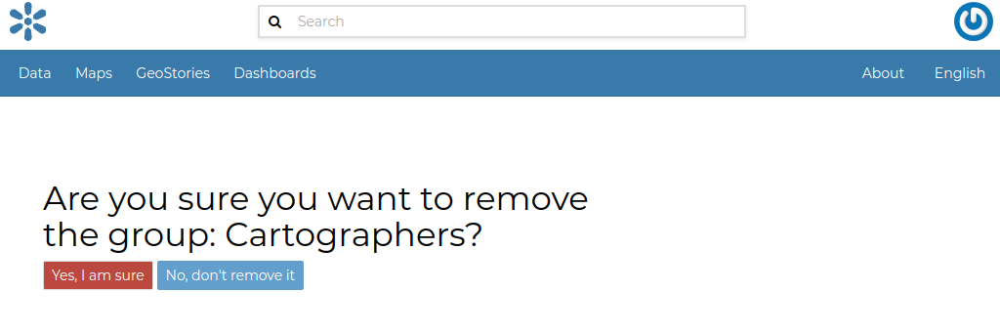

## Creating a Group

| In GeoNode is possible to create new groups with set of permissions which will be inherited by all the group members.
| The creation of a Group can be done both on the GeoNode UI and on the *Admin Panel*, we will explain how in this paragraph.

The `Create Groups` link of *About* menu in the navigation bar allows administrators to reach the *Group Creation Page*.

The following form will open.

Fill out all the required fields and click `Create` to create the group.
The *Group Details Page* will open.

The new created group will be searchable in the *Groups List Page*.

!!! note "Important notes"
    The `Create a New Group` button on the *Groups List Page* allows to reach the *Group Creation Form*.

| As already mentioned above, groups can also be created from the Django-based *Admin Interface* of GeoNode.
| The *Groups* link of the *AUTHENTICATION AND AUTHORIZATION* section allows to manage basic Django groups which only care about permissions.
| To create a GeoNode group you should take a look at the *GROUPS* section.

As you can see, GeoNode provides two types of groups. You will learn more about that in the next paragraph.

## Types of Groups

In GeoNode users can be grouped through a *Group Profile*, an enhanced Django group which can be enriched with some further information such as a description, a logo, an email address, some keywords, etc.
It also possible to define some *Group Categories* based on which those group profiles can be divided and filtered.

A new **Group Profile** can be created as follow:

* click on the *Group Profile* `+ Add` button

* fill out all the required fields (see the picture below), *Group Profiles* can be explicitly related to group categories

  

* click on `Save` to perform the creation, the new created group profile will be visible in the *Group Profiles List*

  

## Group Categories

*Group Profiles* can also be related to *Group Categories* which represents common topics between groups.
In order to add a new **Group Category** follow these steps:

* click on the *Group Categories* `+ Add group category` button

* fill out the creation form (type *name* and *description*)

  

* click on `Save` to perform the creation, the new created category will be visible in the *Group Categories List*

  

## Managing a Group

Through the `Groups` link of *About* menu in the navigation bar, administrators can reach the *Groups List Page*.

In that page all the GeoNode *Group Profiles* are listed.

For each group some summary information (such as the *title*, the *description*, the number of *members* and *managers*) are displayed near the *Group Logo*.

Administrators can manage a group from the *Group Profile Details Page* which is reachable by clicking on the *title* of the group.

As shown in the picture above, all information about the group are available on that page:

* the group *Title*;
* the *Last Editing Date* which shows a timestamp corresponding to the last editing of the group properties;
* the *Keywords* associated with the group;
* *Permissions* on the group (Public, Public(invite-only), Private);
* *Members* who join the group;
* *Managers* who manage the group.

There are also four links:

* The `Edit Group Details` link opens the *Group Profile Form* through which the following properties can be changed:

  * *Title*.
  * *Logo* (see next paragraphs).
  * *Description*.
  * *Email*, to contact one or all group members.
  * *Keywords*, a comma-separated list of keywords.
  * *Access*, which regulates permissions:

    * *Public*: any registered user can view and join a public group.
    * *Public (invite-only)*: only invited users can join, any registered user can view the group.
    * *Private*: only invited users can join the group, registered users cannot see any details about the group, including membership.

  * *Categories*, the group categories the group belongs to.

* `Manage Group Members` (see next paragraphs).
* the `Delete this Group`, click on it to delete the Group Profile. GeoNode requires you to confirm this action.

  

* the `Group Activities` drives you to the *Group Activities Page* where you can see all datasets, maps and documents associated with the group. There is also a *Comments* tab which shows comments on those resources.

  

## Group Logo

Each group represents something in common between its members.
So each group should have a *Logo* which graphically represents the idea that identify the group.

On the *Group Profile Form* page you can insert a logo from your disk by click on `Browse...`.

| Click on `Update` to apply the changes.
| Take a look at your group now, you should be able to see that logo.

## Managing Group members

The `Manage Group Members` link opens the *Group Members Page* which shows *Group Members* and *Group Managers*.
**Managers** can edit group details, can delete the group, can see the group activities and can manage memberships.
Other **Members** can only see the group activities.

| In Public Groups, users can join the group without any approval.
  Other types of groups require the user to be invited by the group managers.
| Only group managers can *Add new members*.
  In the picture below, you can see the manager can search for users by typing their names into the *User Identifiers* search bar.
  Once found, he can add them to the group by clicking the `Add Group Members` button.
  The *Assign manager role* flag implies that all the users found will become managers of the group.

The following picture shows you the results.

If you want to change the role of group members after adding them, you can use the "promote" button to make a member into a manager, and the "demote" button to make a manager into a regular member.