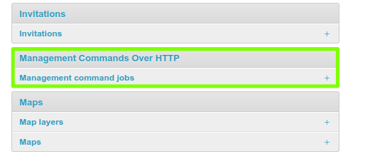
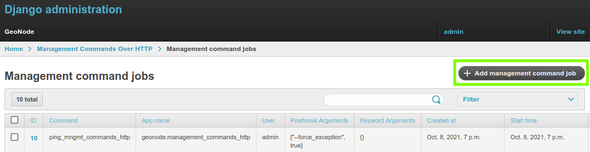
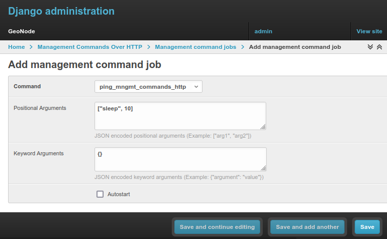
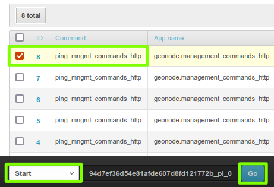
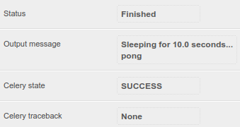
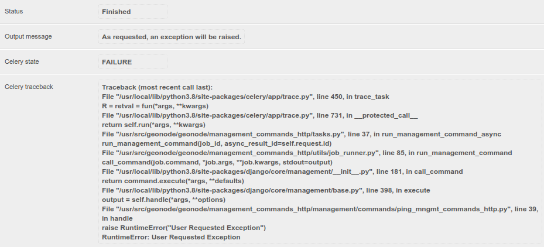

# Async execution over http

It is possible to expose and run management commands over http.

To run [custom Django management commands](https://docs.djangoproject.com/en/3.2/howto/custom-management-commands/) we usually make use of the command line:

```bash
python manage.py ping_mngmt_commands_http
$> pong
```

The `management_commands_http` app allows us to run commands when we have no access to the command line.
It is possible to run a command using the API or the Django admin GUI.

For security reasons, only admin users can access the feature and the desired command needs to be explicitly exposed.
By default the following commands are exposed: *ping_mngmt_commands_http*, *updatelayers*, *sync_geonode_datasets*, *sync_geonode_maps*, *importlayers* and *set_all_datasets_metadata*.

To expose more commands you can change the environment variable `MANAGEMENT_COMMANDS_EXPOSED_OVER_HTTP` and the added commands will be exposed in your application.

The list of exposed commands is available by the endpoint `list_management_commands` and is also presented by the form in the admin page `create management command job`.

!!! Note
    To use the commands in an asynchronous approach, `ASYNC_SIGNALS` needs to be set to `True` and Celery should be running.

## Manage using django admin interface

### Creating a job

Access the admin panel: `http://<your_geonode_host>/admin` and go to `Management command jobs`.

{ align=center }
/// caption
*Management command admin section*
///

You will arrive at `http://<your_geonode_host>/en/admin/management_commands_http/managementcommandjob/`,
then click on the button `+ Add management command job` at `http://<your_geonode_host>/en/admin/management_commands_http/managementcommandjob/add/`.

{ align=center }
/// caption
*Add management command job*
///

Select the command and fill the form, with the arguments and or key-arguments if needed.
Save your job and in the list select the `start` action, alternatively you can mark the `autostart` option and the command will be started automatically when created.

{ align=center }
/// caption
*Creating a management command job form*
///

### Starting a job

To start a job:

{ align=center }
/// caption
*Starting a job*
///

1. Select the job to be started.
2. Select the `start` action.
3. Click on `Go`.
4. The page will refresh and the job status will have changed. If it takes a long time to run, refresh the page to see the updated status.
5. A `stop` option is also available.

!!! Note
    If it takes too long to load the page, `ASYNC_SIGNALS` may not be activated.
    If its status gets stuck at `QUEUED`, verify if Celery is running and properly configured.

### Job status

Clicking on the link in the ID of a job, we can see the details of that job.
For the job we just created, we can verify the output message and Celery job status.

{ align=center }
/// caption
*Example job status*
///

When we have an error during execution the traceback message will be available in the `Celery traceback`.
In the next image a `ping_mngmt_commands_http` job was created with the arguments `["--force_exception", true]`.
Checking the text in this field can be useful when troubleshooting errors.

{ align=center }
/// caption
*Example job traceback message*
///

## Manage using API endpoints

The execution of the management commands can be handled by HTTP requests to an API: `http://<your_geonode_host>/api/v2/management/`.

All the requests need to be authenticated with administrative permissions, that is, a *superuser*.

You can find here a Postman collection with all the examples listed here and other available endpoints:

[geonode_mngmt_commands.postman_collection.json](data/geonode_mngmt_commands.postman_collection.json)

### List exposed commands

Getting a list of the exposed commands:

```bash
curl --location --request GET 'http://<your_geonode_host>/api/v2/management/commands/' --header 'Authorization: Basic YWRtaW46YWRtaW4='
```

Response:

```json
{
    "success": true,
    "error": null,
    "data": [
        "ping_mngmt_commands_http",
        "updatelayers",
        "set_all_datasets_metadata",
        "sync_geonode_maps",
        "importlayers",
        "sync_geonode_datasets"
    ]
}
```

!!! Note
    You should change the header `Authorization`, `Basic YWRtaW46YWRtaW4=`, to your auth token. In this example a token for `admin` as username and `admin` as password is used.

### Creating a job

Optionally, before creating the job you can get its *help message* with the following call:

```bash
curl --location --request GET 'http://<your_geonode_host>/api/v2/management/commands/ping_mngmt_commands_http/' --header 'Authorization: Basic YWRtaW46YWRtaW4='
```

Creating a job for running `ping_mngmt_commands_http` with 30 seconds of sleep time:

```bash
curl --location --request POST 'http://<your_geonode_host>/api/v2/management/commands/ping_mngmt_commands_http/jobs/' \
--header 'Authorization: Basic YWRtaW46YWRtaW4=' \
--header 'Content-Type: application/json' \
--data-raw '{
    "args": ["--sleep", 30],
    "kwargs": {},
    "autostart": false
}'
```

Response:

```json
{
    "success": true,
    "error": null,
    "data": {
        "id": 8,
        "command": "ping_mngmt_commands_http",
        "app_name": "geonode.management_commands_http",
        "user": 1000,
        "status": "CREATED",
        "created_at": "2021-10-08T18:17:25.045752Z",
        "start_time": null,
        "end_time": null,
        "args": [
            "--sleep",
            30
        ],
        "kwargs": {},
        "celery_result_id": null,
        "output_message": null
    }
}
```

!!! Note
    Alternatively you can omit the `jobs` part of the URL to create a job, using `http://<your_geonode_host>/api/v2/management/commands/ping_mngmt_commands_http/` as URL.

### Start/Stop actions

To start the created job:

```bash
curl --location --request PATCH 'http://<your_geonode_host>/api/v2/management/jobs/8/start/' --header 'Authorization: Basic YWRtaW46YWRtaW4='
```

Response:

```json
{
    "success": true,
    "error": null,
    "data": {
        "id": 8,
        "command": "ping_mngmt_commands_http",
        "app_name": "geonode.management_commands_http",
        "user": 1000,
        "status": "QUEUED",
        "created_at": "2021-10-08T18:17:25.045752Z",
        "start_time": null,
        "end_time": null,
        "args": [
            "--sleep",
            30
        ],
        "kwargs": {},
        "celery_result_id": null,
        "output_message": null
    }
}
```

!!! Note
    During execution the job can be interrupted using the following call:

    ```bash
    curl --location --request PATCH 'http://<your_geonode_host>/api/v2/management/jobs/8/stop/' --header 'Authorization: Basic YWRtaW46YWRtaW4='
    ```

Note that the status changed from **CREATED** to **QUEUED**, during execution it will be **STARTED** and at the end **FINISHED**.

### Jobs list and status

You can verify your job status and details with the following call:

```bash
curl --location --request GET 'http://<your_geonode_host>/api/v2/management/jobs/8/status/' --header 'Authorization: Basic YWRtaW46YWRtaW4='
```

Response:

```json
{
    "id": 8,
    "command": "ping_mngmt_commands_http",
    "app_name": "geonode.management_commands_http",
    "user": 1000,
    "status": "FINISHED",
    "created_at": "2021-10-08T18:17:25.045752Z",
    "start_time": "2021-10-08T18:20:02.761475Z",
    "end_time": "2021-10-08T18:20:32.802007Z",
    "args": [
        "--sleep",
        30
    ],
    "kwargs": {},
    "celery_result_id": "fe7359a6-5f8c-47bf-859a-84351b5ed80c",
    "output_message": "Sleeping for 30.0 seconds...\npong\n",
    "celery_task_meta": {
        "date_done": "2021-10-08T18:20:32.810649Z",
        "status": "SUCCESS",
        "traceback": null,
        "worker": "worker1@4f641ffa9c0b"
    }
}
```

When running multiple jobs and to audit already executed jobs, a list of jobs can be retrieved using the following call:

```bash
curl --location --request GET 'http://<your_geonode_host>/api/v2/management/jobs/' --header 'Authorization: Basic YWRtaW46YWRtaW4='
```

Response:

```json
{
    "links": {
        "next": null,
        "previous": null
    },
    "total": 1,
    "page": 1,
    "page_size": 10,
    "data": [
        {
            "id": 1,
            "command": "ping_mngmt_commands_http",
            "app_name": "geonode.management_commands_http",
            "user": 1000,
            "status": "FINISHED",
            "created_at": "2021-10-08T18:17:25.045752Z"
        }
    ]
}
```

!!! Note
    This list can be filtered by the fields `celery_result_id`, `command`, `app_name`, `status`, `user` and `user__username`.
