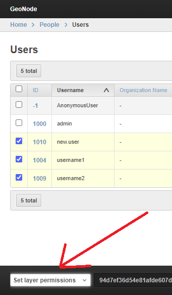
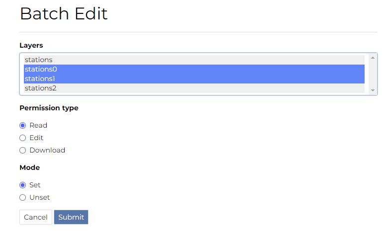

# Batch Sync Permissions

GeoNode provides a very useful management command `set_layers_permisions` allowing an administrator to easily add or remove permissions to groups and users on one or more datasets.

The `set_layers_permisions` command arguments are:

- **permissions** to set or unset: `read`, `download`, `edit`, `manage`

    ```python
    READ_PERMISSIONS = [
        'view_resourcebase'
    ]
    DOWNLOAD_PERMISSIONS = [
        'view_resourcebase',
        'download_resourcebase'
    ]
    EDIT_PERMISSIONS = [
        'view_resourcebase',
        'change_dataset_style',
        'download_resourcebase',
        'change_resourcebase_metadata',
        'change_dataset_data',
        'change_resourcebase'
    ]
    MANAGE_PERMISSIONS = [
        'delete_resourcebase',
        'change_resourcebase',
        'view_resourcebase',
        'change_resourcebase_permissions',
        'change_dataset_style',
        'change_resourcebase_metadata',
        'publish_resourcebase',
        'change_dataset_data',
        'download_resourcebase'
    ]
    ```

NB: the above permissions list may change with `ADVANCED_WORKFLOW` enabled. For additional info: https://docs.geonode.org/en/master/admin/admin_panel/index.html#how-to-enable-the-advanced-workflow

- **resources**: datasets on which permissions are assigned; type the dataset id, multiple choices can be typed with a comma separator, if no ids are provided all datasets are considered
- **users**: users to whom permissions are assigned, multiple choices can be typed with a comma separator
- **groups**: groups to whom permissions are assigned, multiple choices can be typed with a comma separator
- **delete**: optional flag meaning the permissions will be unset

## Usage examples

1. Assign **edit** permissions on the datasets with id **1** and **2** to the users **username1** and **username2** and to the group **group_name1**.

    ```bash
    python manage.py set_layers-permissions -p edit -u username1,username2 -g group_name1 -r 1,2
    ```

2. Assign **manage** permissions on all the datasets to the group **group_name1**.

    ```bash
    python manage.py set_layers-permissions -p manage -g group_C
    ```

3. Unset **download** permissions on the dataset with id **1** for the user **username1**.

    ```bash
    python manage.py set_layers-permissions -p download -u username1 -r 1 -d
    ```

The same functionalities, with some limitations, are available also from `Admin Dashboard >> Users` or `Admin Dashboard >> Groups >> Group profiles`.

{ align=center }

An action named `Set layer permissions` is available from the list, redirecting the administrator to a form to set or unset read, edit, and download permissions on the selected users or group profile.

{ align=center }

It is enough to select the dataset and press `Submit`. If the async mode is activated, the permission assignment is asynchronous.
