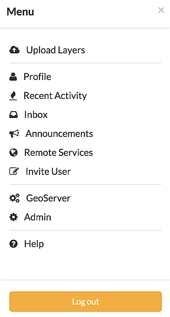
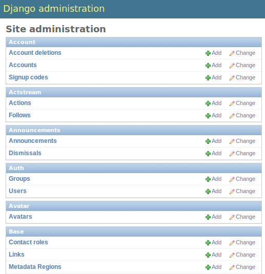
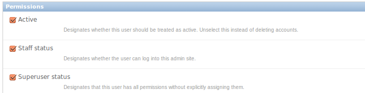
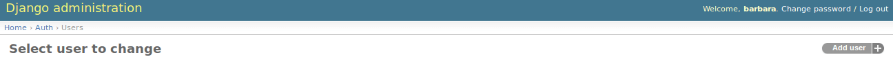
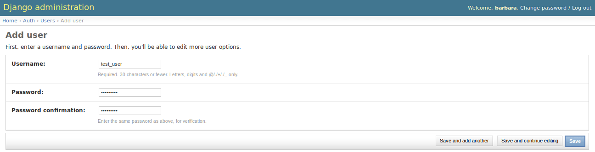
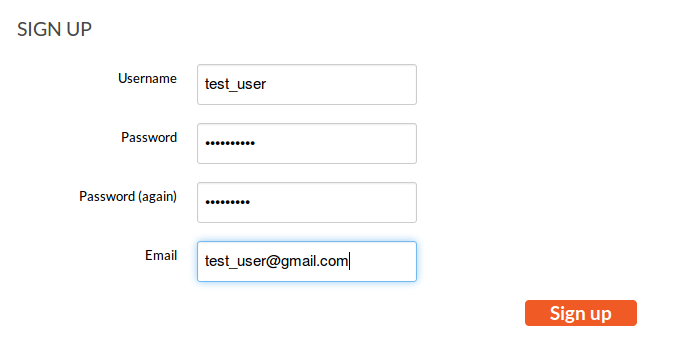

# Create Users and Super Users

Your first step is to create a user. There are three options to do so. Depending on which kind of user you want to create, you may choose a different option. We will start with creating a *superuser*, because this user is the most important. A superuser has all the permissions without explicitly assigning them.

The easiest way to create a superuser, in Linux, is to open your terminal and type:

```bash
$ DJANGO_SETTINGS_MODULE=geonode.settings python manage.py createsuperuser
```

!!! Note
    If you enabled `local_settings.py`, the command will change as follows:

    ```bash
    $ DJANGO_SETTINGS_MODULE=geonode.local_settings python manage.py createsuperuser
    ```

You will be asked for a username, in this tutorial we will call the superuser you now create *your_superuser*, an email address, and a password.

Now you have created a superuser and you should become familiar with the *Django Admin Interface*. As a superuser you have access to this interface, where you can manage users, datasets, permissions, and more. To learn more details about this interface, check the corresponding admin guide section. For now it is enough to just follow the steps. To enter the *Django Admin Interface*, go to your GeoNode website and *sign in* with *your_superuser*. Once you are logged in, the name of your user will appear at the top right. Click on it and the following menu will appear:

{ align=center }

Clicking on *Admin* causes the interface to show up.

{ align=center }

Go to *Auth* -> *Users* and you will see all the users that exist at the moment. In your case it will only be *your_superuser*. Click on it, and you will see a section on *Personal Info*, one on *Permissions*, and one on *Important dates*. For the moment, the section on *Permissions* is the most important.

{ align=center }

As you can see, there are three boxes that can be checked and unchecked. Because you created a superuser, all three boxes are checked by default. If only the box *active* had been checked, the user would not be a superuser and would not be able to access the *Django Admin Interface*, which is only available for users with the *staff* status. Therefore keep the following two things in mind:

- a superuser is able to access the *Django Admin Interface* and has all permissions on the data uploaded to GeoNode
- an ordinary user, created from the GeoNode interface, only has *active* permissions by default. The user will not have the ability to access the *Django Admin Interface* and certain permissions have to be added for them

Until now we have only created superusers. So how do you create an ordinary user? You have two options:

1. Django Admin Interface

    First we will create a user via the *Django Admin Interface* because we still have it open. Therefore go back to *Auth* -> *Users* and you should find a button on the right that says *Add user*.

    { align=center }

    Click on it and a form to fill out will appear. Name the new user `test_user`, choose a password, and click *save* at the right bottom of the page.

    { align=center }

    Now you should be directed to the page where you can change the permissions on the user *test_user*. By default only *active* is checked. If you want this user also to be able to enter the admin interface you could also check *staff status*. But for now we leave the settings as they are.

    To test whether the new user was successfully created, go back to the GeoNode web page and try to sign in.

2. GeoNode website

    To create an ordinary user you could also just use the GeoNode website. If you installed GeoNode using a release, you should see a *Register* button at the top, beside the *Sign in* button. You might have to log out before.

    { align=center }

    Hit the button and again a form will appear for you to fill out. This user will be named *geonode_user*.

    { align=center }

    By hitting *Sign up* the user will be signed up, by default only with the status *active*.
