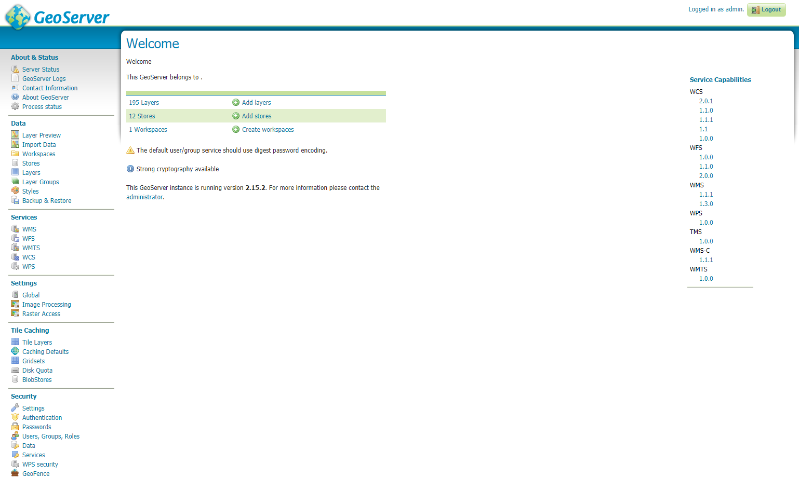
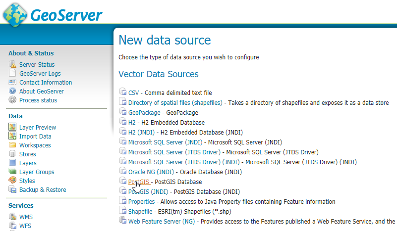
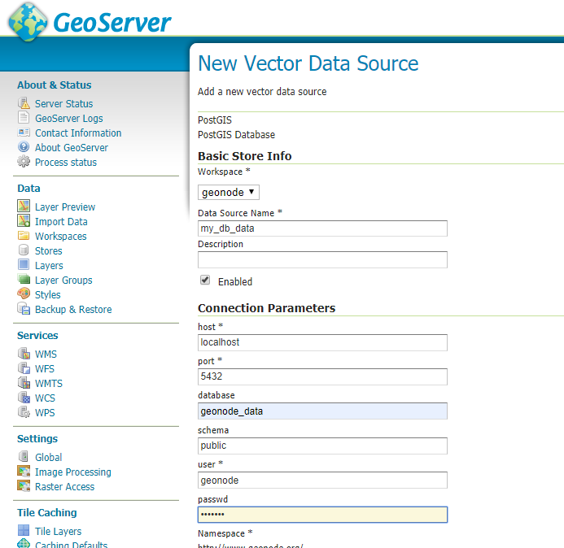
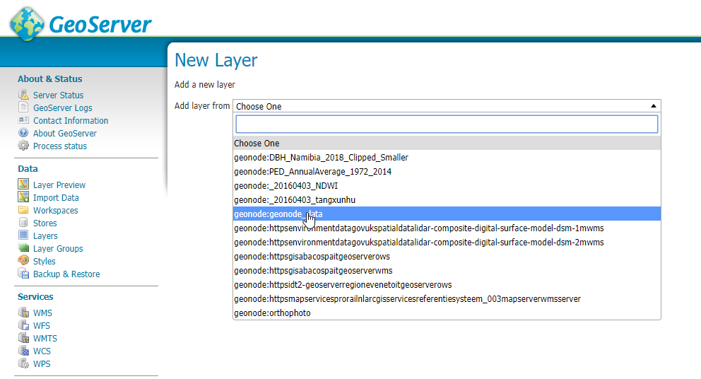
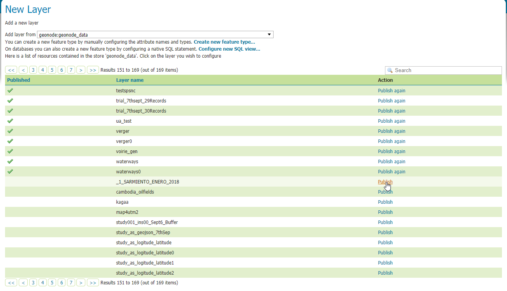
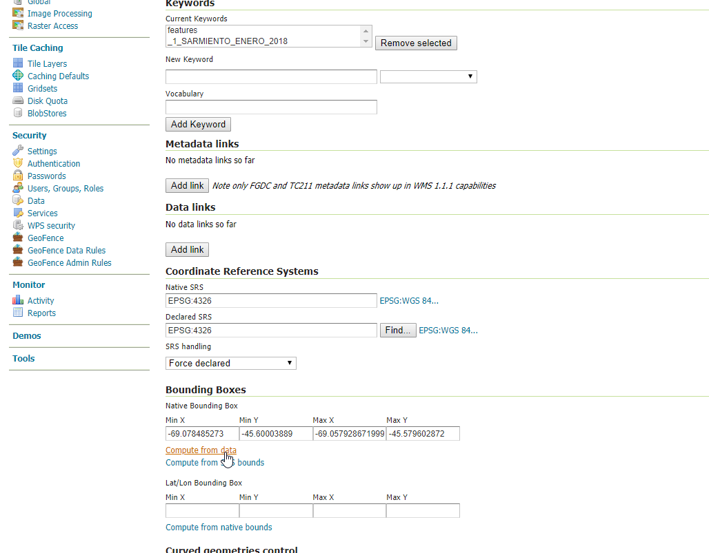
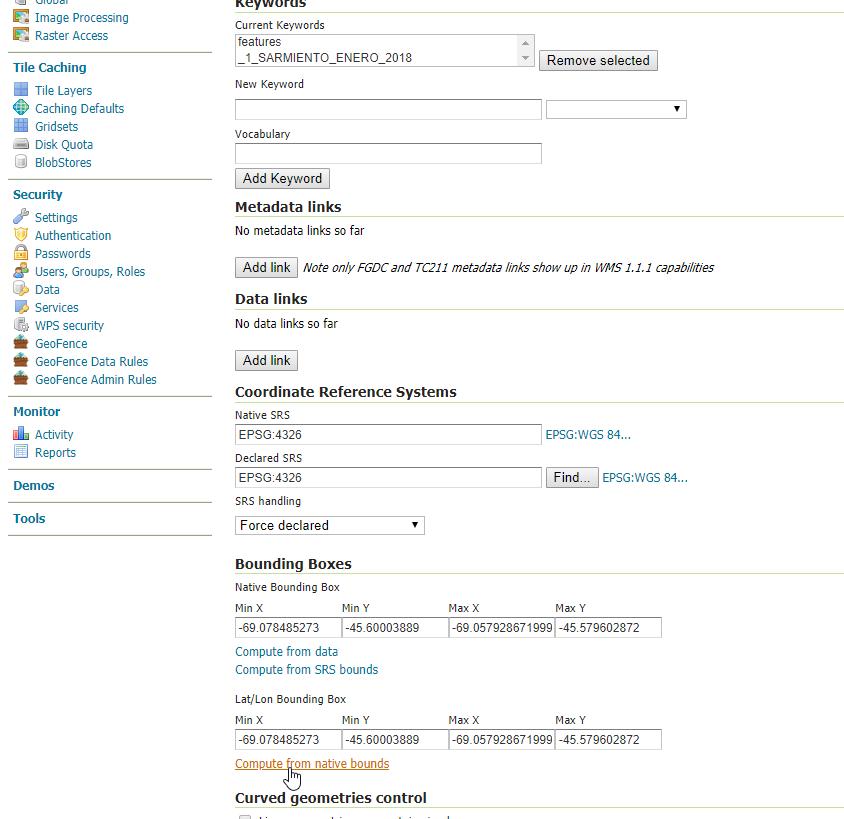
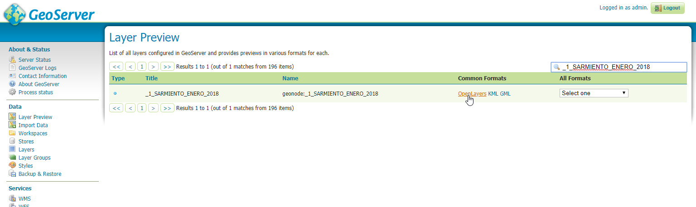

# Loading Data into GeoNode

There are situations where it is not possible or not convenient to use the `Upload Form` to add new datasets to GeoNode through the web interface. For instance:

- The dataset is too big to be uploaded through a web interface.
- Importing data from a mass storage system programmatically.
- Importing tables from a database.

This section walks through the various options available to load data into GeoNode from GeoServer, from the command line, or programmatically.

!!! Warning
    Some parts of this section are adapted from the [GeoServer](https://geoserver.geo-solutions.it/edu/en) project and training documentation.

## Management Command `importlayers`

The `geonode.geoserver` Django app includes two management commands that you can use to load data into GeoNode.

Both of them can be invoked by using the `manage.py` script.

First, let us look at the `--help` option of the `importlayers` management command in order to inspect all command options and features.

Run:

```bash
DJANGO_SETTINGS_MODULE=geonode.settings python manage.py importlayers --help
```

!!! Note
    If you enabled `local_settings.py`, the command becomes:

    ```bash
    DJANGO_SETTINGS_MODULE=geonode.local_settings python manage.py importlayers --help
    ```

This produces output similar to the following:

```bash
usage: manage.py importlayers [-h] [-hh HOST] [-u USERNAME] [-p PASSWORD]
                              [--version] [-v {0,1,2,3}] [--settings SETTINGS]
                              [--pythonpath PYTHONPATH] [--traceback] [--no-color]
                              [--force-color] [--skip-checks]
                              [path [path ...]]

Brings files from a local directory, including subfolders, into a GeoNode site.
The datasets are added to the Django database, the GeoServer configuration, and the
pycsw metadata index. At this moment only files of type Esri Shapefile (.shp) and GeoTiff (.tif) are supported.
In order to perform the import, GeoNode must be up and running.

positional arguments:
path                  path [path...]

optional arguments:
-h, --help            show this help message and exit
--version             show program's version number and exit
-v {0,1,2,3}, --verbosity {0,1,2,3}
                        Verbosity level; 0=minimal output, 1=normal output,
                        2=verbose output, 3=very verbose output
--settings SETTINGS   The Python path to a settings module, e.g.
                        "myproject.settings.main". If this isn't provided, the
                        DJANGO_SETTINGS_MODULE environment variable will be
                        used.
--pythonpath PYTHONPATH
                        A directory to add to the Python path, e.g.
                        "/home/djangoprojects/myproject".
-hh HOST, --host HOST
                        Geonode host url
-u USERNAME, --username USERNAME
                        Geonode username
-p PASSWORD, --password PASSWORD
                        Geonode password
```

While most options are self-explanatory, a few of the key ones are worth reviewing:

- `-hh` identifies the GeoNode server where you want to upload the datasets. The default value is `http://localhost:8000`.
- `-u` identifies the username for the login. The default value is `admin`.
- `-p` identifies the password for the login. The default value is `admin`.

The import datasets management command is invoked by specifying options as described above and giving the path to a directory that contains multiple files. For this exercise, use the default set of testing datasets that ship with GeoNode. You can replace this path with a directory containing your own shapefiles.

```bash
First let's run the GeoNode server:
DJANGO_SETTINGS_MODULE=geonode.settings python manage.py runserver

Then let's import the files:
DJANGO_SETTINGS_MODULE=geonode.settings python manage.py importlayers /home/user/.virtualenvs/geonode/lib/python3.8/site-packages/gisdata/data/good/vector/
```

This command produces output similar to the following:

```bash
san_andres_y_providencia_poi.shp: 201
san_andres_y_providencia_location.shp: 201
san_andres_y_providencia_administrative.shp: 201
san_andres_y_providencia_coastline.shp: 201
san_andres_y_providencia_highway.shp: 201
single_point.shp: 201
san_andres_y_providencia_water.shp: 201
san_andres_y_providencia_natural.shp: 201

1.7456605294117646 seconds per Dataset

Output data: {
    "success": [
        "san_andres_y_providencia_poi.shp",
        "san_andres_y_providencia_location.shp",
        "san_andres_y_providencia_administrative.shp",
        "san_andres_y_providencia_coastline.shp",
        "san_andres_y_providencia_highway.shp",
        "single_point.shp",
        "san_andres_y_providencia_water.shp",
        "san_andres_y_providencia_natural.shp"
    ],
    "errors": []
}
```

As output, the command prints:

```bash
layer_name: status code for each Layer

upload_time spent of each Dataset

A json with the representation of the Datasets uploaded or with some errors.
```

The status code is the response returned by GeoNode. For example, `201` means that the dataset has been uploaded correctly.

If you encounter errors while running this command, check the GeoNode logs for more information.

## Management Command `updatelayers`

While it is possible to import datasets directly from your server filesystem into GeoNode, you may already have an existing GeoServer with data in it, or you may want to configure data from a GeoServer that is not directly supported by file upload.

GeoServer supports a wide range of data formats and database connections. Some of them may not be supported as GeoNode upload formats. You can add them to GeoNode by following the procedure below.

GeoServer supports four types of data: `Raster`, `Vector`, `Databases`, and `Cascaded`.

For a list of supported formats for each type of data, consult the following pages:

- [GeoServer vector data formats](https://docs.geoserver.org/latest/en/user/data/vector/index.html)
- [GeoServer raster data formats](https://docs.geoserver.org/latest/en/user/data/raster/index.html)
- [GeoServer database data formats](https://docs.geoserver.org/latest/en/user/data/database/index.html)
- [GeoServer cascaded data formats](https://docs.geoserver.org/latest/en/user/data/cascaded/index.html)

!!! Note
    Some raster or vector formats, or some database types, require specific plugins in GeoServer in order to be used. Consult the GeoServer documentation for more information.

## Data from a PostGIS database

Let us walk through an example of configuring a new PostGIS database in GeoServer and then configuring those datasets in GeoNode.

First, visit the GeoServer administration interface on your server. This is usually on port `8080` and is available at `http://localhost:8080/geoserver/web/`.

1. Login with the superuser credentials you set up when you first configured your GeoNode instance.

    Once you are logged in to the GeoServer Admin interface, you should see the following:

    { align=center }

    !!! Note
        The number of stores, datasets, and workspaces may be different depending on what you already have configured in GeoServer.

2. Select the `Stores` option in the left-hand menu, then choose `Add new Store`. The following screen is displayed:

    { align=center }

3. Select the PostGIS store type to create a connection to your existing database. On the next screen, enter the parameters required to connect to your PostGIS database and adapt them as needed for your own setup.

    { align=center }

    !!! Note
        If you are unsure about any of the settings, leave them at their default values.

4. The next screen lets you configure the datasets in your database. This will differ depending on the datasets in your database.

    { align=center }

5. Select the `Publish` button for one of the datasets. The next screen is displayed, where you can enter metadata for that dataset. Since this metadata is managed in GeoNode, you can leave it unchanged for now.

    { align=center }

6. The values that *must* be specified are the Declared SRS. You must also select the `Compute from Data` and `Compute from native bounds` links after the SRS is specified.

    { align=center }

    { align=center }

7. Click save and this dataset is then configured for use in GeoServer.

    { align=center }
