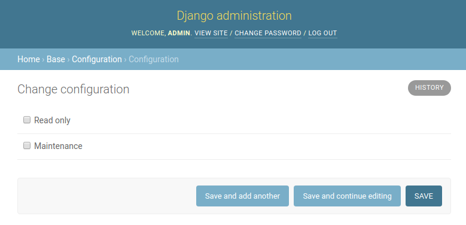

# Read-only and Maintenance modes

## Overview

GeoNode gives an option to operate in different modes, according to the needs and demands of the certain application system.

Changing the currently used mode can be done in the admin panel by a user with super-user privileges, by modifying the `Configuration` singleton model in the `BASE` application:

{ align=center }
/// caption
*Configuration change in the admin panel*
///

## Read-Only Mode

Activating the Read-Only Mode, by setting `Read only` to `True` in the `Configuration`, activates a middleware rejecting all modifying requests, `POST`, `PUT`, and `DELETE`, with an exception for:

- `POST` to the login view
- `POST` to the logout view
- `POST` to the admin login view
- `POST` to the admin logout view
- all requests to the OWS endpoint
- all requests ordered by a super-user

Additionally, all UI elements allowing modification of GeoNode content are hidden, so for example the `Upload Layer` button is not rendered in the templates.

In case a user tries to perform a forbidden request, they will be presented with a static HTML page informing them that GeoNode is in Read-Only mode and this action is currently forbidden.

## Maintenance Mode

Activating the Maintenance Mode, by setting `Maintenance` to `True` in the `Configuration`, activates the highest-level middleware, the one executed first, rejecting all requests to the GeoNode instance, with an exception for:

- `POST` to the admin login view
- `POST` to the admin logout view
- all requests ordered by a super-user

In case a user tries to perform any request against GeoNode, including `GET` requests, they will be presented with a static HTML page informing them that maintenance actions are being performed on the GeoNode instance, and asking them to try again soon.

The maintenance mode was implemented with backup and restore procedures in mind, without the need to bring the instance down, but at the same time with a restriction on any external interference.
