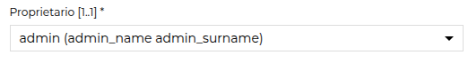
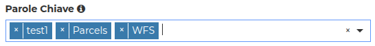

# Metadata editor client

The metadata editor client is basically implemented using the [react-jsonschema-form](https://github.com/rjsf-team/react-jsonschema-form) library.

Some improvements have been made in order to better integrate with GeoNode, such as handling autocomplete, error reporting, and so on.

In order to do that, some custom annotations have been added.

## `geonode:after`

This annotation is used server side to place a field just after another.

In the metadata editor the fields are presented in the same order as they are declared in the schema. This annotation allows adding a new declared field after an existing one:

```json
"short_name": {
   "type": ["string", "null"],
   "geonode:after": "title",
   "geonode:handler": "sparse"
},
```

## Text widget

By default, `react-jsonschema-form` presents string elements in text fields.
If your text is multiline, you may want to edit it in a text area.

This is how it is declared:

```json
"ui:options": {
  "widget": "textarea",
  "rows": 5
},
```

## Dropdown menus { #metadata_dropdown }

In case you have a field that should be populated with the content of a service, you may use the autocomplete feature:

```json
"ui:options": {
  "geonode-ui:autocomplete": "/api/v2/metadata/autocomplete/users"
}
```

This is an improvement to `react-jsonschema-form` implemented within GeoNode.

The client presents a dropdown menu with the content returned by the autocomplete service.

Please note that in order to handle this kind of dropdown, the service must provide a list of entries having `id` and `label` as fields.

According to the field type, different widgets are shown.

### Single choice

Here is an example of an object. The widget will be a single-choice dropdown menu:

```json
"owner": {
    "type": "object",
    "title": "Proprietario",
    "properties": {
        "id": {
            "type": "string",
            "ui:widget": "hidden"
        },
        "label": {
            "type": "string"
        }
    },
    "ui:options": {
        "geonode-ui:autocomplete": "/api/v2/metadata/autocomplete/users"
    }
},
```

And this is how it is rendered:

{ align=center }
/// caption
*Single choice dropdown*
///

### Multi choice

In case the field is an array, the dropdown will be multi-choice:

```json
"EOVsReference": {
    "type": "array",
    "items": {
        "type": "object",
        "properties": {
            "id": {
                "type": "string"
            },
            "label": {
                "type": "string"
            }
        }
    },
    "ui:options": {
        "geonode-ui:autocomplete": "/api/v2/metadata/autocomplete/thesaurus/eov/keywords"
    }
},
```

And this is how it is rendered:

{ align=center }
/// caption
*Multi choice dropdown*
///

## Codelists { #metadata_dropdown_codelist }

In case a dropdown is fed with a codelist stored in a Thesaurus, you may use the `geonode:thesaurus` annotation, which creates an `autocomplete` entry pointing to the defined thesaurus. The dropdown can be either *single* or *multi* choice, as documented in the sections above.

For instance, feeding the `SparseHandler` this subschema:

```json
"p_data_level": {
  "type": "object",
  "properties": {
    "id": {"type": "string"},
    "label": {"type": "string"}
  },
  "geonode:handler": "sparse",
  "geonode:thesaurus": "prj1_data_level"
},
```

it will give back toward the client:

```json
"p_data_level": {
    "type": "object",
    "properties": {
        "id": {"type": "string"},
        "label": {"type": "string"}
    },
    "geonode:handler": "sparse",
    "geonode:thesaurus": "prj1_data_level",
    "title": "Data Level",
    "ui:options": {
        "geonode-ui:autocomplete": "/api/v2/metadata/autocomplete/thesaurus/prj1_data_level/keywords"
    }
},
```
