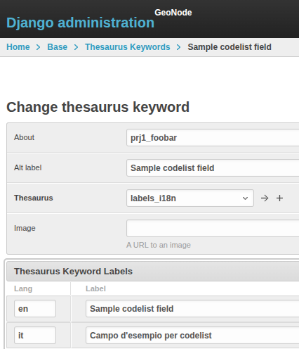

# Examples: Adding a metadata field

To wrap up the metadata documentation, here we present some examples about how to add a brand new field to the metadata editor.

## Example 1: minimal field

Some points related to this field:

- We do not need any special behavior, that is logic for checking internal consistency or updating other fields according to the content of this field
- The field is declared as a simple type, numeric

In this case, where we don't need any specific logic, we can rely on the existing [SparseHandler](https://github.com/GeoNode/geonode/blob/master/geonode/metadata/handlers/sparse.py).

The `SparseHandler` has its own register of handled fields, where custom apps can add their own, so in order to add a numerical field it is enough to add it in the register by specifying its name and the JSON sub-schema, for example:

```python
from geonode.metadata.handlers.sparse import sparse_field_registry

sparse_field_registry.register("accuracy", {"type": "number"})
```

This simple code adds the sparse field `accuracy`, typed as numeric, in the schema.

Please note that the `SparseHandler` will return to the manager a possibly modified subschema, and not the registered one.
For instance:

- `"geonode:handler": "sparse"` will be added in order to mark the handler for the field
- annotations `title` and `description` may be added or modified, see [Metadata localization](i18n.md#metadata_fields_localization)

for example:

```json
"accuracy": {
    "type": "number",
    "geonode:handler": "sparse",
    "title": "Positional accuracy"
}
```

## Example 2: complex json field

- No special behavior
- The field may be as complex as the JSON Schema specification allows

For instance, we want a list of persons defined by 2 fields, one containing the full name, and the other a URI.

```json
"prj1_data_creator": {
    "type": "array",
    "title": "Resource creator",
    "minItems": 1,
    "items": {
        "type": "object",
        "properties": {
            "fullname": {
                "type": "string",
                "maxLength": 255,
                "title": "Name surname",
                "description": "Insert the full name of the person who created the resource"
            },
            "orcid": {
                "type": "string",
                "format": "uri",
                "title": "ORCID",
                "description": "Insert the ORCID of the person who created the resource"
            }
        }
    },
    "geonode:after": "abstract",
    "geonode:handler": "sparse"
},
```

Since the type is a complex one, in this case `array`, but `object` is handled the same way, the `SparseHandler` treats the content as a json object. Here is a sample for the content of the above structure:

```json
"prj1_data_creator": [
    {
        "fullname": "John Doe",
        "orcid": "http://sampleid"
    }
],
```

## Example 3: codelist

You can add a field with a dropdown menu by using thesauri, see [Dropdown menus](client.md#metadata_dropdown).

- create a brand new thesaurus with the items you need, see [Thesauri](../../admin/thesauri/thesauri.md)
- create a field, either single or multiple entry, and reference the thesaurus, see [Codelists](client.md#metadata_dropdown_codelist)

for example:

```json
"prj1_foobar": {
  "type": "object",
  "properties": {
    "id": {"type": "string"},
    "label": {"type": "string"}
  },
  "geonode:handler": "sparse",
  "geonode:thesaurus": "project1_codelist_foobar"
},
```

- you may also add the label for the new field by adding a `ThesaurusKeyword` to the `labels_i18n` thesaurus

{ width=250px }
