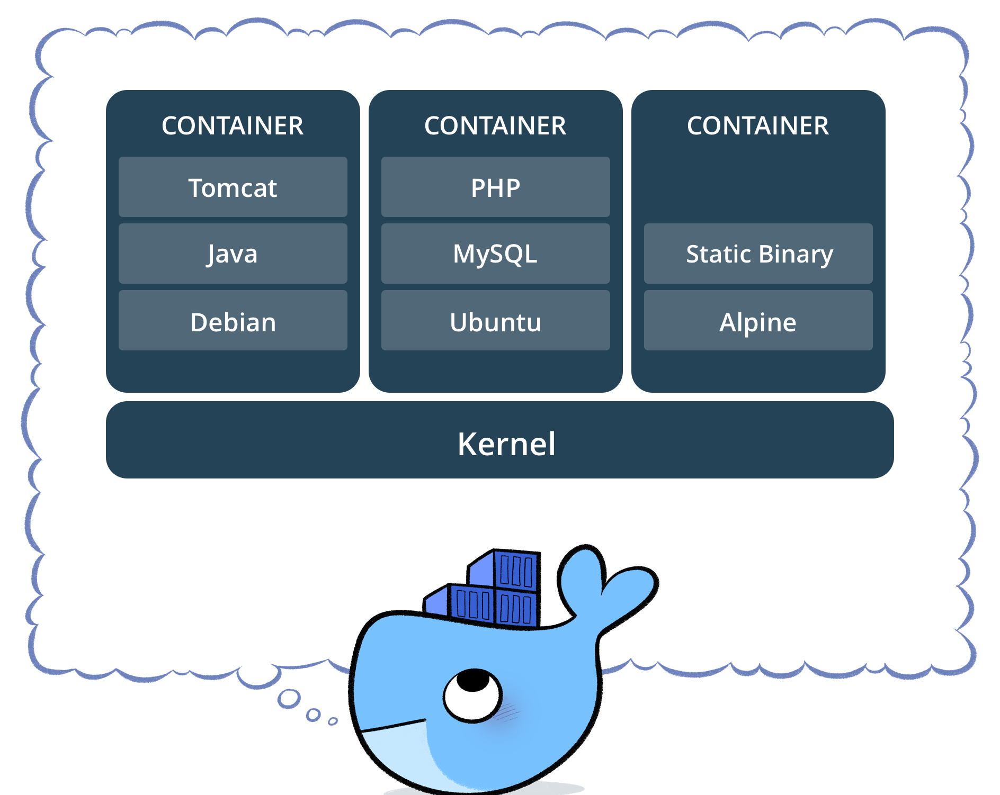

# Quick Start Installation { #quick_start_installation }

The following is a quick guide to get started with GeoNode on the most common operating systems.

!!! Note
    For a full setup and deployment, please refer to the complete installation guides:
    
    - [Docker installation](../../setup/docker/prerequisites.md)
    - [Bare installation](../../setup/bare/prerequisites.md)

This is meant to be run on a fresh machine with no previously installed packages or GeoNode versions.

!!! Warning
    The methods presented here are meant to be used for a limited internal demo only.
    Before exposing your GeoNode instance to a public server, please read carefully the [hardening guide](../../setup/configuration/hardening.md).

## Recommended Minimum System Requirements

A definite specification of technical requirements is difficult to recommend. Accepted performance is highly subjective. Furthermore, performance depends on factors such as concurrent users, records in the database, or the network connectivity of your infrastructure.

For deployment of GeoNode on a single server, the following are the *bare minimum* system requirements:

- 8GB of RAM (16GB or more preferred for a production deployment).
- 2.2GHz processor with 4 cores. Additional processing power may be required for multiple concurrent styling renderings.
- 30 GB software disk usage, reserved for the OS and source code only.
- Additional disk space for any data hosted with GeoNode, data stored in the database, and tiles cached with GeoWebCache.
  For DB, spatial data, cached tiles, and "scratch space" useful for administration, a decent baseline size for GeoNode deployments is between 50GB and 100GB.
- 64-bit hardware **strongly** recommended.

## Install via Docker

[Docker](https://www.docker.com/) is a free software platform used for packaging software into standardized units for development, shipment, and deployment.

{ align=center }
/// caption
*Docker*  
*Credits to Docker.*
///

A container image is a lightweight, stand-alone, executable package of a piece of software that includes everything needed to run it: code, runtime, system tools, system libraries, and settings.

Docker containers running on a single machine share that machine's operating system kernel. They start instantly and use less compute and RAM.

Containers can share a single kernel, and the only information that needs to be in a container image is the executable and its package dependencies, which never need to be installed on the host system.

Multiple containers can run on the same machine and share the OS kernel with other containers, each running as isolated processes in user space.

This documentation refers to the usage of Docker on an Ubuntu host, but you can of course run Docker also on other Linux distributions, Windows, and Mac.

For the steps to set up Docker on Ubuntu, jump to the [Docker installation prerequisites](../../setup/docker/prerequisites.md).
