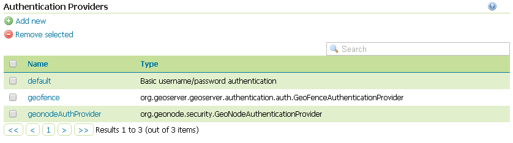
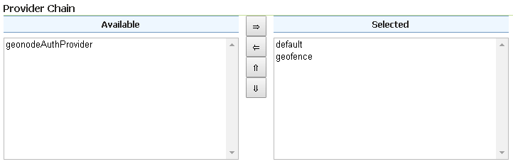
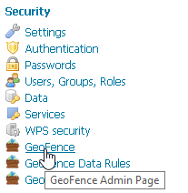
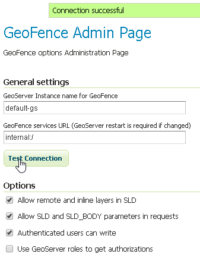
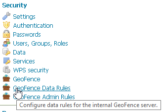
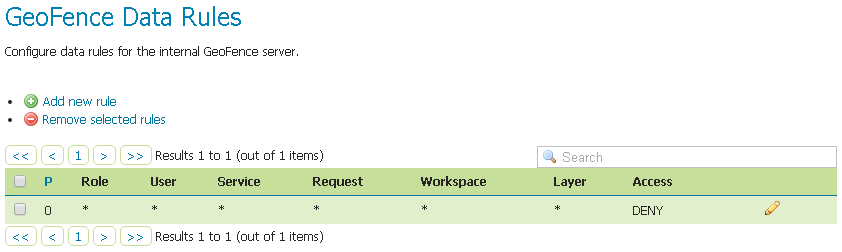
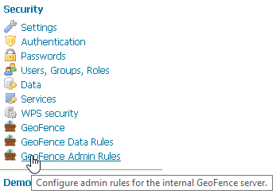
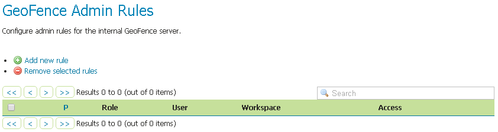

# Setup and test of the GeoFence Server and Default Rules

In order to work correctly, GeoServer needs the [GeoFence Embedded Server](http://docs.geoserver.org/latest/en/user/community/geofence-server/index.html) plugin to be installed and configured on the system.

The GeoServer configuration provided for GeoNode has the plugin already installed with a default configuration. In that case double check that the plugin works correctly and the default rules have been setup by following the next steps.

## Preliminary checks

- GeoServer is up and running and you have admin rights
- The [GeoFence Embedded Server](http://docs.geoserver.org/latest/en/user/community/geofence-server/index.html) plugin has been installed on GeoServer

## Setup of the GeoServer Filter Chains

1. Access the `Security` > `Authentication` section

    { align=center }

2. Identify the section `Authentication Providers` and make sure the `geofence` Authentication Provider is present

    { align=center }

3. Make sure the `Provider Chain` is configured as shown below

    { align=center }

    !!! Warning
        Every time you modify an Authentication Providers, **don't forget to save** the `Authentication` settings. This **must** be done for **each** change.

        { align=center }

## Setup of the GeoFence Server and Rules

1. Make sure GeoFence server works and the default settings are correctly configured

    - Access the `Security` > `GeoFence` section

        { align=center }

    - Make sure the `Options` are configured as follows and the server works well when performing a `Test Connection`

        { align=center }

        - `Allow remote and inline layers in SLD`; Set it to `True`
        - `Allow SLD and SLD_BODY parameters in requests`; Set it to `True`
        - `Authenticated users can write`; Set it to `True`
        - `Use GeoServer roles to get authorizations`; Set it to `False`

2. Check the GeoFence default Rules

    - Access the `Security` > `GeoFence Data Rules` section

        { align=center }

    - Make sure the `DENY ALL` Rule is present by default, otherwise your data will be accessible to everyone

        !!! Note
            This rule is **always** the last one

        { align=center }

        !!! Warning
            If that rule does not exists **at the very bottom** (this rule is **always** the last one), add it manually.

    - Access the `Security` > `GeoFence Admin Rules` section

        { align=center }

    - No Rules needed here

        { align=center }
