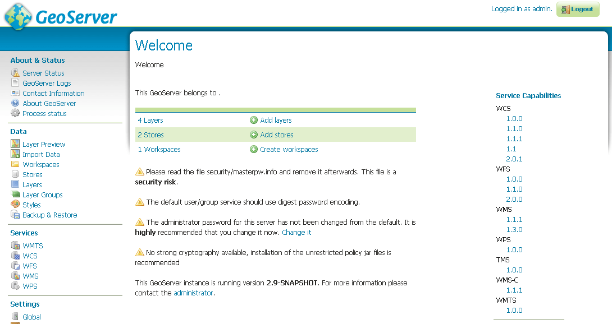
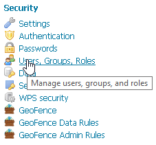
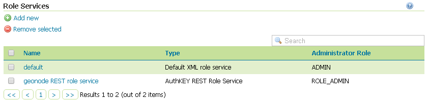
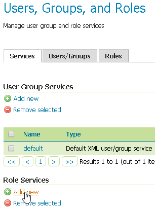
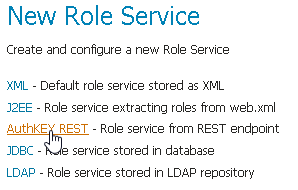
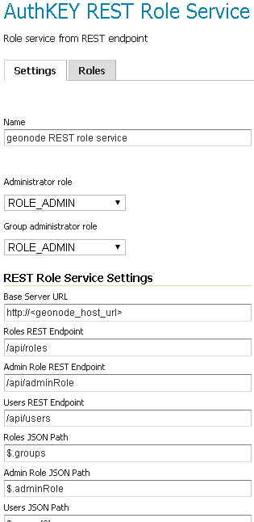

# Connection to the GeoNode REST Role Service

## Preliminary checks

- GeoServer is up and running and you have admin rights
- GeoServer must reach the GeoNode instance via HTTP
- The GeoServer Host IP Address must be allowed to access the GeoNode Role Service APIs. See the `AUTH_IP_WHITELIST` section above

## Setup of the GeoNode REST Role Service

1. Login as `admin` to the GeoServer GUI

    !!! Warning
        In a production system remember to change the default admin credentials `admin` / `geoserver`

    { align=center }

2. Access the `Security` > `Users, Groups, Roles` section

    { align=center }

3. **If not yet configured** the service `geonode REST role service`, click on `Role Services` > `Add new`

    !!! Note
        This passage is **not** needed if the `geonode REST role service` has been already created. If so it will be displayed among the Role Services list

        { align=center }

    { align=center }

4. **If not yet configured** the service `geonode REST role service`, choose `AuthKEY REST - Role service from REST endpoint`

    { align=center }

5. Create / update the `geonode REST role service` accordingly

    { align=center }

    - `Name`; **Must** be `geonode REST role service`
    - `Base Server URL`; Must point to the GeoNode instance base URL (e.g. `http://<geonode_host_url>`)
    - `Roles REST Endpoint`; Enter `/api/roles`
    - `Admin Role REST Endpoint`; Enter `/api/adminRole`
    - `Users REST Endpoint`; Enter `/api/users`
    - `Roles JSON Path`; Enter `$.groups`
    - `Admin Role JSON Path`; Enter `$.adminRole`
    - `Users JSON Path`; Enter `$.users[0].groups`

    Once everything has been setup and it is working, choose the `Administrator role` and `Group administrator role` as `ROLE_ADMIN`

## Allow GeoFence to validate rules with `ROLES`

!!! Warning
    The following instructions are different according to the GeoServer version you are currently using.
