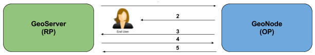
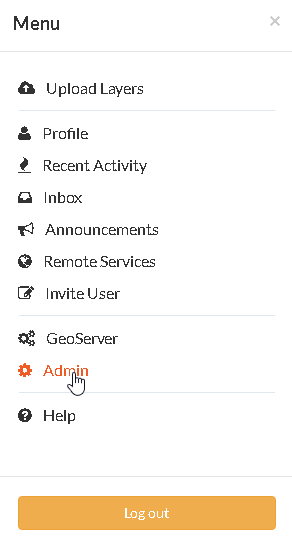
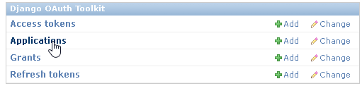
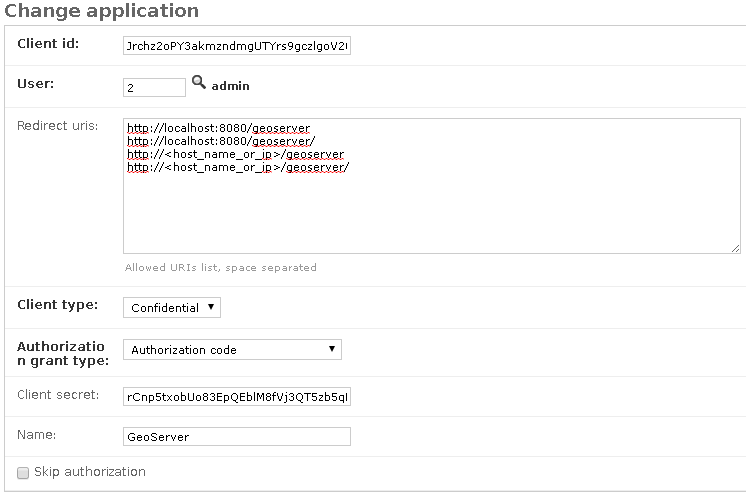

# GeoNode Security Backend

## DJango Authentication

The Django authentication system handles both authentication and authorization.

The auth system consists of:

1. Users
2. Permissions: binary flags designating whether a user may perform a certain task
3. Groups: a generic way of applying labels and permissions to more than one user
4. A configurable password hashing system
5. Forms and view tools for logging in users, or restricting content
6. A pluggable backend system

The authentication system in Django aims to be very generic and does not provide some features commonly found in web authentication systems. Solutions for some of these common problems have been implemented in third-party packages:

1. Password strength checking
2. Throttling of login attempts
3. Authentication against third parties, such as OAuth

!!! Note
    For more details on installation and configuration of the Django authentication system, refer to the official guide: [Django authentication](https://docs.djangoproject.com/en/3.2/topics/auth/).

GeoNode communicates with GeoServer through Basic Authentication under the hood in order to configure data and the GeoServer catalog.

In order to do this, you must be sure that GeoNode knows the **internal** admin user and password of GeoServer.

!!! Warning
    This must be an internal GeoServer user with admin rights, not a GeoNode one.

Make sure the credentials are correctly configured in `settings.py`.

## OGC_SERVER

Ensure that the `OGC_SERVER` settings are correctly configured.

Notice that the two properties `LOGIN_ENDPOINT` and `LOGOUT_ENDPOINT` must specify the GeoServer OAuth2 endpoints. The default values `'j_spring_oauth2_geonode_login'` and `'j_spring_oauth2_geonode_logout'` work in most cases, unless you need specific endpoints different from those. In any case, those values **must** be coherent with the GeoServer OAuth2 plugin configuration.

If in doubt, use the default values below.

```python
...
# OGC (WMS/WFS/WCS) Server Settings
OGC_SERVER = {
    'default': {
        'BACKEND': 'geonode.geoserver',
        'LOCATION': GEOSERVER_LOCATION,
        'LOGIN_ENDPOINT': 'j_spring_oauth2_geonode_login',
        'LOGOUT_ENDPOINT': 'j_spring_oauth2_geonode_logout',
        # PUBLIC_LOCATION needs to be kept like this because in dev mode
        # the proxy won't work and the integration tests will fail
        # the entire block has to be overridden in the local_settings
        'PUBLIC_LOCATION': GEOSERVER_PUBLIC_LOCATION,
        'USER': 'admin',
        'PASSWORD': 'geoserver',
        'MAPFISH_PRINT_ENABLED': True,
        'PRINT_NG_ENABLED': True,
        'GEONODE_SECURITY_ENABLED': True,
        'WMST_ENABLED': False,
        'BACKEND_WRITE_ENABLED': True,
        'WPS_ENABLED': False,
        'LOG_FILE': '%s/geoserver/data/logs/geoserver.log' % os.path.abspath(os.path.join(PROJECT_ROOT, os.pardir)),
        'DATASTORE': '',
        'TIMEOUT': 10
    }
}
...
```

## GeoNode and GeoServer A&A Interaction

The GeoServer instance used by GeoNode has a particular setup that allows the two frameworks to correctly interact and exchange information on user credentials and permissions.

In particular, GeoServer is configured with a `Filter Chain` for authorization that makes use of the following two protocols:

1. **Basic Authentication**. This is the default GeoServer authentication mechanism. It uses [RFC 2617 - Basic and Digest Access Authentication](https://tools.ietf.org/html/rfc2617) in order to check user credentials.

    In other words, GeoServer takes a `username` and a `password` encoded in [Base64](https://tools.ietf.org/html/rfc4648) on the HTTP request headers and compares them against its internal database, which by default is an encrypted XML file in the GeoServer Data Dir.

    If the user credentials match, then GeoServer checks authorization through its `Role Services`.

    !!! Note
        GeoServer ships by default with `admin` and `geoserver` as the default administrator user name and password. Before putting GeoServer online, it is imperative to change at least the administrator password.

2. **OAuth2 Authentication**. This module allows GeoServer to authenticate against the [OAuth2 Protocol](https://tools.ietf.org/html/rfc6749). If the Basic Authentication fails, GeoServer falls back to this by using GeoNode as OAuth2 Provider by default.

!!! Note
    Further details can be found directly in the official GeoServer documentation at [Authentication Chain](http://docs.geoserver.org/latest/en/user/security/auth/chain.html#security-auth-chain).

From the **GeoNode backend (server) side**, the server will make use of **Basic Authentication** with administrator credentials to configure the GeoServer catalog. GeoServer must be reachable by GeoNode, and GeoNode must know the internal GeoServer admin credentials.

From the **GeoNode frontend (browser and GUI) side**, the authentication goal is to allow GeoServer to recognize as valid a user who has already logged into GeoNode, providing a kind of [SSO](https://en.wikipedia.org/wiki/Single_sign-on) mechanism between the two applications.

GeoServer must know and must be able to access GeoNode via HTTP/HTTPS. In other words, an external user connected to GeoNode must be authenticated to GeoServer with the same permissions. This is possible through the **OAuth2 Authentication** protocol.

### GeoNode / GeoServer Authentication Mechanism

**GeoNode as OAuth2 Provider (OP)**

OpenID Connect is an identity framework built on the OAuth 2.0 protocol which extends the authorization of OAuth 2.0 processes to implement its authentication mechanism. OpenID Connect adds a discovery mechanism allowing users to use an external trusted authority as an identity provider. From another point of view, this can be seen as a single sign-on system.

OAuth 2.0 is an authorization framework that is capable of providing a way for clients to access a resource with restricted access on behalf of the resource owner. OpenID Connect allows clients to verify the users with an authorization-server-based authentication.

As an OP, GeoNode will be able to act as a trusted identity provider, thus allowing the system to work in an isolated environment and/or allowing GeoNode to authenticate private users managed by the local Django auth subsystem.

**GeoServer as OAuth2 Relying Party (RP)**

Thanks to **OAuth2 Authentication**, GeoServer is able to retrieve an end user’s identity directly from the OAuth2 Provider (OP).

With GeoNode acting as an OP, the mechanism avoids the use of cookies by relying instead on the OAuth2 secure protocol.

How the OAuth2 protocol works:

{ align=center }

1. The relying party sends the request to the OAuth2 provider to authenticate the end user.
2. The OAuth2 provider authenticates the user.
3. The OAuth2 provider sends the ID token and access token to the relying party.
4. The relying party sends a request to the user info endpoint with the access token received from the OAuth2 provider.
5. The user info endpoint returns the claims.

### GeoNode / GeoServer Authorization Mechanism

Allowing GeoServer to make use of OAuth2 in order to act as an OAuth2 RP is not sufficient to map a user identity to its roles.

On the GeoServer side, we still need a `RoleService` that is able to talk to GeoNode and transform the tokens into a user principal to be used within the GeoServer security subsystem itself.

In other words, after successful authentication, GeoServer needs to authorize the user in order to understand which resources they are enabled to access. A `REST`-based role service on the GeoNode side allows GeoServer to talk to GeoNode via [REST](https://en.wikipedia.org/wiki/Representational_state_transfer) to get the current user along with the list of its roles.

Nevertheless, knowing the roles associated with a user is not sufficient. Complete GeoServer authorization needs a set of `Access Rules`, associated to the roles, in order to establish which resources and data are accessible by the user.

The GeoServer authorization is based on roles only, therefore for each authenticated user we need also to know:

1. The roles associated to a valid user session.
2. The access permissions associated to a GeoServer resource.

The authentication mechanism above allows GeoServer to get information about the user and their roles, which addresses point 1.

About point 2, GeoServer makes use of the [GeoFence Embedded Server](http://docs.geoserver.org/latest/en/user/community/geofence-server/index.html) plugin. GeoFence is a Java web application that provides an advanced authentication/authorization engine for GeoServer using the interface described [here](https://github.com/geoserver/geofence/wiki/First-steps).

GeoFence has its own rules database for the management of authorization rules, and overrides the standard GeoServer security management system by implementing a sophisticated resource access manager. GeoFence also implements and exposes a [REST API](https://github.com/geoserver/geofence/wiki/REST-API) allowing remote authorized clients to read, write, and modify security rules.

The advantages of using this plugin are multiple:

1. Authorization rules have fine granularity, allowing security constraints even on sub-regions and attributes of layers.
2. GeoFence exposes a REST interface to its internal rule database, allowing external managers to update the security constraints programmatically.
3. GeoFence implements an internal caching mechanism which considerably improves performance under load.

**GeoNode interaction with GeoFence**

GeoNode itself is able to push and manage authorization rules to GeoServer through the GeoFence [REST API](https://github.com/geoserver/geofence/wiki/REST-API), acting as an administrator for GeoServer. GeoNode properly configures the GeoFence rules any time it is needed, for example when the permissions of a resource/layer are updated.

GeoServer must know and must be able to access GeoNode via HTTP/HTTPS. In other words, an external user connected to GeoNode must be authenticated to GeoServer with the same permissions. This is possible through the **GeoNodeCookieProcessingFilter**.

Summarizing, we will have different ways to access GeoNode layers:

1. Through GeoNode via Django authentication and **GeoNodeCookieProcessingFilter**. Basically, the users available in GeoNode are also valid for GeoServer or any other backend.

    !!! Warning
        If a GeoNode user has administrator rights, that user will be able to administer GeoServer too.

2. Through the GeoServer security subsystem. It will always be possible to access GeoServer using its internal security system and users, unless explicitly disabled. This is dangerous, and you must know what you are doing.

## DJango OAuth Toolkit Setup and Configuration

GeoNode makes use of the OAuth2 protocol for all the frontend interactions with GeoServer. GeoNode must be configured as an OAuth2 Provider and provide a `Client ID` and a `Client Secret` key to GeoServer.

This is possible by enabling and configuring the [Django OAuth Toolkit plugin](https://django-oauth-toolkit.readthedocs.io/en/latest/).

!!! Warning
    GeoNode and GeoServer will not work at all if the following steps are not executed during the first installation.

## Default settings.py Security Settings for OAuth2

Double-check that the OAuth2 Provider and Security Plugin are enabled and that the settings below are correctly configured.

### AUTH_IP_WHITELIST

`AUTH_IP_WHITELIST` limits access to users/groups REST role service endpoints to only the whitelisted IP addresses. An empty list means `allow all`.

If you need to limit API REST calls to only some specific IPs, fill the list like this: `AUTH_IP_WHITELIST = ['192.168.1.158', '192.168.1.159']`

Default values are:

```python
...
AUTH_IP_WHITELIST = []
...
```

### INSTALLED_APPS

In order to allow GeoNode to act as an OAuth2 Provider, you need to enable the `oauth2_provider` Django application provided by Django OAuth Toolkit.

```python
...
INSTALLED_APPS = (

    'modeltranslation',

    ...
    'guardian',
    'oauth2_provider',
    ...

) + GEONODE_APPS
...
```

### MIDDLEWARE_CLASSES

Installing the `oauth2_provider` Django application is not sufficient to enable the full functionality. GeoNode also needs to include additional entities in its internal model.

```python
...
MIDDLEWARE_CLASSES = (
    'django.middleware.common.CommonMiddleware',
    'django.contrib.sessions.middleware.SessionMiddleware',
    'django.contrib.messages.middleware.MessageMiddleware',
    'django.middleware.locale.LocaleMiddleware',
    'pagination.middleware.PaginationMiddleware',
    'django.middleware.csrf.CsrfViewMiddleware',
    'django.contrib.auth.middleware.AuthenticationMiddleware',
    'django.middleware.clickjacking.XFrameOptionsMiddleware',
    'django.contrib.auth.middleware.SessionAuthenticationMiddleware',
    'oauth2_provider.middleware.OAuth2TokenMiddleware',
)
...
```

### AUTHENTICATION_BACKENDS

In order to allow GeoNode to act as an OAuth2 Provider, enable the `oauth2_provider.backends.OAuth2Backend` Django backend provided by Django OAuth Toolkit.

Also notice that you need to specify the OAuth2 Provider scopes and declare which generator to use in order to create OAuth2 client IDs.

```python
...
AUTHENTICATION_BACKENDS = (
    'oauth2_provider.backends.OAuth2Backend',
    'django.contrib.auth.backends.ModelBackend',
    'guardian.backends.ObjectPermissionBackend',
)

OAUTH2_PROVIDER = {
    'SCOPES': {
        'read': 'Read scope',
        'write': 'Write scope',
        'groups': 'Access to your groups'
    },

    'CLIENT_ID_GENERATOR_CLASS': 'oauth2_provider.generators.ClientIdGenerator',
}
...
```

## Django OAuth Toolkit Admin Setup

Once `settings.py` and `local_settings.py` have been correctly configured for your system:

1. Complete the GeoNode setup steps.

    Prepare the model:

    ```bash
    python manage.py makemigrations
    python manage.py migrate
    python manage.py syncdb
    ```

    Prepare the static data:

    ```bash
    python manage.py collectstatic
    ```

    Make sure the database has been populated with initial default data:

    !!! Warning
        Deprecated. This command will be replaced by migrations in the future, so be careful.

    ```bash
    python manage.py loaddata initial_data.json
    ```

    Make sure there is a superuser for your environment:

    !!! Warning
        Deprecated. This command will be replaced by migrations in the future, so be careful.

    ```bash
    python manage.py createsuperuser
    ```

    !!! Note
        Read the base tutorials in the GeoNode developer documentation for details on the specific commands and how to use them.

2. Start the application.

    Start GeoNode according to how the setup has been done: debug mode through `paver`, or proxied by an HTTP server like Apache HTTPD, Nginx, or others.

3. Finalize the setup of the OAuth2 Provider.

    First, configure and create a new OAuth2 application called `GeoServer` through the GeoNode admin dashboard.

    Access the GeoNode admin dashboard:

    { align=center }

    Go to `Django OAuth Toolkit` > `Applications`:

    { align=center }

    Update or create the application named `GeoServer`:

    !!! Warning
        The application name **must** be `GeoServer`.

    { align=center }

    Provide:

    - `Client id`: an alphanumeric code representing the OAuth2 Client ID. The GeoServer OAuth2 plugin will use this value.
    - `User`: search for the `admin` user. Its `ID` will be automatically updated into the form.
    - `Redirect uris`: it is possible to specify many URIs here. Those must coincide with the GeoServer instance URIs.
    - `Client type`: choose `Confidential`.
    - `Authorization grant type`: choose `Authorization code`.
    - `Client secret`: an alphanumeric code representing the OAuth2 Client Secret. The GeoServer OAuth2 plugin will use this value.
    - `Name`: must be `GeoServer`.

    !!! Warning
        In a production environment, it is highly recommended to modify the default `Client id` and `Client secret` provided with the GeoNode installation.
