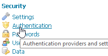
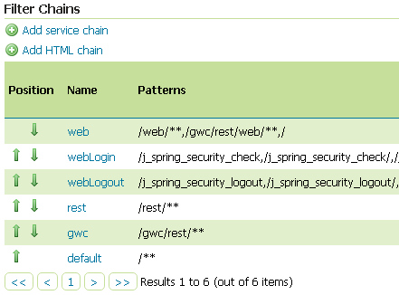
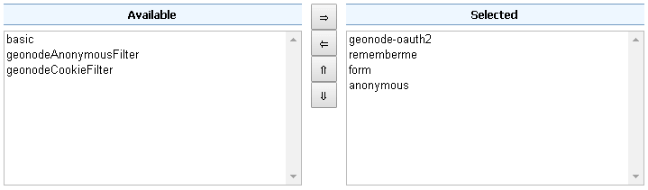
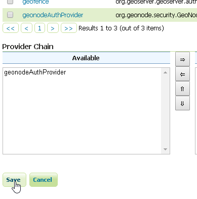
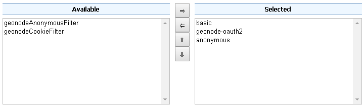
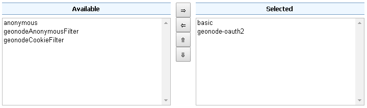
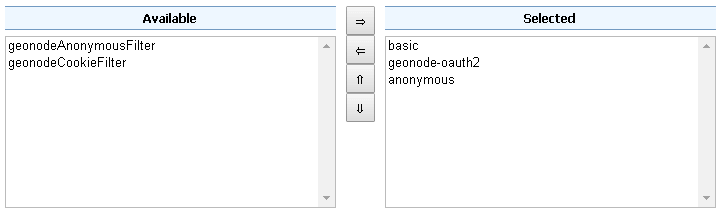
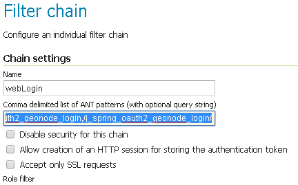
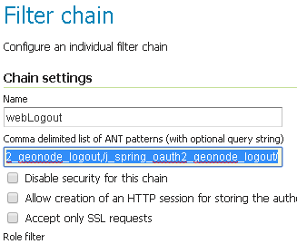

# Configuration of the GeoServer Filter Chains

The following steps ensure GeoServer can adopt more Authentication methods. As stated above, it is possible to Authenticate to GeoServer using different protocols.

GeoServer scans the authentication filters chain associated to the specified path and tries them one by one sequentially. The first one matching the protocol and able to grant access to the user breaks the cycle by creating a `User Principal` and injecting it into the GeoServer `SecurityContext`.

The Authentication process then ends here and the control goes to the Authorization one, which will try to retrieve the authenticated user's Roles through the available GeoServer Role Services associated to the Authentication Filter that granted the access.

## Preliminary checks

- GeoServer is up and running and you have admin rights
- GeoServer must reach the GeoNode instance via HTTP
- The `geonode-oauth2 - Authentication using a GeoNode OAuth2` Authentication Filter and the `geonode REST role service` have been correctly configured

## Setup of the GeoServer Filter Chains

1. Access the `Security` > `Authentication` section

    { align=center }

2. Identify the section `Filter Chains`

    { align=center }

3. Make sure the `web` Filter Chain is configured as shown below

    { align=center }

    !!! Warning
        Every time you modify a Filter Chain, **don't forget to save** the `Authentication` settings. This **must** be done for **each** change.

        { align=center }

4. Make sure the `rest` Filter Chain is configured as shown below

    { align=center }

    !!! Warning
        Every time you modify a Filter Chain, **don't forget to save** the `Authentication` settings. This **must** be done for **each** change.

        { align=center }

5. Make sure the `gwc` Filter Chain is configured as shown below

    { align=center }

    !!! Warning
        Every time you modify a Filter Chain, **don't forget to save** the `Authentication` settings. This **must** be done for **each** change.

        { align=center }

6. Make sure the `default` Filter Chain is configured as shown below

    { align=center }

    !!! Warning
        Every time you modify a Filter Chain, **don't forget to save** the `Authentication` settings. This **must** be done for **each** change.

        { align=center }

7. Add the `GeoNode Login Endpoints` to the comma-delimited list of the `webLogin` Filter Chain

    { align=center }

    !!! Warning
        Every time you modify a Filter Chain, **don't forget to save** the `Authentication` settings. This **must** be done for **each** change.

        { align=center }

8. Add the `GeoNode Logout Endpoints` to the comma-delimited list of the `webLogout` Filter Chain

    { align=center }

    !!! Warning
        Every time you modify a Filter Chain, **don't forget to save** the `Authentication` settings. This **must** be done for **each** change.

        { align=center }

9. Add the `GeoNode Logout Endpoints` to the comma-delimited list of the `formLogoutChain` XML node in `<GEOSERVER_DATA_DIR>/security/filter/formLogout/config.xml`

    You will need a text editor to modify the file.

    !!! Note
        If the `<formLogoutChain>` XML node does not exist at all, create a **new one** as specified below

    ```xml
    <logoutFilter>
      ...
      <redirectURL>/web/</redirectURL>
      <formLogoutChain>/j_spring_security_logout,/j_spring_security_logout/,/j_spring_oauth2_geonode_logout,/j_spring_oauth2_geonode_logout/</formLogoutChain>
    </logoutFilter>
    ```

    !!! Warning
        The value `j_spring_oauth2_geonode_logout` **must** be the same specified as `Logout Authentication EndPoint` in the `geonode-oauth2 - Authentication using a GeoNode OAuth2` above.
