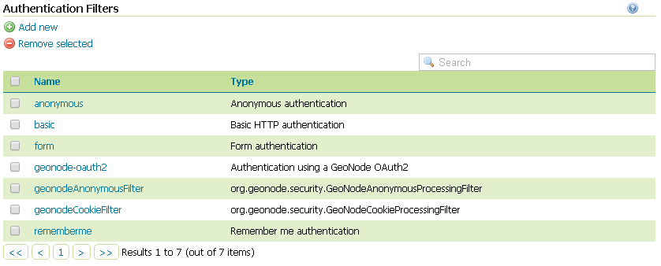
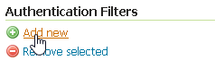
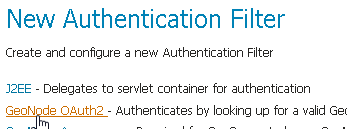
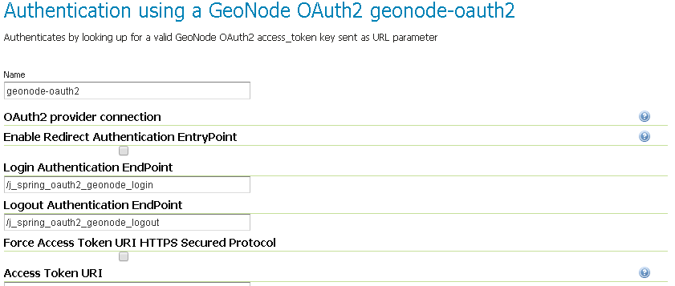

# Setup of the GeoServer OAuth2 Authentication Filter

It is necessary now check that GeoServer can connect to OAuth2 Providers, specifically to GeoNode OP, and be able to authenticate users through it.

## Preliminary checks

- GeoServer is up and running and you have admin rights
- GeoServer must reach the GeoNode instance via HTTP
- OAuth2 `Client ID` and `Client Secret` have been generated on GeoNode and known

## Setup of the GeoNode OAuth2 Security Filter

1. Access the `Security` > `Authentication` section

    { align=center }

2. **If not yet configured** the Authentication Filter `geonode-oauth2 - Authentication using a GeoNode OAuth2`, click on `Authentication Filters` > `Add new`

    !!! Note
        This passage is **not** needed if the `geonode-oauth2 - Authentication using a GeoNode OAuth2` has been already created. If so it will be displayed among the Authentication Filters list

        { align=center }

    { align=center }

3. **If not yet configured** the Authentication Filter `geonode-oauth2 - Authentication using a GeoNode OAuth2`, choose `GeoNode OAuth2 - Authenticates by looking up for a valid GeoNode OAuth2 access_token key sent as URL parameter`

    { align=center }

4. Create / update the `geonode-oauth2 - Authentication using a GeoNode OAuth2` accordingly

    { align=center }

    - `Name`; **Must** be `geonode-oauth2`
    - `Enable Redirect Authentication EntryPoint`; It is recommended to put this to `False`, otherwise GeoServer won't allow you to connect to its Admin GUI through the `Form` but only through GeoNode
    - `Login Authentication EndPoint`; Unless you have specific needs, keep the default value `/j_spring_oauth2_geonode_login`
    - `Logout Authentication EndPoint`; Unless you have specific needs, keep the default value `/j_spring_oauth2_geonode_logout`
    - `Force Access Token URI HTTPS Secured Protocol`; This must be `False` unless you enabled a `Secured Connection` on GeoNode. In that case you will need to trust the GeoNode `Certificate` on the GeoServer JVM Keystore. Please see details below
    - `Access Token URI`; Set this to `http://<geonode_host_base_url>/o/token/`
    - `Force User Authorization URI HTTPS Secured Protocol`; This must be `False` unless you enabled a `Secured Connection` on GeoNode. In that case you will need to trust the GeoNode `Certificate` on the GeoServer JVM Keystore. Please see details below
    - `User Authorization URI`; Set this to `http://<geonode_host_base_url>/o/authorize/`
    - `Redirect URI`; Set this to `http://<geoserver_host>/geoserver`. This address **must** be present on the `Redirect uris` of GeoNode `OAuth2` > `Applications` > `GeoServer`
    - `Check Token Endpoint URL`; Set this to `http://<geonode_host_base_url>/api/o/v4/tokeninfo/`
    - `Logout URI`; Set this to `http://<geonode_host_base_url>/account/logout/`
    - `Scopes`; Unless you have specific needs, keep the default value `read,write,groups`
    - `Client ID`; The `Client id` alphanumeric key generated by the GeoNode `OAuth2` > `Applications` > `GeoServer`
    - `Client Secret`; The `Client secret` alphanumeric key generated by the GeoNode `OAuth2` > `Applications` > `GeoServer`
    - `Role source`; In order to authorize the user against GeoNode, choose `Role service` > `geonode REST role service`
