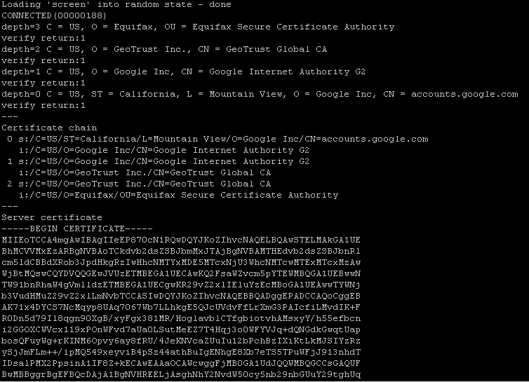
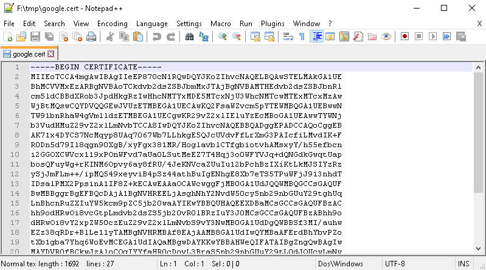
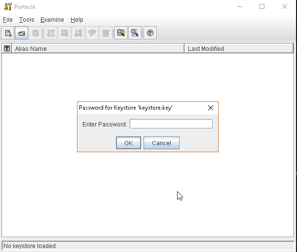
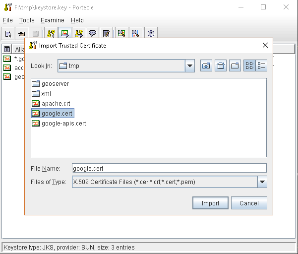
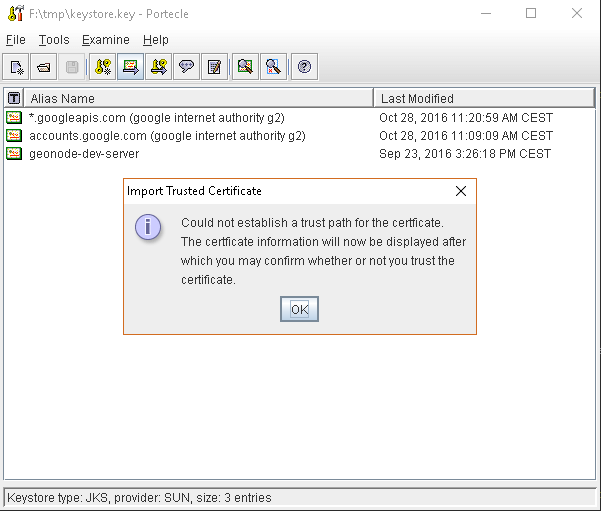
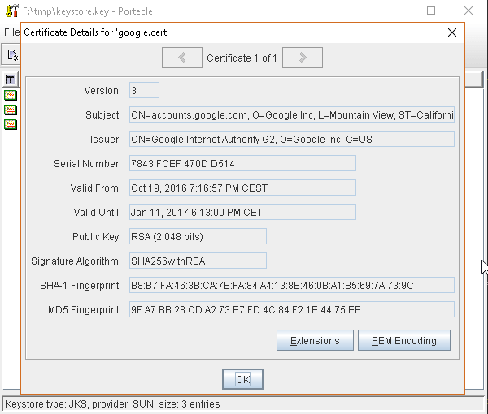
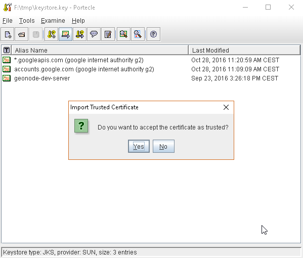
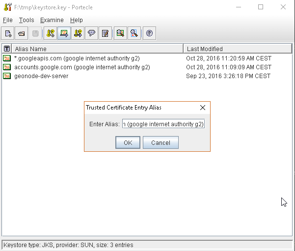
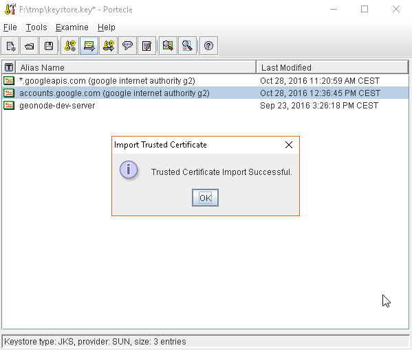
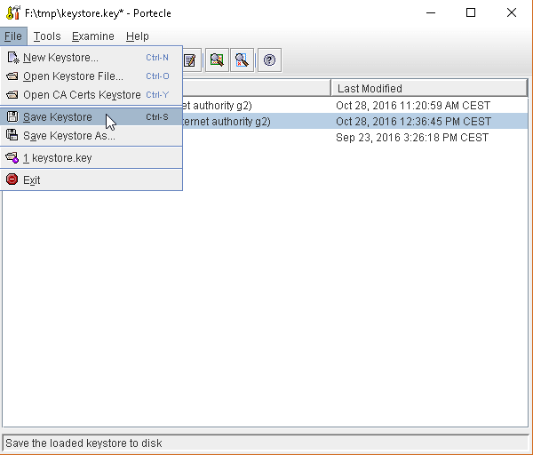

# SSL Trusted Certificates

When using a custom `Keystore` or trying to access a non-trusted or self-signed SSL-protected OAuth2 Provider from a non-SSH connection, you will need to add the certificates to the JVM `Keystore`.

In order to do this you can follow the next steps:

In this example we are going to:

1. Retrieve SSL Certificate from GeoNode domain

    `Access Token URI` = `https://<geonode_host_base_url>/o/token/` therefore we need to trust `https://<geonode_host_base_url>` or `<geonode_host_base_url>:443`

    !!! Note
        You will need to get and trust certificates from every different HTTPS URL used on OAuth2 Endpoints.

2. Store SSL Certificates on local hard-disk
3. Add SSL Certificates to the Java Keystore
4. Enable the JVM to check for SSL Certificates from the Keystore

## 1. Retrieve the SSL Certificate from GeoNode domain

Use the `openssl` command in order to dump the certificate.

For `https://<geonode_host_base_url>`:

```bash
openssl s_client -connect <geonode_host_base_url>:443
```

{ align=center }

## 2. Store SSL Certificate on local hard-disk

Copy-and-paste the section `-BEGIN CERTIFICATE-`, `-END CERTIFICATE-` and save it into a `.cert` file.

!!! Note
    `.cert` file are plain text files containing the ASCII characters included on the `-BEGIN CERTIFICATE-`, `-END CERTIFICATE-` sections

`geonode.cert` (or whatever name you want with `.cert` extension)

{ align=center }

## 3. Add SSL Certificates to the Java Keystore

You can use the Java command `keytool` like this.

`geonode.cert` (or whatever name you want with `.cert` extension)

```bash
keytool -import -noprompt -trustcacerts -alias geonode -file geonode.cert -keystore ${KEYSTOREFILE} -storepass ${KEYSTOREPASS}
```

Or, alternatively, you can use some graphic tool which helps you manage the SSL Certificates and Keystores, like [Portecle](http://portecle.sourceforge.net/).

```bash
java -jar c:\apps\portecle-1.9\portecle.jar
```

{ align=center }
{ align=center }
{ align=center }
{ align=center }
{ align=center }
{ align=center }
{ align=center }
{ align=center }
{ align=center }

## 4. Enable the JVM to check for SSL Certificates from the Keystore

In order to do this, you need to pass a `JAVA_OPTION` to your JVM:

```bash
-Djavax.net.ssl.trustStore=F:\tmp\keystore.key
```

## 5. Restart your server

!!! Note
    Here below you can find a bash script which simplifies the Keystore SSL Certificates importing. Use it at your convenience.

```bash
HOST=myhost.example.com
PORT=443
KEYSTOREFILE=dest_keystore
KEYSTOREPASS=changeme

# get the SSL certificate
openssl s_client -connect ${HOST}:${PORT} </dev/null \
    | sed -ne '/-BEGIN CERTIFICATE-/,/-END CERTIFICATE-/p' > ${HOST}.cert

# create a keystore and import certificate
keytool -import -noprompt -trustcacerts \
    -alias ${HOST} -file ${HOST}.cert \
    -keystore ${KEYSTOREFILE} -storepass ${KEYSTOREPASS}

# verify we've got it.
keytool -list -v -keystore ${KEYSTOREFILE} -storepass ${KEYSTOREPASS} -alias ${HOST}
```
