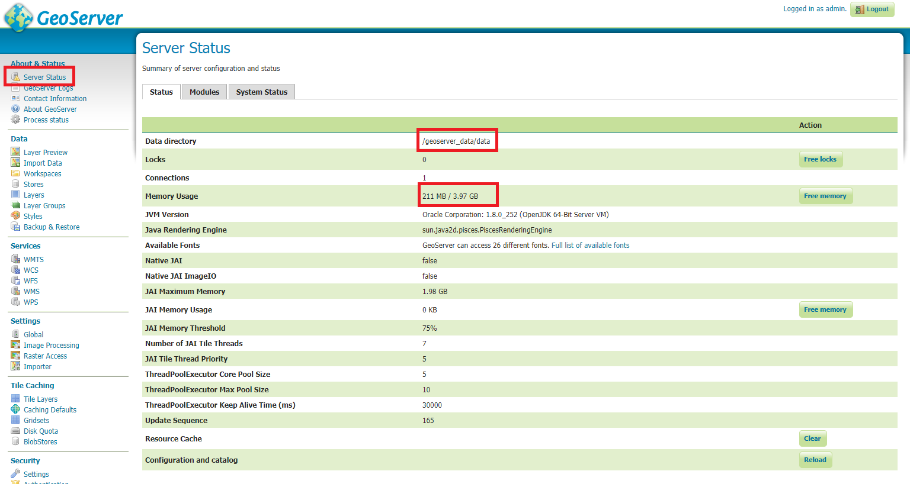
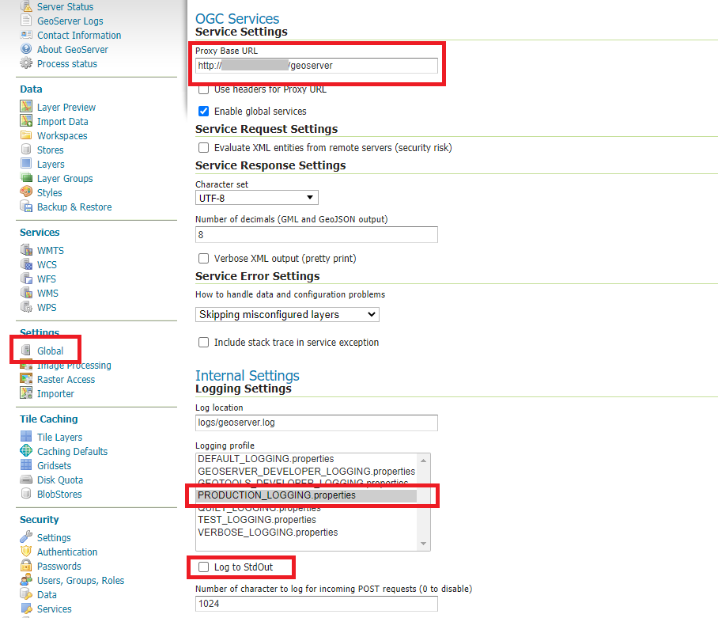
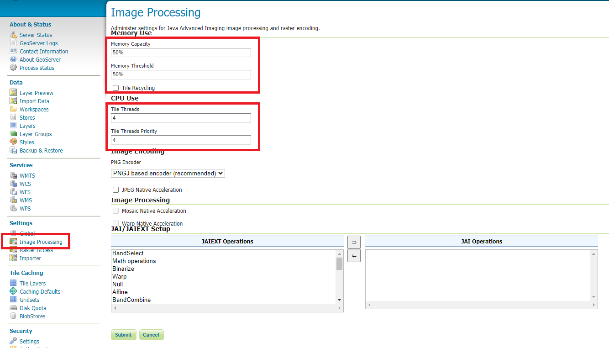
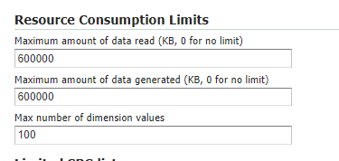
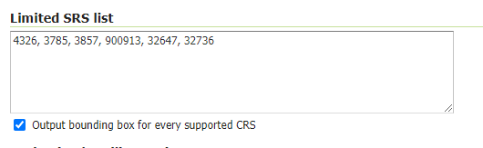
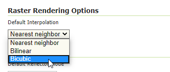
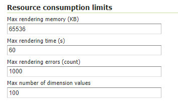
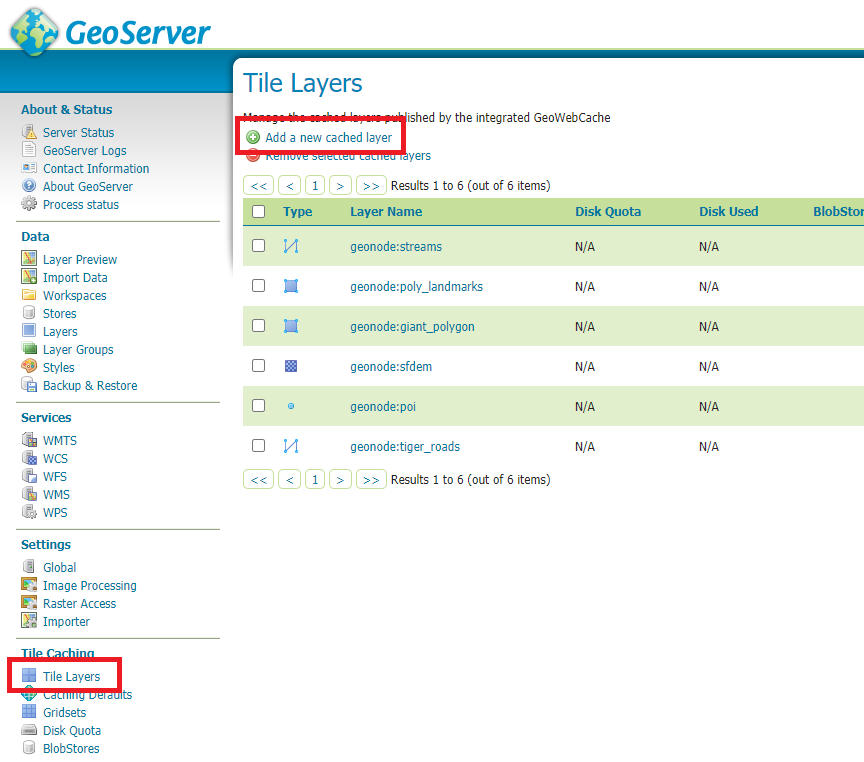
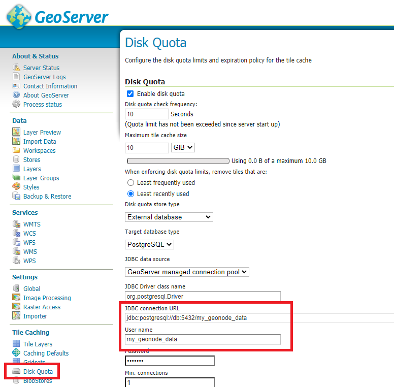
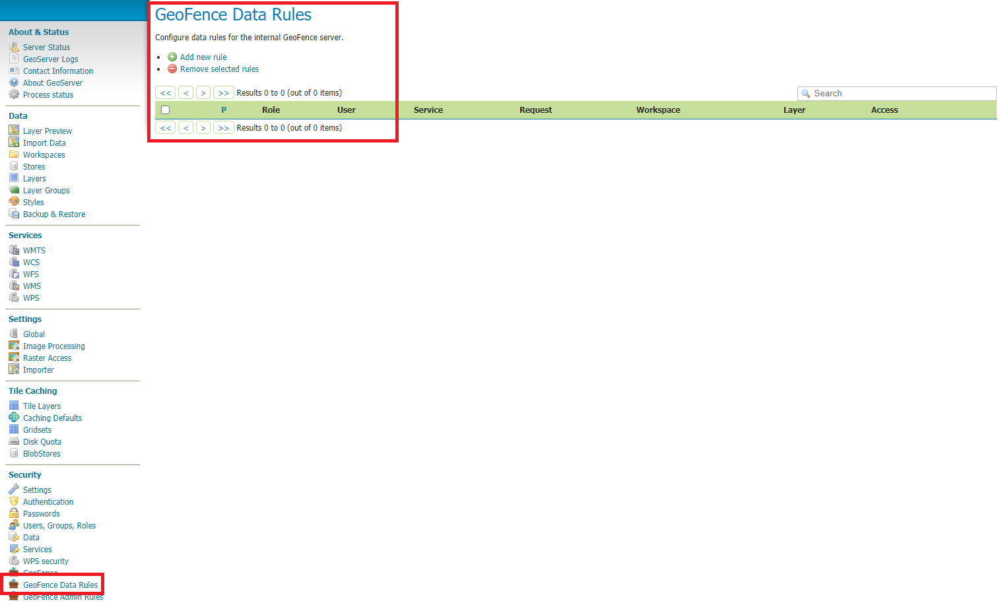

# Further Production Enhancements { #geonode-production-enhancements }

## GeoServer Production Settings

### JVM Settings: Memory And GeoServer Options

The `.env` file provides a way to customize GeoServer JVM options.

The `GEOSERVER_JAVA_OPTS` variable allows you to tune up the GeoServer container and enable specific GeoServer options.

```bash
GEOSERVER_JAVA_OPTS=
    -Djava.awt.headless=true -Xms4G -Xmx4G -XX:PerfDataSamplingInterval=500
    -XX:SoftRefLRUPolicyMSPerMB=36000 -XX:-UseGCOverheadLimit -XX:+UseConcMarkSweepGC
    -XX:+UseParNewGC -XX:ParallelGCThreads=4 -Dfile.encoding=UTF8 -Djavax.servlet.request.encoding=UTF-8
    -Djavax.servlet.response.encoding=UTF-8 -Duser.timezone=GMT
    -Dorg.geotools.shapefile.datetime=false -DGS-SHAPEFILE-CHARSET=UTF-8 -DGEOSERVER_CSRF_DISABLED=true -DPRINT_BASE_URL=http://geoserver:8080/geoserver/pdf
```

`-Djava.awt.headless (true)`

Work with graphics-based applications in Java without an actual display, keyboard, or mouse.
A typical use case of UI components running in a headless environment could be an image converter app. Though it needs graphics data for image processing, a display is not really necessary. The app could be run on a server and converted files saved or sent over the network to another machine for display.

`-Xms4G -Xmx4G`

This means that your JVM will be started with Xms amount of memory and will be able to use a maximum of Xmx amount of memory. Above will start a JVM with 2 GB of memory and will allow the process to use up to 4 GB of memory. You need to adjust this value depending on your available RAM.

`-DGEOSERVER_CSRF_DISABLED (True)`

The GeoServer web admin employs a CSRF (Cross-Site Request Forgery) protection filter that will block any form submissions that did not appear to originate from GeoServer. This can sometimes cause problems for certain proxy configurations. You can disable the CSRF filter by setting the `GEOSERVER_CSRF_DISABLED` property to `true`.
[Further details](https://docs.geoserver.org/main/en/user/security/webadmin/csrf/)

Whenever you need to change one or more of the JVM options, you will need to restart the GeoServer Docker container.

```bash
# Hard restart of the container: the only way to update the .env variables
docker-compose up -d geoserver
```

This command will **preserve** all the GeoServer configuration and data, since the `GEOSERVER_DATA_DIR` is stored on a Docker static volume.

Nevertheless, any change you have made manually to the container, for example adding a new plugin to GeoServer or updating some JARs into the `WEB-INF/lib` library folder, will be lost.

You will need to add the JARs again and restart GeoServer *softly*.

```bash
# Soft restart of the container: the .env variables won't be updated
docker-compose restart geoserver
```

### Global And Services Settings

- Check the GeoServer memory usage and status. Ensure the `GEOSERVER_DATA_DIR` path points to the static volume.

  { align=center width="350px" }
  /// caption
  *GeoServer Status*
  ///

- GeoServer `Global Settings`: make sure the `Proxy Base Url` points to the public URL and the `LOGGING` levels are set to `Production Mode`.

  { align=center width="350px" }
  /// caption
  *Global Settings*
  ///

- GeoServer `Image Processing Settings`: unless you are using some specific renderer or GeoServer plugin, use the following recommended options.

    !!! Note
        Further details are available in the [GeoServer image processing documentation](https://docs.geoserver.org/main/en/user/configuration/image_processing/index.html#image-processing).

  { align=center width="350px" }
  /// caption
  *Image Processing Settings*
  ///

- Tune up `GeoServer Services Configuration`: `WCS`, `WFS`, `WMS` and `WPS`.

  - **WCS**: Update the limits according to your needs. Do not use very high values, as this will make GeoServer prone to DoS attacks.

    { align=center width="350px" }
    /// caption
    *WCS Resource Consuption Limits*
    ///

  - **WMS**: Specify here the SRS list you are going to use. Empty means all the ones supported by GeoServer, but be careful since the `GetCapabilities` output will become huge.

    { align=center width="350px" }
    /// caption
    *WMS Supported SRS List*
    ///

  - **WMS**: `Raster Rendering Options` allows you to tune up the WMS output for better performance or quality. Best Performance: `Nearest Neighbour` - Best Quality: `Bicubic`.

      !!! Warning
          Raster images should always be optimized before being ingested into GeoNode. The general recommendation is to **never** upload a non-processed GeoTIFF image to GeoNode.

          Further details:

          - [Enterprise raster training](https://geoserver.geo-solutions.it/edu/en/enterprise/raster.html)
          - [Advanced GDAL raster data](https://geoserver.geo-solutions.it/edu/en/raster_data/advanced_gdal/index.html)

    { align=center width="350px" }
    /// caption
    *WMS Raster Rendering Options*
    ///

  - **WMS**: Update the limits according to your needs. Do not use very high values, as this will make GeoServer prone to DoS attacks.

    { align=center width="350px" }
    /// caption
    *WMS Resource Consuption Limits*
    ///

### GeoWebCache DiskQuota On Postgis

By default, GeoWebCache DiskQuota is disabled. That means the layers cache might potentially grow indefinitely.

GeoWebCache DiskQuota should always be enabled on a production system. If it is enabled, this **must** be configured to use a DB engine like PostGIS to store its indexes.

- First of all, ensure `Tile Caching` is enabled on all available layers.

    !!! Note
        GeoNode typically does this automatically for you. It is worth double-checking anyway.

  { align=center width="350px" }
  /// caption
  *Tile Caching: Tiled Datasets*
  ///

- Configure `Disk Quota` by providing the connection string to the DB Docker container as specified in the `.env` file.

  { align=center width="350px" }
  /// caption
  *Tile Caching: Disk Quota Configuration*
  ///

### GeoFence Security Rules On Postgis

By default, GeoFence stores the security rules on an `H2` DB.

On a production system, this is not really recommended. You will need to update the GeoServer Docker container in order to enable GeoFence to store the rules into the DB Docker container instead.

In order to do that, follow the procedure below:

```bash
# Enter the GeoServer Docker Container
docker-compose exec geoserver bash

# Install a suitable editor
apt update
apt install nano

# Edit the GeoFence DataStore .properties file
nano /geoserver_data/data/geofence/geofence-datasource-ovr.properties
```

!!! Note
    Make sure to provide the same connection parameters specified in the `.env` file.

```ini
geofenceVendorAdapter.databasePlatform=org.hibernate.spatial.dialect.postgis.PostgisDialect
geofenceDataSource.driverClassName=org.postgresql.Driver
geofenceDataSource.url=jdbc:postgresql://db:5432/my_geonode_data
geofenceDataSource.username=my_geonode_data
geofenceDataSource.password=********
geofenceEntityManagerFactory.jpaPropertyMap[hibernate.default_schema]=public

geofenceDataSource.testOnBorrow=true
geofenceDataSource.validationQuery=SELECT 1
geofenceEntityManagerFactory.jpaPropertyMap[hibernate.testOnBorrow]=true
geofenceEntityManagerFactory.jpaPropertyMap[hibernate.validationQuery]=SELECT 1

geofenceDataSource.removeAbandoned=true
geofenceDataSource.removeAbandonedTimeout=60
geofenceDataSource.connectionProperties=ApplicationName=GeoFence;
```

```bash
# Update the GeoServer WEB-INF/lib JARs accordingly
wget --no-check-certificate "https://repo1.maven.org/maven2/org/postgis/postgis-jdbc/1.3.3/postgis-jdbc-1.3.3.jar" -O postgis-jdbc-1.3.3.jar
wget --no-check-certificate "https://maven.geo-solutions.it/org/hibernatespatial/hibernate-spatial-postgis/1.1.3.2/hibernate-spatial-postgis-1.1.3.2.jar" -O hibernate-spatial-postgis-1.1.3.2.jar
rm /usr/local/tomcat/webapps/geoserver/WEB-INF/lib/hibernate-spatial-h2-geodb-1.1.3.1.jar
mv hibernate-spatial-postgis-1.1.3.2.jar /usr/local/tomcat/webapps/geoserver/WEB-INF/lib/
mv postgis-jdbc-1.3.3.jar /usr/local/tomcat/webapps/geoserver/WEB-INF/lib/
```

The container is ready to be restarted now.

!!! Warning
    Remember to do a **soft restart** otherwise the `WEB-INF/lib` JARs will be reset to the original state.

```bash
# Exit the GeoServer container
exit

# Soft Restart GeoServer Docker Container
docker-compose restart geoserver
```

**IMPORTANT**: The first time you perform this procedure, GeoFence will not be able to retrieve the old security rules anymore.

You will need to [Fixup GeoNode Datasets Permissions](#fixup-geonode-datasets-permissions) in order to regenerate the security rules.

## Fixup GeoNode Datasets Permissions

The list of the GeoFence security rules is available from the `GeoFence Data Rules` section.

Always double-check the list is accessible and the data rules are there. If it is empty, no layer will be accessible by standard users other than admin.

{ align=center width="350px" }
/// caption
*GeoFence Data Rules*
///

In order to re-sync the GeoFence security rules, follow the procedure below:

```bash
# Enter the GeoNode Docker Container
docker-compose exec django bash

# Run the `sync_geonode_datasets` management command
./manage.sh sync_geonode_datasets --updatepermissions
```

## Regenerate GeoNode Datasets Thumbnails

The following procedure allows you to *batch* regenerate all datasets thumbnails:

```bash
# Enter the GeoNode Docker Container
docker-compose exec django bash

# Run the `sync_geonode_datasets` management command
./manage.sh sync_geonode_datasets --updatethumbnails
```

## Regenerate GeoNode Datasets BBOXES

The following procedure allows you to *batch* regenerate all datasets BBOXES:

```bash
# Enter the GeoNode Docker Container
docker-compose exec django bash

# Run the `sync_geonode_datasets` management command
./manage.sh sync_geonode_datasets --updatebbox
```

## Fixup GeoNode Datasets Metadata And Download Links

The following procedure allows you to fix up broken or incorrect metadata links:

```bash
# Enter the GeoNode Docker Container
docker-compose exec django bash

# Run the `set_all_datasets_metadata` management command
./manage.sh set_all_datasets_metadata -d
```

It is also possible to *force* purging the links before regenerating:

```bash
# Enter the GeoNode Docker Container
docker-compose exec django bash

# Run the `set_all_datasets_metadata` management command
./manage.sh set_all_datasets_metadata -d --prune
```

## Migrate GeoNode To A New Hostname

In case you need to move your instance to another domain, for example from `https://my_geonode.geonode.org/` to `https://prod_geonode.geonode.org/`, follow the procedure below:

- Update the `.env` file by specifying the new name accordingly.
- Restart the GeoNode Docker container.

```bash
docker-compose up -d geonode
```

- Run the following management commands from inside the GeoNode Docker container.

```bash
# Enter the GeoNode Docker Container
docker-compose exec django bash

# Run the `migrate_baseurl` management command
./manage.sh migrate_baseurl --source-address=my_geonode.geonode.org --target-address=prod_geonode.geonode.org

# Run the `set_all_datasets_metadata` management command
./manage.sh set_all_datasets_metadata -d
```

## Add Huge Or DB Datasets To Your Instance

Uploading huge datasets, or DB tables, to GeoNode from the `Web Upload Interface` is not really possible sometimes.

The suggested procedure in such cases is the following:

- Add the dataset to `GeoServer` first directly.

  You must upload the data into the GeoServer Docker container static volume first and then add the layer manually through the `GeoServer Admin GUI`.

- Once the dataset is correctly configured on GeoServer, run the following management command from inside the GeoNode Docker container.

```bash
# Enter the GeoNode Docker Container
docker-compose exec django bash

# Run the `updatelayers` management command
./manage.sh updatelayers -w <workspace_name> -f <layer_name>
```
