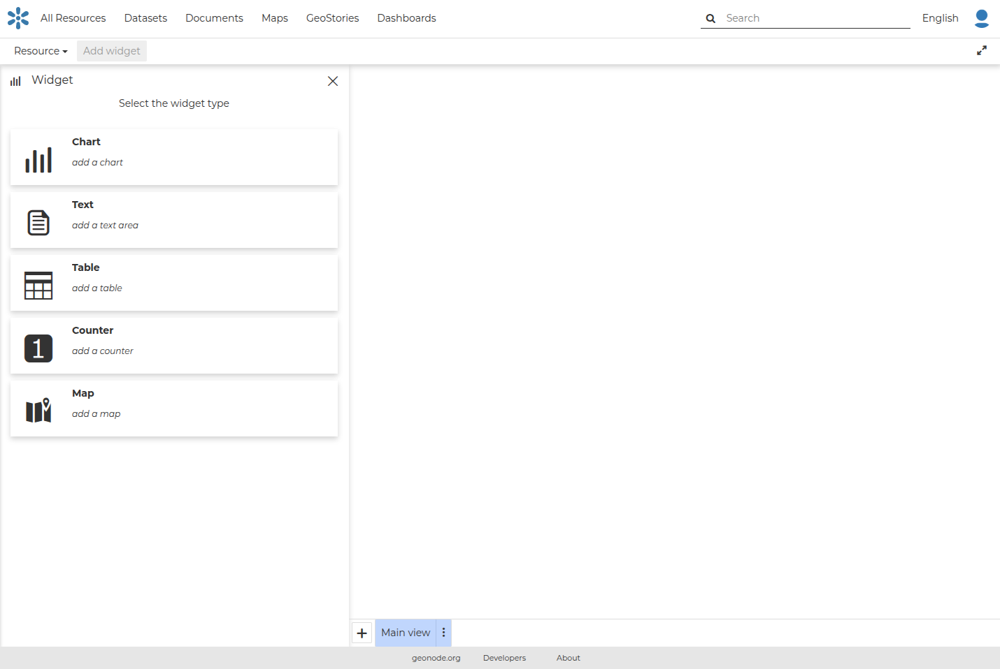

## Dashboard { #dashboard }

Dashboard is a MapStore tool integrated in GeoNode that provides the user with a space to add many Widgets, such as charts, maps, tables, texts and counters, and can create connections between them in order to:

- Provide an overview to better visualize a specific data context
- Interact spatially and analytically with the data by creating connections between widgets
- Perform analysis on involved data/layers

To build a new Dashboard go to `Add Resource` on the *All Resources* page and choose *Create dashboard*, or select `New` on the *Dashboards* page.

Now you have landed on the Dashboard editing page, where you can start creating a dashboard:

{ align=center }
/// caption
*New Dashboard Apps option*
///

### Further Reading

Follow the link below to get more detailed information about the usage of Dashboard.

[Dashboard Documentation](https://mapstore.readthedocs.io/en/latest/user-guide/exploring-dashboards)
