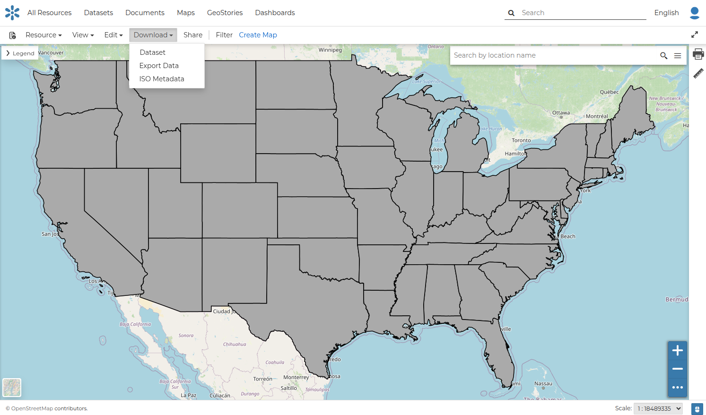
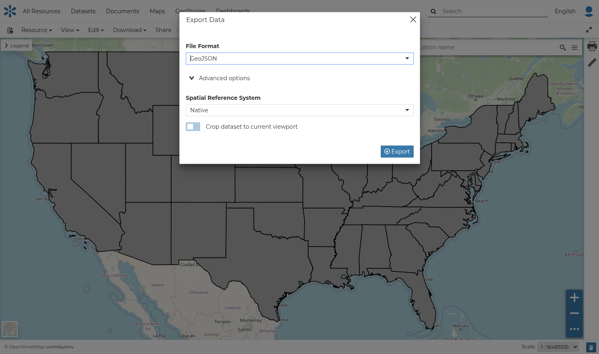
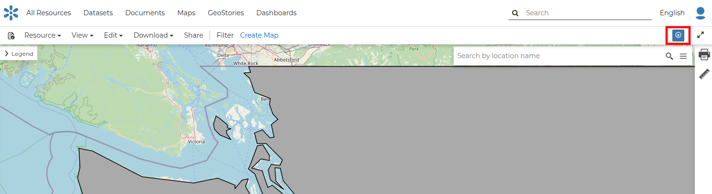
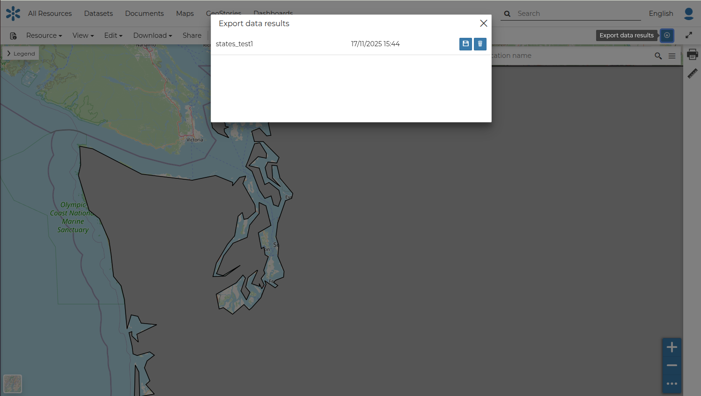

## Downloading Datasets { #dataset-download }

At the top of the *Dataset Menu* there is a `Download` link where it is possible to perform the following actions:

- Download the dataset
- Export in another format
- Download the ISO metadata

{ align=center }
/// caption
*Downloading dataset*
///

By selecting the `Export data` option you will be able to select from a list of supported export file formats.

{ align=center }
/// caption
*Export Dataset in a different format*
///

As shown in the image above, GeoNode allows you to download a subset of data. Click on `Crop dataset to the current viewport` to download filtered data.

On clicking Export, the file is prepared and a notification is shown when the file is ready.

To download the file to your machine, click on the export dataset icon. This opens the prepared export files and you can save the files on your machine by clicking on the save icon on each item.

{ align=center }
/// caption
*Export Results Icon*
///

{ align=center }
