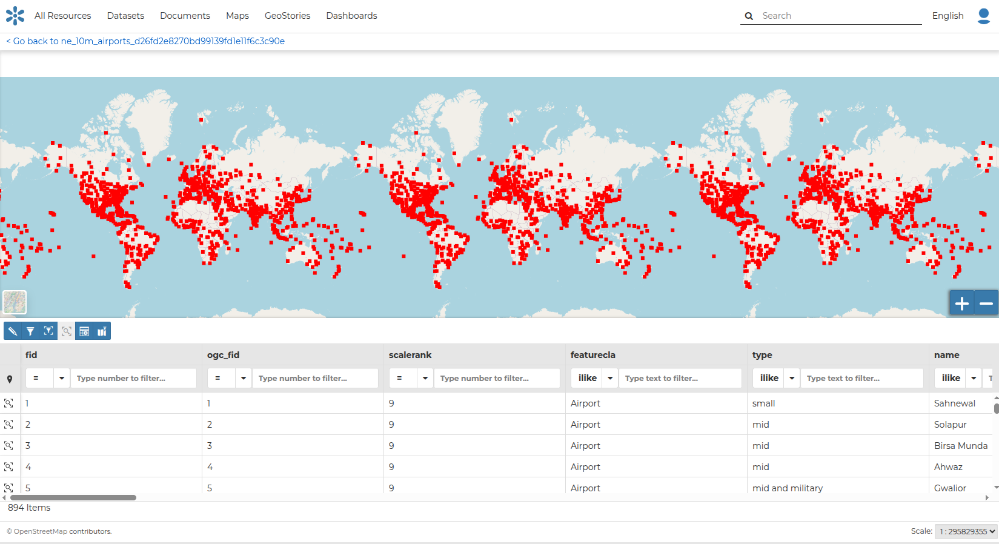
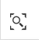
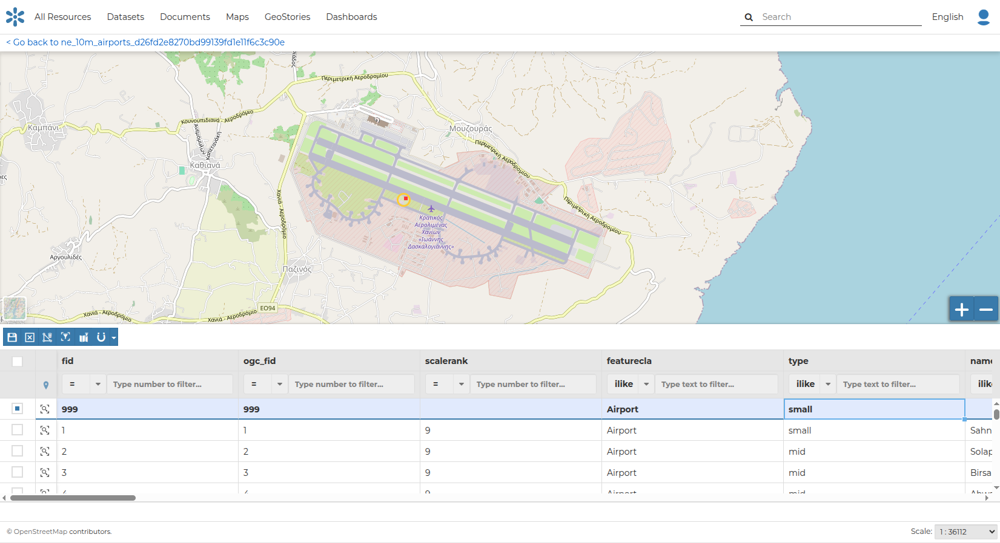

## Dataset Editing (Vectors) { #dataset-editing }

The data content of vector datasets can be edited from the UI by clicking the `Edit Data` link from the `Edit` options on the *Dataset Page*.

In this section you will learn how to edit a *Dataset*, and its data. See the metadata section to learn how to explore dataset metadata and how to upload and edit it. The *Styles* are covered in a dedicated section.

### Editing the Dataset Data { #dataset-data-editing }

The `Edit data` link in the *Dataset Editing* options opens the *Dataset* within a *Map*.

{ align=center }
/// caption
*Editing the Dataset Data*
///

The *Attribute Table* panel of the *Dataset* automatically appears at the bottom of the *Map*. In that panel all the features are listed. For each feature you can zoom to its extent by clicking the corresponding *magnifying glass* icon { width="30px" height="30px" } at the beginning of the row, and you can also observe which values the feature assumes for each attribute.

Click the *Edit Mode* button { width="30px" height="30px" } to start an editing session.

Now you can:

- *Add new Features*

  Through the *Add New Feature* button { width="30px" height="30px" } it is possible to set up a new feature for your dataset.

  Fill the attributes fields and click { width="30px" height="30px" } to save your change.

  Your new feature does not have a shape yet. Click on { width="30px" height="30px" } to draw its shape directly on the *Map* then click on { width="30px" height="30px" } to save it.

!!! note
    When your new feature has a multi-vertex shape you have to double-click the last vertex to finish the drawing.

{ align=center }
/// caption
*Create New Feature*
///

- *Delete Features*

  If you want to delete a feature you have to select it in the *Attribute Table* and click { width="30px" height="30px" }.

- *Change the Feature Shape*

  You can edit the shape of an existing geometry by dragging its vertices with the mouse. A blue circle lets you know which vertex you are moving.

  Features can have *multipart shapes*. You can add parts to the shape when editing it.

- *Change the Feature Attributes*

  When you are in *Edit Mode* you can also edit the attribute values by changing them directly in the corresponding text fields. You can do this by going into edit mode and double-clicking the values.

Once you have finished you can end the *Editing Session* by clicking { width="30px" height="30px" }.

By default the GeoNode map viewer is [MapStore](https://mapstore2.geo-solutions.it/mapstore/#/) based. See the [MapStore documentation](https://docs.mapstore.geosolutionsgroup.com/en/latest/user-guide/attributes-table/) for further information.
