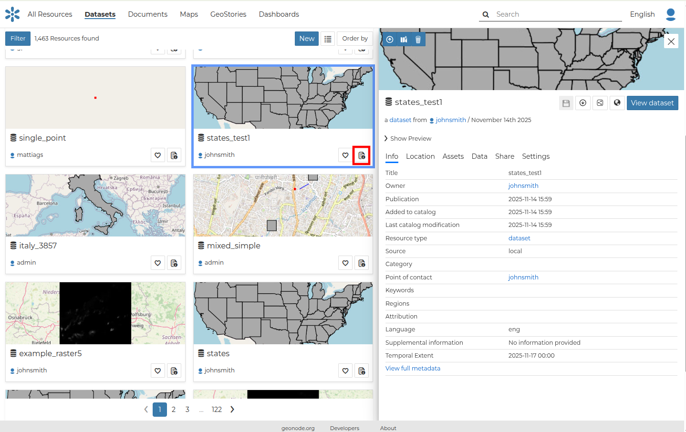
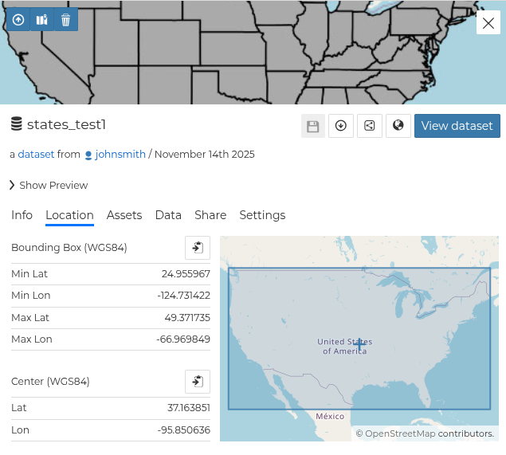
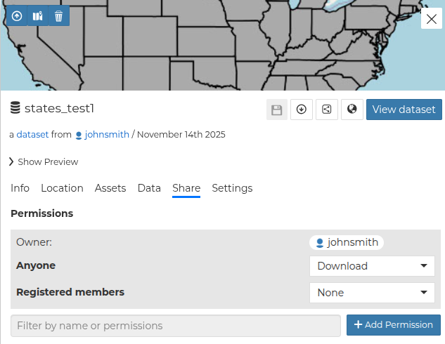
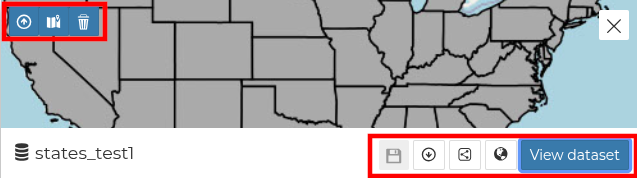

# Dataset Information

From the *Dataset Search Page* (see [Finding Data](../catalog/finding_data.md)) you can select the `Open properties` icon from the dataset you are interested in to see an overview about it.

{ align=center }

The information panel reports:

- The *Info* tab is active by default. This tab section shows some dataset metadata such as its title, the abstract, date of publication etc. The metadata also indicates the dataset owner, what are the topic categories the dataset belongs to and which regions are affected.

{ align=center }
/// caption
*Dataset Info tab*
///

- The *Location* tab shows the spacial extent of the dataset.

{ align=center }
/// caption
*Dataset Location tab*
///

By clicking on the copy icons you have a copy of the current *Bounding Box* or the *Center* in the clipboard which once pasted will be a WKT text.

{ align=center }
/// caption
*Bounding Box and Center*
///

- The *Assets* tab presents the current dataset's download link. Moreover, the user is able to add additional assets that are related to this dataset.

{ align=center }
/// caption
*Dataset Attributes tab*
///

- The *Data* tab shows the data structure behind the dataset. All the attributes are listed and for each of them some statistics (e.g. the range of values) are estimated (if possible).

{ align=center }
/// caption
*Dataset Attributes tab*
///

- The *Share* tab allows to the owner of the dataset to edit its permissions.

{ align=center }
/// caption
*Dataset Linked Resources tab*
///

- The *Settings* tab allows to the owner of the dataset to define a group, the publishing status, and more options (e.g Approved).

{ align=center }
/// caption
*Dataset Settings tab*
///

From the upper left toolbar on the thumbnail part of the properties panel it is possible to:

{ align=center }
/// caption
*Dataset Info toolbar*
///

- Upload a new thumbnail for this dataset
- Set a thumbnail by using the full extent of the dataset
- Remove the thumbnail

While from the low right toolbar on the thumbnail part of the properties panel it is possible to:

- Save the current changes of the dataset
- Download the dataset
- Copy the resource URL
- Copy the OGC resource web services URL

You can access the dataset details page by clicking on *View dataset* in the overview panel.
That page looks like the one shown in the picture below.

{ align=center }
/// caption
*Dataset page*
///
