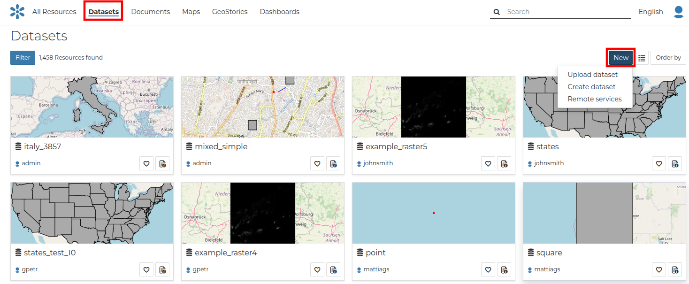
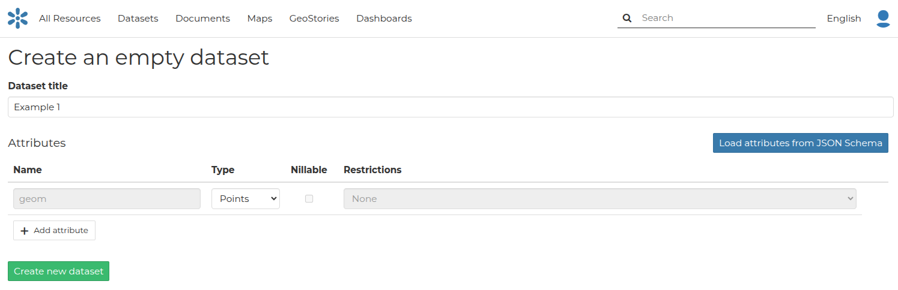
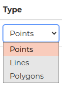
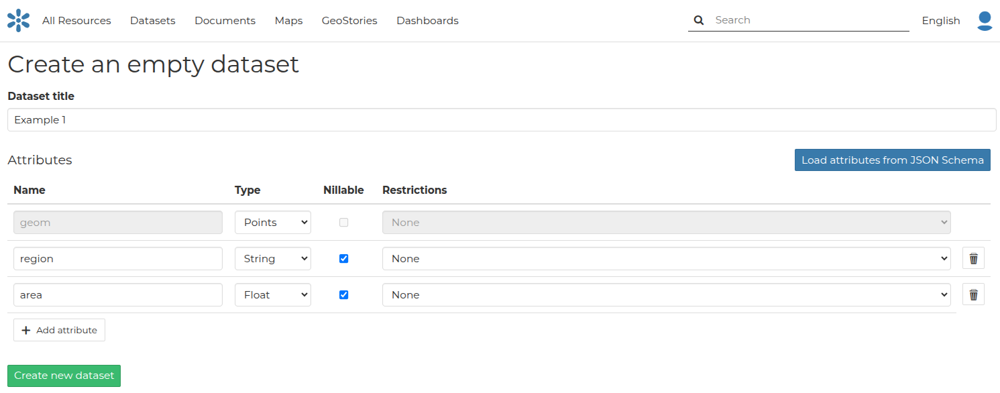
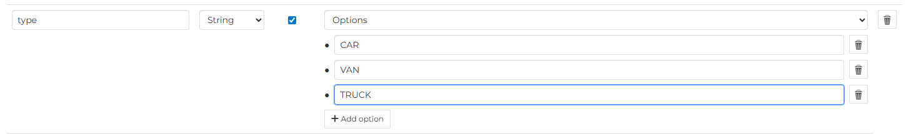
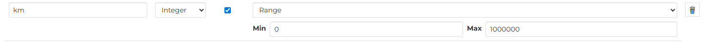

## Creating a Dataset from scratch

An interesting tool that GeoNode makes available to you is *Create dataset*. It allows you to create a new vector dataset from scratch. The *Dataset Creation Form* is reachable through the `Create dataset` link shown in the picture below.

{ align=center }
/// caption
*Create dataset link*
///

The corresponding form where users are able to create a dataset from scratch is presented below:

{ align=center }
/// caption
*Form for creating a dataset*
///

In order to create the new dataset you have to fill out the required fields:

- *Dataset title*
- *Geometry type*
- *Attributes* (name, geometry type, etc)

At first, the user has to define a dataset title and the geometry type:

{ align=center }
/// caption
*Geometry types*
///

Then, through the `Add Attribute` button, the user can add new attributes. Usually dataset features should have some *Attributes* that enrich the amount of information associated with each of them.

{ align=center }
/// caption
*New Dataset creation from scratch*
///

### Defining attributes constraints

For numeric and textual attributes, two constraints can be defined. These constrain the admitted values for the attribute, either during a dataset update operation or a dataset editing session.

Two types of constraints can be selected from the dropdown under the *Restrictions* column:

- **Options**: For numeric and string values, a list of controlled values (domain) can be defined.

  { align=center }

- **Range**: For numeric values, a range of values can be defined. This constrains the admitted values for the attribute, either during a *Dataset Update* operation or a *Data Editing* session.

  { align=center }

Once the form has been filled out, click on `Create new dataset`. You will be redirected to the *Dataset Page*. Now your dataset is created but is still empty, no features have been added yet. See [Dataset Editing](dataset_editing.md#dataset-editing) to learn how to add new features.
