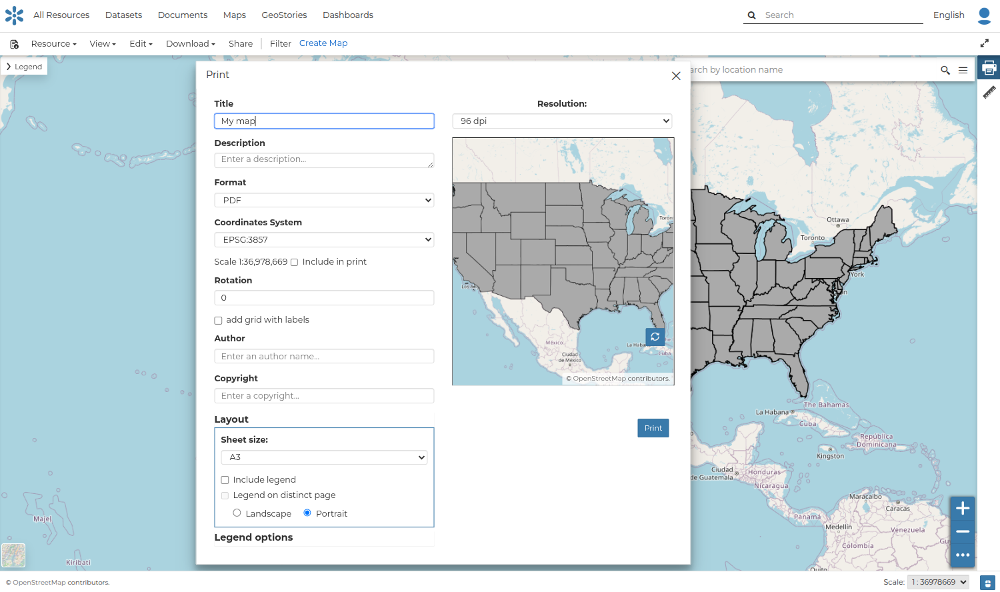
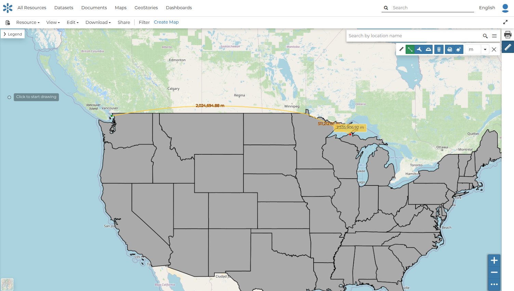

## Printing

The [MapStore](https://mapstore2.geo-solutions.it/mapstore/#/) based map viewer of GeoNode allows you to print the current view with a customizable layout.

Click the `Print` button, located on the right of the screen, and the **Printing Window** will open.

{ align=center }
/// caption
*The Printing Window*
///

From this window you can:

- enter *Title* and *Description*
- choose the *Resolution* in dpi
- select the format
- select the coordinate
- add the scale
- add a grid with label
- customize the *Layout*
- the *Sheet size* (A3, A4)
- whether to include the legend or not
- whether to put the legend on a separate page
- the page *Orientation* (Landscape or Portrait)
- customize the *Legend*
- the *Label Font*
- the *Font Size*
- the *Font Emphasis* (bold, italic)
- whether to *Force Labels*
- whether to use *Anti Aliasing Font*
- the *Icon Size*
- the *Legend Resolution* in dpi

To print the view click on `Print`.

## Performing Measurements

Click on `Measure`, located on the right of the screen, to perform a measurement.
As you can see in the picture below, this tool allows you to measure *Distances*, *Areas* and the *Bearing* of lines.

{ align=center }
/// caption
*The Measure Tool*
///
