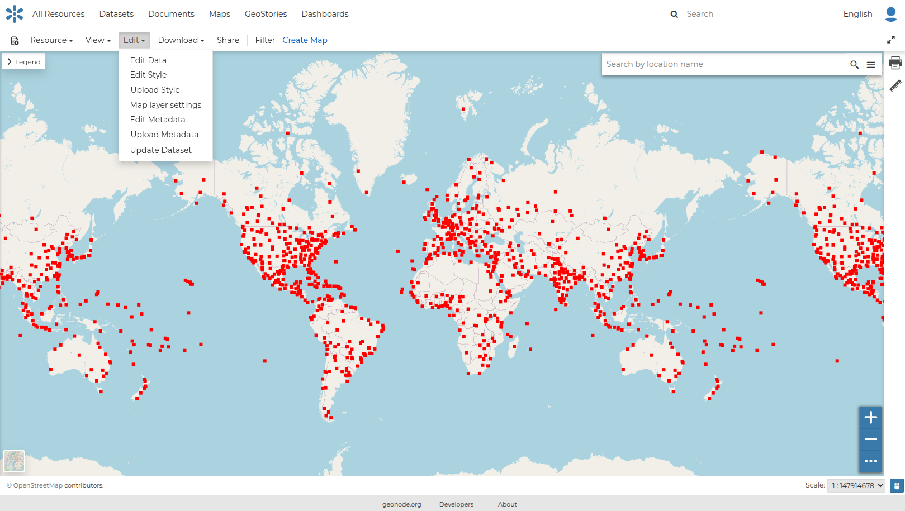

## The dataset viewer

### Data viewer and editor
For vector (tabular) datasets, data content can be edited. When the **View/Edit Data** menu item is clicked, the **Attribute Table** panel of the Dataset will automatically appear at the bottom of the Map. In that panel all the features are listed. For each feature you can zoom to its extent by clicking on the corresponding magnifying glass icon  at the beginning of the row, edit its attribute values, and remove it. New features can also be created. 
You can reference MapStore's documentation about basic and advanced usage of the [Attribute table](https://docs.mapstore.geosolutionsgroup.com/en/latest/user-guide/attributes-table/){ target=_blank }.

### Mapping Settings

#### Editing the dataset style
In GeoNode each dataset has one style refered to as a Default Style which is determined by the nature of the data you’re mapping. When uploading a new dataset (see Datasets Uploading) a new default style will be associated to it.

In order to edit a dataset style, open the *Dataset Page* (see [Dataset Information](dataset_info.md)) and click on `Edit`. Then click the `Edit Style` link in the *options* (see the picture below).

{ align=center }
/// caption
*Edit Styles button*
///

The *Dataset* will open in a new *Map* with the style panel. 

For more information for editing the style please take a look at [Dataset and Map Styling](../resource_styling.md).

#### GetFeatureInfo 
TBD

### Create Map
Datasets can be previewed inside a map. The viewer provides a subset of the map tools that are available for Maps, because the viewer is mainly intended for just previewing the spatial content of a dataset. For a full featured map, including map widgets and additional plugins, a Map can be created containing the dataset. For more information, see [Creating Maps](../maps/creating_maps.md#creating-map).
