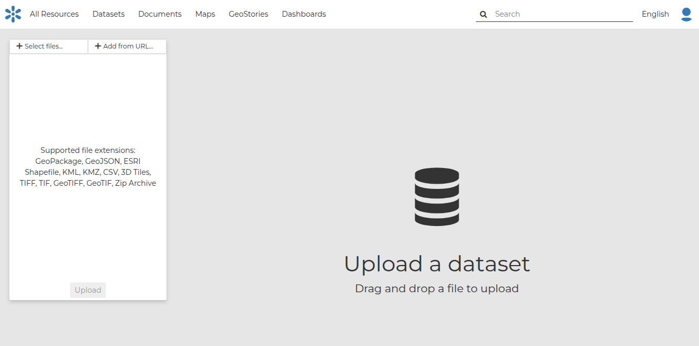

Datasets are published resources representing raster o vector spatial data sources. Datasets can also be associated with metadata, ratings, and comments.
In this section, you will learn how to create a new dataset by uploading a local data set, add dataset info, change the style of the dataset, and share the results.

## Upload from file
The most important resource type in GeoNode is the Dataset. A dataset represents spatial information so it can be displayed inside a map.
To better understand what we are talking about lets upload your first dataset.
It is possible to upload a Datasets in two ways:

 - From the **All Resources** page by clicking the **Add Resource** button which displays a list including Upload dataset link
 - From the **Datasets** page, by clicking on **New** which displays a list including Upload dataset link

The Datasets Uploading page looks like the one in the picture below.

Through the **Select files** button you can select files from your disk, or drag and drop files in the sidebar area. Make sure they are valid raster or vector spatial data, then you can click to **Upload** button.
Multiple files can be uploaded in parallel, within the max parallel uploads per user allowed by the system.

A progress bar and a spinning icon show the operation made during the dataset upload and alert you when the process is over.

!!! note
    If you get the following error message:

    `Total upload size exceeds 100.0 MB. Please try again with smaller files.`

    This means that there is an upload size limit of 100 MB. An user with administrative access can change the upload size limits at the admin panel for size limits.

    Similarly, for the following error message:

    `The number of active parallel uploads exceeds 5. Wait for the pending ones to finish.`

    You can modify the upload parallelism limits at the admin panel for parallelism limits.

## Upload from a URL

GeoNode supports the upload of a remote dataset through a URL. For more information please take a look at [this section](remote/#remote-3d-tiles).
