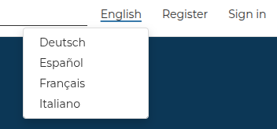
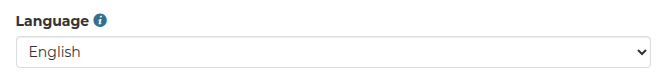

# Default Language Management

GeoNode supports dynamic language selection through both the user interface and the user profile settings.

## Authenticated Users

Authenticated users can change the application language in two different ways:

- Through the **topbar language switcher**
- Through the **Language field** in their User Profile

{ align=center }
/// caption
Topbar language switcher.
///

{ align=center }
/// caption
Language field in the user profile.
///

Both mechanisms are fully synchronized.

When a user changes the language using the topbar switcher, the selected language is automatically persisted in the user profile and stored in the database. Similarly, updating the language from the User Profile immediately affects the language used by the interface.

This ensures that:

- the selected language is persistent across sessions and browser restarts
- the same language preference is consistently applied after login
- the topbar switcher and the profile language always remain synchronized

The stored language preference is automatically applied for authenticated users through middleware during each request.

---

## Anonymous Users

Anonymous users can also change the language using the topbar language switcher.

Since anonymous users do not have a profile stored in the database, the selected language is stored only in the browser through Django's language cookie mechanism.

As a result:

- the language preference affects only the current browser
- the preference is not persisted in the GeoNode database
- different browsers or devices may use different languages independently

---

## Read-Only Mode

When the GeoNode instance is configured in **read-only mode**, persistent database updates are disabled.

In this scenario:

- authenticated users can still change the interface language using the topbar switcher
- the selected language is applied only for the current browser/session
- the language preference is not written to the user profile in the database

This behavior ensures that language switching remains available even while the platform prevents content modifications.

The read-only restriction therefore affects only the persistence of the language preference, not the ability to temporarily change the interface language.
