# Document Information

From the *Documents Search Page* (see [Finding Data](../catalog/finding_data.md)) click on the **open properties** button on the document you are interested in to see an overview of it.

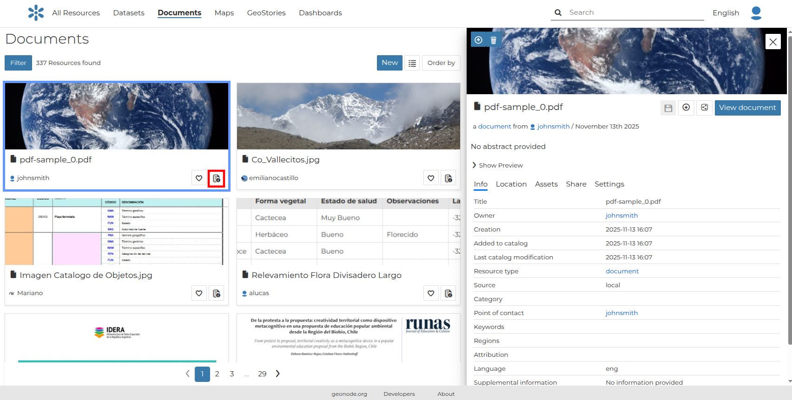{ align=center }

The information panel reports:

- The **Info** tab is active by default. This tab section shows some document metadata such as its title, the abstract, date of publication etc. The metadata also indicates the document owner, what are the topic categories the document belongs to and which regions are affected.

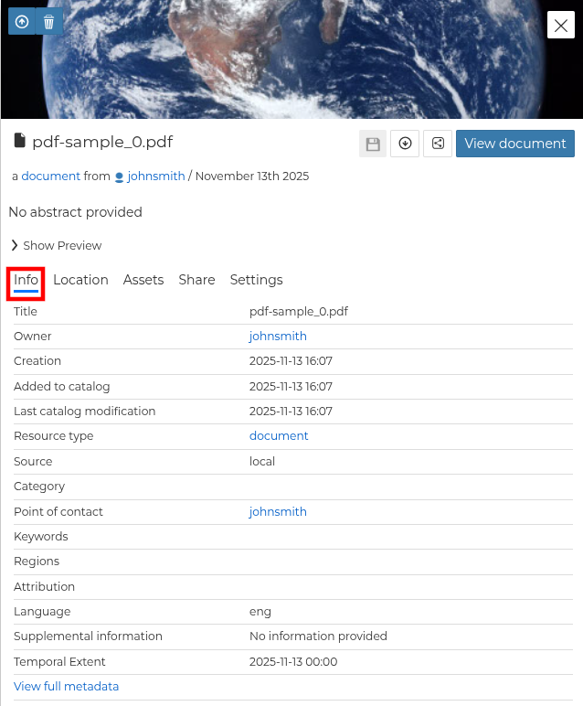{ align=center }
/// caption
*Document Information tab*
///

- The **Location** tab shows the spacial extent of the document.

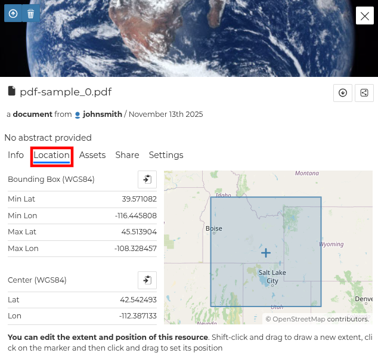{ align=center }
/// caption
*Document Location tab*
///

By clicking on the copy icons you have a copy of the current *Bounding Box* or the *Center* in the clipboard which once pasted will be a WKT text.

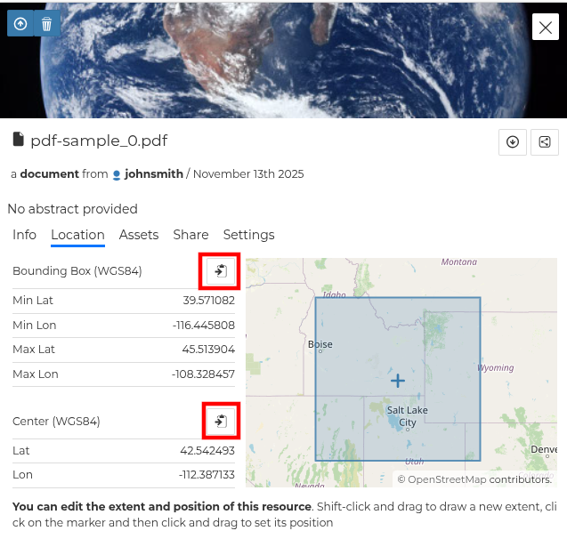{ align=center }
/// caption
*Bounding Box and Center*
///

!!! warning
    From the document information panel, the *Location* tab is in read only mode. To edit it, see the document editing section.

- The *Assets* tab presents the current document's download link. Moreover, the user is able to add additional assets that are related to this document.

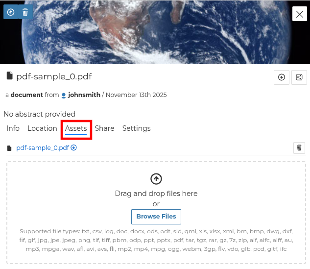{ align=center }
/// caption
*Document Assets tab*
///

- The *Share* tab allows to the owner of the document to edit its permissions.

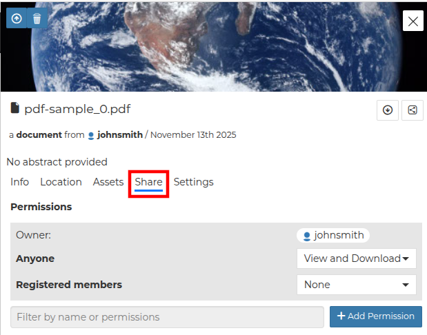{ align=center }
/// caption
*Document Share tab*
///

- The *Settings* tab allows to the owner of the document to define a group, the publishing status, and more options (e.g Approved).

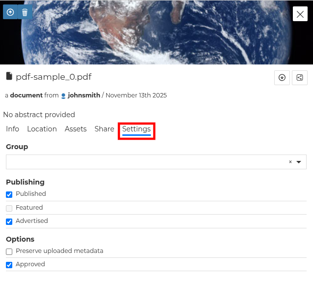{ align=center }
/// caption
*Document Settings tab*
///

From the upper of the document's properties table, it is possible:

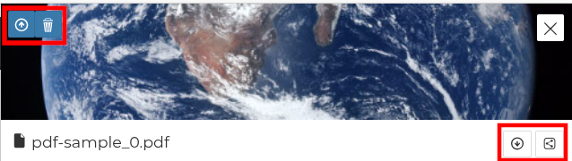{ align=center }
/// caption
*Document thumbnail's toolbar*
///

- Upload / set a new thumbnail for the document or remove the current thumbnail (upper left buttons).
- Directly *Download* the document or copy the resource URL (down right buttons).

You can access the document details page by clicking the document itself from the document list or the *View document* in the overview panel.

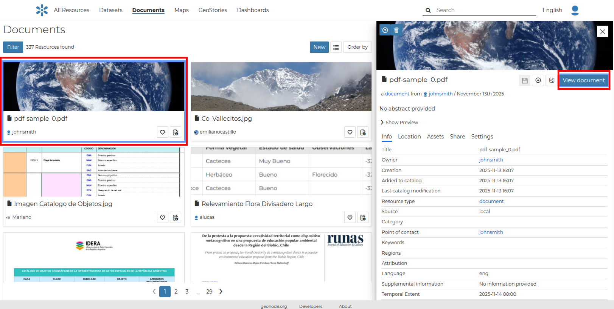{ align=center }
/// caption
*Document page*
///

On the page of a document, the resource is either directly displayed on the page or accessible by clicking on the link provided under the title.

## Exploring the Document detail menu Sections

As soon as a document is opened, the **Info** panel is shown. It reports the document metadata such as its title, abstract, date of publication etc. The metadata also indicates the user who is responsible for uploading and managing this content, as well as the group to which it is linked.

Selecting *View Metadata* from the `View` button it is possible to visualize the metadata of the document.

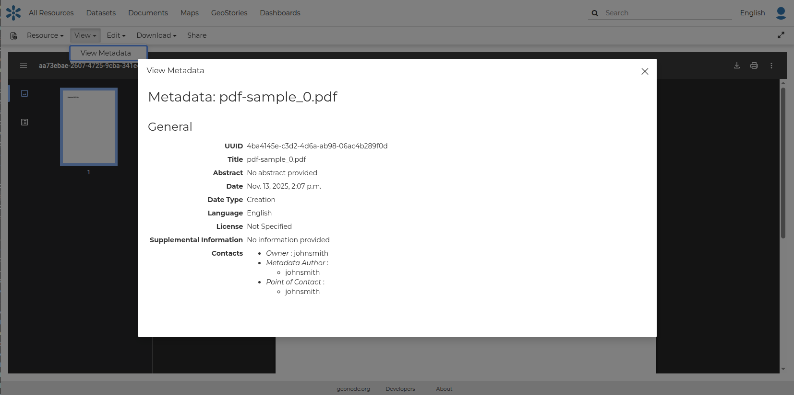{ align=center }
/// caption
*Document Metadata*
///

By selecting the `Share` tab, the corresponding `Share` tab from the properties table is opened.

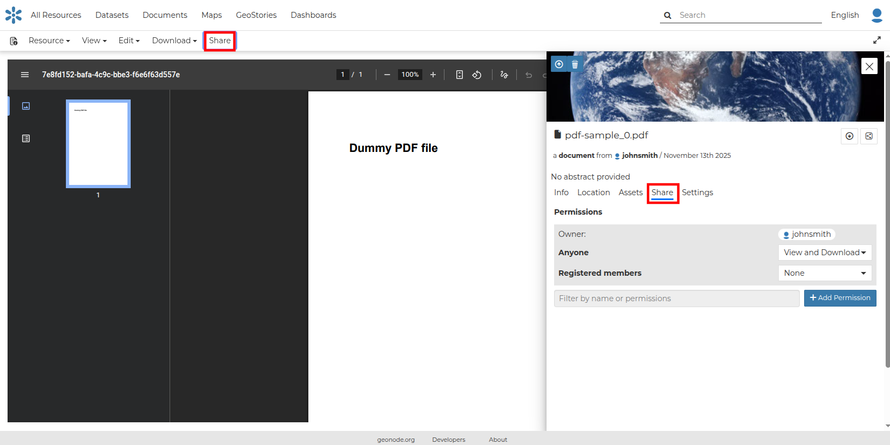{ align=center }
/// caption
*Document Sharing*
///

If you want to download the document, click on the `Download` tab and then from the dropdown menu click `Download`.

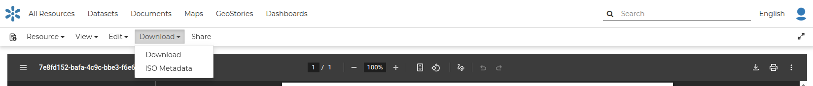{ align=center }
/// caption
*Document Metadata download*
///
